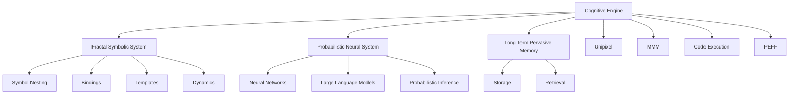
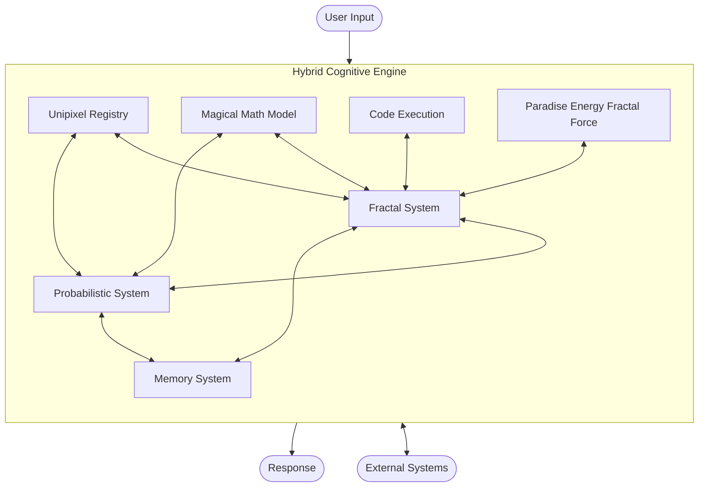
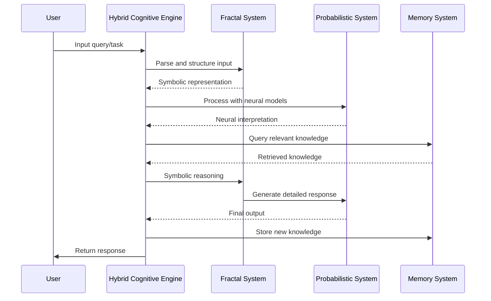

# Cognitive Engine

A powerful hybrid Neuro-Symbolic AI system that combines fractal symbolic representations with probabilistic neural models for enhanced reasoning and learning capabilities.

## Quick Links

- [Neural Tests Quick-Start Guide](NEURAL_TESTS.md) - Run the neural network test suite
- [Neural Test Documentation](setup/NEURAL_TEST_GUIDE.md) - Detailed guide for neural tests
- [Architecture Overview](docs/architecture.md) - System architecture details

## Overview

The Cognitive Engine integrates two complementary approaches to artificial intelligence:

1. **Fractal Symbolic System**: Provides structured representation, symbolic manipulation, and hierarchical reasoning across 7 levels of nested fractal symbol systems.

2. **Probabilistic Neural System**: Leverages neural networks and large language models for pattern recognition, natural language understanding, and generative capabilities.

These systems are integrated with a Long Term Pervasive Memory system for durable knowledge retention and retrieval.



### Key Advantages

Compared with traditional approaches like working with a single LLM:

- **Infinite Memory**: Store and organize knowledge across 7 levels of nested fractal symbol systems
- **Continuous Learning**: Adapt and improve with less supervision
- **Resource Efficiency**: Lower compute requirements in both simple and complex tasks
- **Enhanced Reasoning**: Improved problem-solving through symbolic-neural integration

## System Architecture



### Core Modules

- **[Fractal System](docs/fractal.md)**: Symbol nesting, bindings, templates, and dynamics
  - Core structures for symbolic representation
  - Binding mechanisms for connecting symbols across layers
  - Template systems for pattern replication

- **[Probabilistic System](docs/probabilistic.md)**: Neural networks, LLMs, and probabilistic inference
  - Neural network interfaces for connectionist approaches
  - LLM integration components for leveraging pre-trained language models
  - Probabilistic inference engines for reasoning under uncertainty
  
- **[Memory System](docs/memory.md)**: Long-term pervasive memory storage and retrieval
  - Multi-modal storage mechanisms for diverse information types
  - Efficient retrieval algorithms with associative capabilities
  - Temporal reasoning and forgetting curves

### Specialized Modules

- **[Unipixel](docs/unipixel.md)**: Fractal unit/atom/pixel for each layer of the system
  - Based on Active Inference / Free Energy Principle objects
  - Functions as basic building blocks for symbolic-neural integration

- **[MMM (Magical Math Model)](docs/mmm.md)**: 7 layers of cognitive motor to find patterns
  - Pattern recognition within and across layers
  - Hierarchical mathematical modeling of cognitive processes

- **[Code Execution](docs/code_execution.md)**: Skills for executing and operating code
  - Self-modification capabilities
  - Integration with external code repositories
  - Safe execution environments

- **[PEFF (Paradise Energy Fractal Force)](docs/peff.md)**: System for harmony, optimization, security, ethics, and emotions
  - Ethical reasoning frameworks
  - Optimization for system balance
  - Security and robustness mechanisms
  - Emotional intelligence modeling

## Project Structure

```
cognitive-engine/
├── cognitive_engine/     # Main package
│   ├── __init__.py       # Package initialization
│   ├── engine.py         # Main integration point
│   ├── fractal/          # Fractal system implementation
│   ├── probabilistic/    # Probabilistic system implementation
│   ├── memory/           # Long Term Pervasive Memory system
│   ├── unipixel/         # Fractal unit implementation
│   ├── mmm/              # Magical Math Model implementation
│   ├── code_execution/   # Code execution capabilities
│   └── peff/             # Paradise Energy Fractal Force
├── docs/                 # Documentation
│   ├── index.md          # Documentation home
│   ├── architecture.md   # System architecture details
│   ├── fractal.md        # Fractal system documentation
│   ├── probabilistic.md  # Probabilistic system documentation
│   └── ...               # Other module documentation
├── examples/             # Example usage and demos
│   ├── basic_usage.py    # Simple usage examples
│   ├── reasoning.py      # Reasoning examples
│   └── pattern_finding.py # Pattern finding examples
├── tests/                # Test suite
├── setup.py              # Package installation
├── requirements.txt      # Dependencies
└── LICENSE               # License information
```

## Data Flow



## Installation

```bash
# Clone the repository
git clone https://github.com/yourusername/cognitive-engine.git
cd cognitive-engine

# Create a virtual environment
python -m venv venv
source venv/bin/activate  # On Windows: venv\Scripts\activate

# Install dependencies
pip install -r requirements.txt

# Install in development mode
pip install -e .
```

### Dependencies

- Python 3.8+
- Core libraries:
  - NumPy (≥1.22.0)
  - SciPy (≥1.8.0)
  - PyTorch (≥2.0.0)
  - Transformers (≥4.25.0)
  - NetworkX (≥2.8.0)

See `requirements.txt` for the complete list of dependencies.

## Usage Examples

### Basic Usage

```python
from cognitive_engine import HybridCognitiveEngine
from cognitive_engine.fractal import FractalSystem
from cognitive_engine.probabilistic import LLMInterface
from cognitive_engine.memory import PervasiveMemory

# Initialize with default components
engine = HybridCognitiveEngine()

# Or customize components
engine = HybridCognitiveEngine(
    symbolic_system=FractalSystem(levels=7),
    neural_system=LLMInterface(model="gpt-4"),
    memory_system=PervasiveMemory(storage_path="./memory_store")
)

# Process a query
result = engine.process("Analyze the relationship between climate change and economic policy")
print(result['response'])

# Perform reasoning on a complex question
reasoning_result = engine.reason("How might quantum computing affect cryptographic systems?")
print(reasoning_result['reasoning_trace'])
print(reasoning_result['conclusion'])
```

### Advanced Pattern Finding

```python
# Create unipixels (fractal units) across different layers
climate_pixel = engine.create_unipixel(
    name="climate_system", 
    layer=3,
    properties={"domain": "environmental_science"}
)

economic_pixel = engine.create_unipixel(
    name="economic_system", 
    layer=3,
    properties={"domain": "economics"}
)

# Find patterns between unipixels
patterns = engine.find_patterns([climate_pixel['id'], economic_pixel['id']])
print(patterns['relationships'])

# Find patterns across all layers
cross_layer_patterns = engine.find_cross_layer_patterns()
print(cross_layer_patterns['emerging_patterns'])
```

### Web Research Integration

```python
# Research a topic with the integrated search capabilities
research_results = engine.research_topic("recent advances in fusion energy", depth=2)
print(research_results['summary'])
print(research_results['key_findings'])

# Save research to memory
engine.memory_system.store(
    content=research_results,
    metadata={"topic": "fusion energy", "timestamp": "2023-03-09"}
)
```

## Development Roadmap

- [x] Core architecture implementation
- [x] Basic fractal and probabilistic integration
- [x] Memory system foundation
- [ ] Enhanced pattern recognition across layers
- [ ] Improved symbolic-neural translation mechanisms
- [ ] External API interfaces
- [ ] Web UI for interactive exploration
- [ ] Distributed computation support

## Contributing

Contributions are welcome! Please see our [Contributing Guide](docs/contributing.md) for details on how to get started.

### Development Setup

```bash
# Fork and clone the repository
git clone https://github.com/your-username/cognitive-engine.git
cd cognitive-engine

# Create a new branch for your feature
git checkout -b feature/your-feature-name

# Set up development environment
python -m venv venv
source venv/bin/activate
pip install -r requirements.txt
pip install -r requirements-dev.txt
pip install -e .

# Run tests
pytest
```

## Documentation

- [Architecture Overview](docs/architecture.md)
- [API Reference](docs/api/index.md)
- [Module Documentation](docs/modules/index.md)
- [Example Gallery](docs/examples/index.md)
- [FAQs](docs/faq.md)

## License

This project is licensed under the MIT License - see the [LICENSE](LICENSE) file for details.

## Citation

If you use Cognitive Engine in your research, please cite:

```bibtex
@software{cognitive_engine2023,
  author = {Cognitive Engine Contributors},
  title = {Cognitive Engine: A Hybrid Neuro-Symbolic AI System},
  url = {https://github.com/yourusername/cognitive-engine},
  year = {2023},
}
```

# Neural Network Test Suite

This project includes a comprehensive neural network test suite with visualizations, metrics, and reports. The test suite executes various neural network tests and generates detailed visualizations to help understand the network's behavior and performance.

## Quick Start

To run the neural network tests with proper environment setup, use the all-in-one setup script:

```bash
./setup/setup_and_run.sh --visualize
```

This script will:
1. Find a working Python installation
2. Create a Python virtual environment
3. Install all required dependencies
4. Run the neural tests
5. Generate visualizations and reports

## Visualizations and Reports

The test suite generates the following outputs:

### Static Visualizations
- Test Results Bar Chart with MSE values and inference times
- Network Architecture Diagram showing layer parameters
- Learning Curves with confidence intervals
- Performance Radar Chart showing multiple metrics
- Error Analysis Heatmap for failed tests
- Detailed Network Architecture Visualization

### Animated Visualizations
- Training Progress Animation showing loss and accuracy over time
- Network Activity Heatmap Animation showing neuron activations

### Advanced Visualizations
- 3D Network Architecture Visualization
- Confidence vs MSE Bubble Chart
- Context Distribution Pie Chart
- Test Execution Heat Calendar

### Reports
- Detailed Markdown Test Report
- HTML Visualization Report
- Interactive Dashboard (when available)

## Documentation

For more detailed information, see the following documents:

- [Neural Test Guide](setup/NEURAL_TEST_GUIDE.md) - Comprehensive guide to running neural tests
- [Setup README](setup/README.md) - Information about the setup utilities

## Command Line Options

The neural test runner supports several options:

```bash
./setup/setup_and_run.sh --visualize --verbose --export-vis ./exported_visualizations
```

Available options:
- `--visualize`: Generate visualizations and reports
- `--fallback`: Force NumPy fallback mode if PyTorch is not available
- `--verbose`: Enable verbose logging
- `--config PATH`: Path to a custom configuration file
- `--retrain`: Force model retraining
- `--export-vis PATH`: Export visualizations to the specified directory

## Directory Structure

- `setup/`: Environment setup utilities
- `tests/`: Neural network test scripts and data
- `tests/results/`: Test results and reports
- `visualizations/`: Generated visualizations
- `models/`: Trained model files and recovery data


