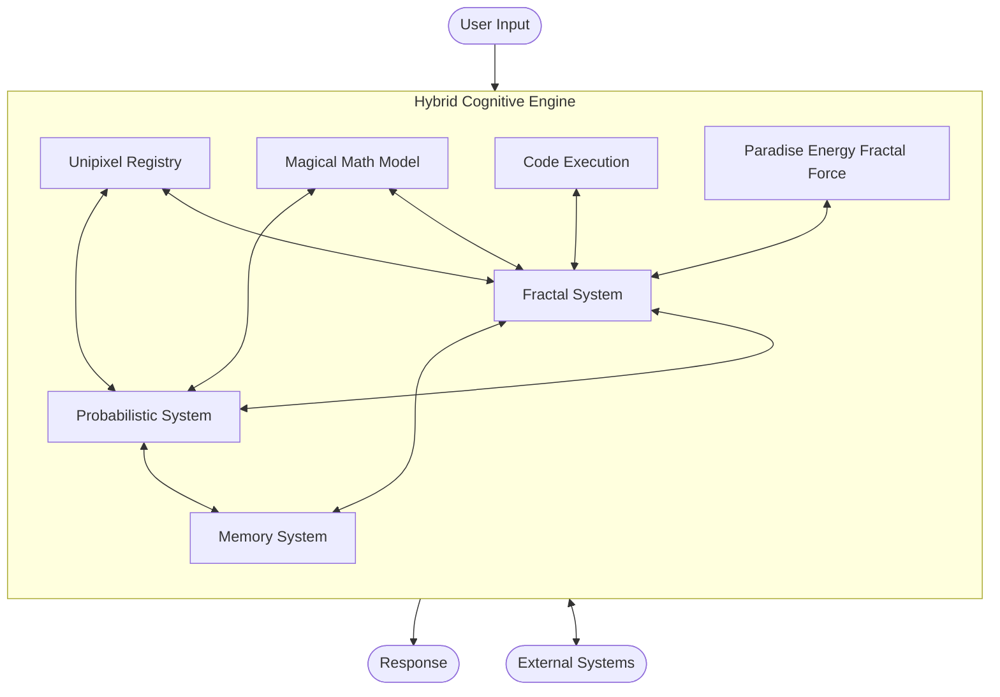
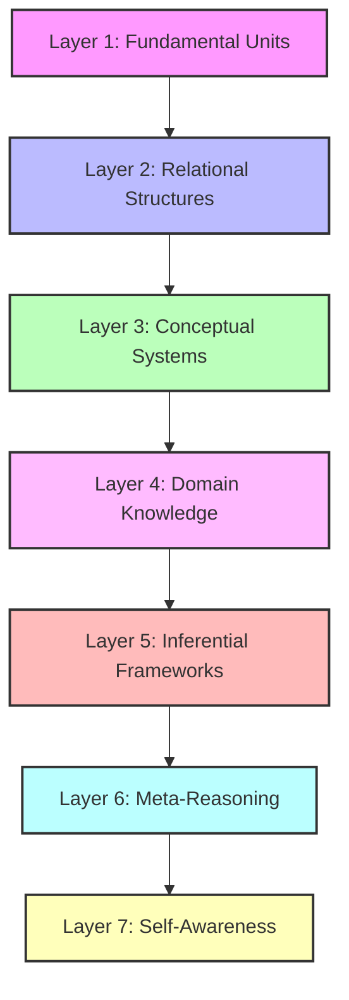
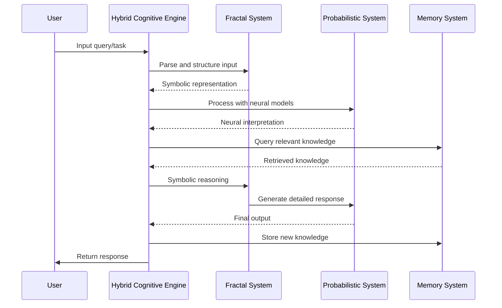

# System Architecture

The Cognitive Engine is designed as a hybrid Neuro-Symbolic AI system that integrates fractal symbolic reasoning with probabilistic neural processing. This document provides an overview of the system architecture, component interactions, and design principles.

## System Overview

The architecture consists of three core systems that form the foundation of the Cognitive Engine:

1. **Fractal System**: Provides symbolic representation, hierarchical reasoning, and structured knowledge organization.
2. **Probabilistic System**: Handles neural networks, language models, and probabilistic inference.
3. **Memory System**: Manages long-term knowledge storage and retrieval.

These core systems are augmented by specialized modules that extend the capabilities of the engine:

- **Unipixel**: Provides fractal units/atoms for each layer of the system.
- **Magical Math Model (MMM)**: Identifies patterns within and across layers.
- **Code Execution**: Enables code analysis and execution capabilities.
- **Paradise Energy Fractal Force (PEFF)**: Manages optimization, ethics, and emotional aspects.

## Hierarchical Structure

The Cognitive Engine operates across seven nested layers, each representing a different level of abstraction:

Each layer has its own:
- Symbol sets and binding mechanisms
- Neural processing components
- Memory structures
- Unipixel implementations

## Information Flow

## Component Interactions

### Fractal-Probabilistic Integration

The integration between symbolic and neural systems is a key innovation of the Cognitive Engine:

1. **Symbol Grounding**: Neural systems provide grounding for symbolic representations
2. **Neural Guidance**: Symbolic systems provide structure and constraints for neural processing
3. **Hybrid Reasoning**: Problems are decomposed into symbolic and neural sub-problems
4. **Cross-System Learning**: Each system can learn from the other's successes and failures

### Memory Integration

The Memory system interacts with both Fractal and Probabilistic systems:

1. **Symbolic Indexing**: Fractal structures provide indexing for memory storage
2. **Neural Retrieval**: Neural models assist in retrieving relevant memories
3. **Memory Consolidation**: Important information moves from short-term to long-term storage
4. **Forgetting Curves**: Time-based decay of less relevant information

## System Modules

### Core Modules

#### Fractal System

The Fractal system provides symbolic representation and manipulation capabilities:

- **Core Structures**: Fundamental symbolic elements
- **Binding Mechanisms**: Rules for connecting symbols
- **Templates**: Reusable symbolic patterns
- **Dynamics**: Rules governing symbol evolution

#### Probabilistic System

The Probabilistic system handles neural and statistical processing:

- **Neural Networks**: Connectionist representations
- **Language Models**: Text processing and generation
- **Probabilistic Inference**: Reasoning under uncertainty

#### Memory System

The Memory system manages knowledge storage and retrieval:

- **Storage Mechanisms**: Multi-modal information storage
- **Retrieval Algorithms**: Context-sensitive information retrieval
- **Associative Networks**: Connection-based memory organization

### Specialized Modules

#### Unipixel

Unipixels are the fundamental units of the system:

- **Active Inference**: Based on Free Energy Principle
- **Multi-level Representation**: Exist at each layer of the system
- **State Management**: Track internal states and beliefs

#### Magical Math Model (MMM)

The MMM identifies patterns and mathematical structures:

- **Pattern Recognition**: Within and across layers
- **Mathematical Modeling**: Abstract representation of cognitive processes
- **Prediction**: Future state prediction based on identified patterns

#### Code Execution

The Code Execution module handles code-related tasks:

- **Code Analysis**: Understanding and reasoning about code
- **Safe Execution**: Isolated execution of code
- **Repository Management**: Interaction with code repositories

#### Paradise Energy Fractal Force (PEFF)

The PEFF handles optimization, ethics, and emotional aspects:

- **Optimization**: System harmony and balance
- **Ethics**: Ethical reasoning and constraints
- **Security**: System protection and robustness
- **Emotional Intelligence**: Modeling and understanding emotions

## Implementation Considerations

### Performance Optimization

- **Selective Processing**: Not all components are activated for every task
- **Hierarchical Processing**: Information moves from lower to higher layers as needed
- **Caching**: Commonly used results are cached for efficiency

### Scaling

- **Distributed Processing**: Components can run on different hardware
- **Parallelization**: Independent processes run in parallel
- **Modular Growth**: New capabilities can be added as modules

### Safety and Security

- **Isolation**: Components run in isolated environments
- **Monitoring**: System activities are logged and monitored
- **Ethical Constraints**: PEFF provides ethical guidelines

## Future Directions

- **Enhanced Cross-Layer Learning**: Improve learning across different levels
- **External Integration**: Connect with external systems and sensors
- **Self-Improvement**: Enable the system to improve its own architecture
- **Multi-Agent Collaboration**: Support collaboration between multiple instances

## References

- Active Inference and Free Energy Principle
- Fractal Representation Theory
- Neural-Symbolic Integration
- Memory Consolidation Models
- Ethical AI Frameworks 