# Cognitive Engine Architecture Visualization

This document provides a comprehensive visual overview of the Cognitive Engine architecture, showcasing the relationships, interactions, and hierarchies between all major components of the system.

## System Overview

The Cognitive Engine is a hybrid neuro-symbolic AI system designed for complex reasoning, pattern recognition, and continuous learning with resource efficiency.

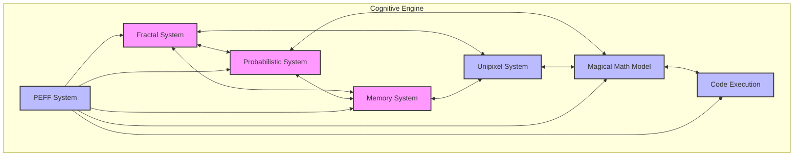
```mermaid
graph TD
    subgraph "Cognitive Engine"
        FS[Fractal System]
        PS[Probabilistic System]
        MS[Memory System]
        UP[Unipixel System]
        MMM[Magical Math Model]
        CE[Code Execution]
        PEFF[PEFF System]
    end
    
    FS <--> PS
    FS <--> MS
    FS <--> UP
    PS <--> MS
    PS <--> MMM
    MS <--> UP
    UP <--> MMM
    MMM <--> CE
    PEFF --> FS
    PEFF --> PS
    PEFF --> MS
    PEFF --> MMM
    PEFF --> CE
    
    classDef coreSystem fill:#f9f,stroke:#333,stroke-width:2px
    classDef supportSystem fill:#bbf,stroke:#333,stroke-width:2px
    
    class FS,PS,MS coreSystem
    class UP,MMM,CE,PEFF supportSystem
```

## 7-Layer Cognitive Architecture

The Cognitive Engine operates across 7 layers of increasing abstraction and complexity:

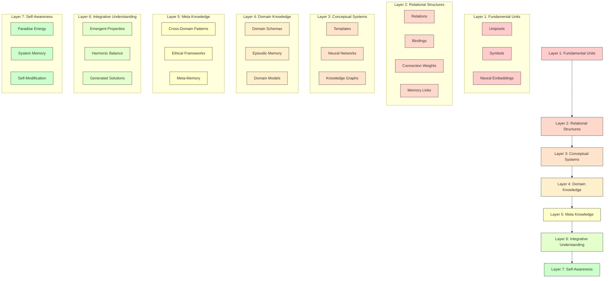
```mermaid
graph TD
    L1[Layer 1: Fundamental Units] --> L2[Layer 2: Relational Structures]
    L2 --> L3[Layer 3: Conceptual Systems]
    L3 --> L4[Layer 4: Domain Knowledge]
    L4 --> L5[Layer 5: Meta Knowledge]
    L5 --> L6[Layer 6: Integrative Understanding]
    L6 --> L7[Layer 7: Self-Awareness]
    
    subgraph "Layer 1: Fundamental Units"
        UP1[Unipixels]
        FS1[Symbols]
        PS1[Neural Embeddings]
    end
    
    subgraph "Layer 2: Relational Structures"
        FS2[Relations]
        FS2b[Bindings]
        PS2[Connection Weights]
        MS2[Memory Links]
    end
    
    subgraph "Layer 3: Conceptual Systems"
        FS3[Templates]
        PS3[Neural Networks]
        MS3[Knowledge Graphs]
    end
    
    subgraph "Layer 4: Domain Knowledge"
        FS4[Domain Schemas]
        MS4[Episodic Memory]
        PS4[Domain Models]
    end
    
    subgraph "Layer 5: Meta Knowledge"
        MMM5[Cross-Domain Patterns]
        PEFF5[Ethical Frameworks]
        MS5[Meta-Memory]
    end
    
    subgraph "Layer 6: Integrative Understanding"
        MMM6[Emergent Properties]
        PEFF6[Harmonic Balance]
        CE6[Generated Solutions]
    end
    
    subgraph "Layer 7: Self-Awareness"
        PEFF7[Paradise Energy]
        MS7[System Memory]
        CE7[Self-Modification]
    end
    
    classDef layer1 fill:#ffcccc,stroke:#333,stroke-width:1px
    classDef layer2 fill:#ffd8cc,stroke:#333,stroke-width:1px
    classDef layer3 fill:#ffe4cc,stroke:#333,stroke-width:1px
    classDef layer4 fill:#fff0cc,stroke:#333,stroke-width:1px
    classDef layer5 fill:#ffffcc,stroke:#333,stroke-width:1px
    classDef layer6 fill:#e4ffcc,stroke:#333,stroke-width:1px
    classDef layer7 fill:#ccffcc,stroke:#333,stroke-width:1px
    
    class L1,UP1,FS1,PS1 layer1
    class L2,FS2,FS2b,PS2,MS2 layer2
    class L3,FS3,PS3,MS3 layer3
    class L4,FS4,MS4,PS4 layer4
    class L5,MMM5,PEFF5,MS5 layer5
    class L6,MMM6,PEFF6,CE6 layer6
    class L7,PEFF7,MS7,CE7 layer7
```

## Core Module Relationships

### Fractal-Probabilistic Integration

The integration between symbolic (Fractal) and neural (Probabilistic) systems:

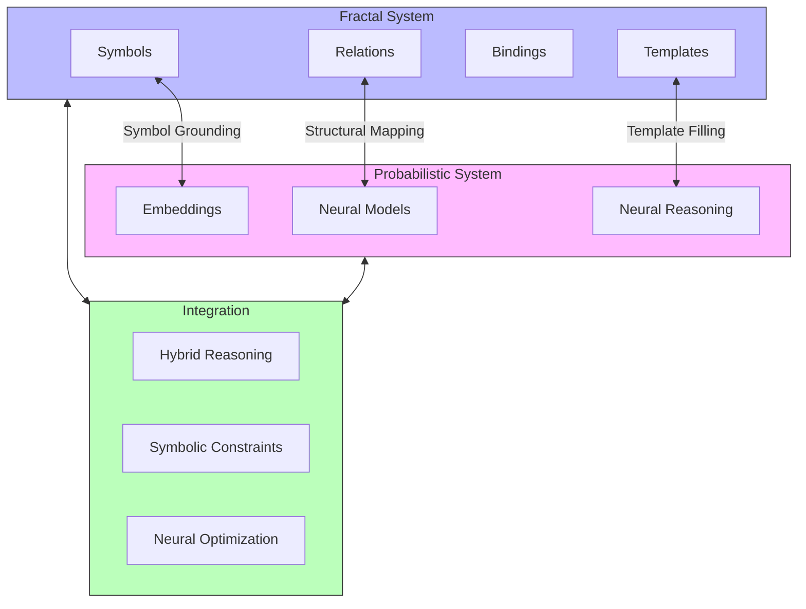
```mermaid
flowchart TB
    subgraph FS[Fractal System]
        Symbols[Symbols]
        Relations[Relations]
        Bindings[Bindings]
        Templates[Templates]
    end
    
    subgraph PS[Probabilistic System]
        NeuralModels[Neural Models]
        Embeddings[Embeddings]
        Reasoning[Neural Reasoning]
    end
    
    Symbols <-->|Symbol Grounding| Embeddings
    Relations <-->|Structural Mapping| NeuralModels
    Templates <-->|Template Filling| Reasoning
    
    subgraph Integration
        HybridReasoning[Hybrid Reasoning]
        SymbolicConstraints[Symbolic Constraints]
        NeuralOptimization[Neural Optimization]
    end
    
    FS <--> Integration
    PS <--> Integration
    
    style FS fill:#bbf,stroke:#333,stroke-width:1px
    style PS fill:#fbf,stroke:#333,stroke-width:1px
    style Integration fill:#bfb,stroke:#333,stroke-width:1px
```

### Memory System Architecture

The multi-layered Memory System and its integration with other components:

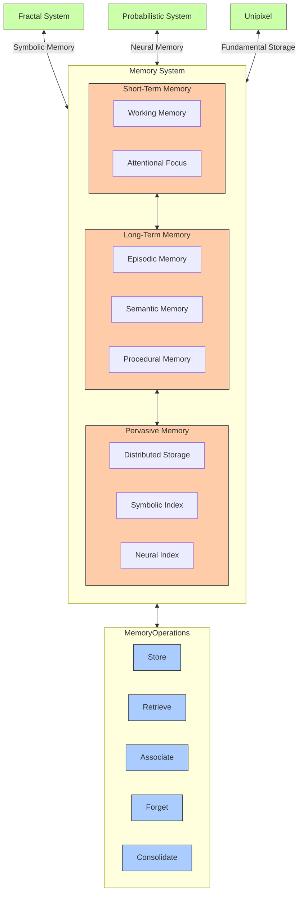
```mermaid
graph TD
    subgraph MS[Memory System]
        direction TB
        
        subgraph STE[Short-Term Memory]
            WorkingMemory[Working Memory]
            AttentionalFocus[Attentional Focus]
        end
        
        subgraph LTE[Long-Term Memory]
            EpisodicMemory[Episodic Memory]
            SemanticMemory[Semantic Memory]
            ProceduralMemory[Procedural Memory]
        end
        
        subgraph PLE[Pervasive Memory]
            DistributedStorage[Distributed Storage]
            SymbolicIndex[Symbolic Index]
            NeuralIndex[Neural Index]
        end
        
        STE <--> LTE
        LTE <--> PLE
    end
    
    subgraph MemoryOperations
        Store[Store]
        Retrieve[Retrieve]
        Associate[Associate]
        Forget[Forget]
        Consolidate[Consolidate]
    end
    
    FS[Fractal System] <-->|Symbolic Memory| MS
    PS[Probabilistic System] <-->|Neural Memory| MS
    UP[Unipixel] <-->|Fundamental Storage| MS
    
    MS <--> MemoryOperations
    
    classDef memoryType fill:#ffccaa,stroke:#333,stroke-width:1px
    classDef memoryOps fill:#aaccff,stroke:#333,stroke-width:1px
    classDef external fill:#ccffaa,stroke:#333,stroke-width:1px
    
    class STE,LTE,PLE memoryType
    class Store,Retrieve,Associate,Forget,Consolidate memoryOps
    class FS,PS,UP external
```

### Unipixel System

The Unipixel as the fundamental unit of the Cognitive Engine:

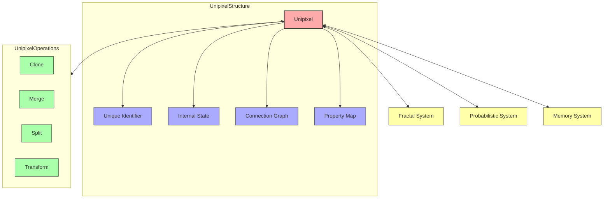
```mermaid
graph TD
    subgraph UnipixelStructure
        UP[Unipixel] --> ID[Unique Identifier]
        UP --> State[Internal State]
        UP --> Connections[Connection Graph]
        UP --> Properties[Property Map]
    end
    
    subgraph UnipixelOperations
        Clone[Clone]
        Merge[Merge]
        Split[Split]
        Transform[Transform]
    end
    
    UP <--> FS[Fractal System]
    UP <--> PS[Probabilistic System]
    UP <--> MS[Memory System]
    UP <--> UnipixelOperations
    
    classDef unipixel fill:#ffaaaa,stroke:#333,stroke-width:2px
    classDef component fill:#aaaaff,stroke:#333,stroke-width:1px
    classDef operation fill:#aaffaa,stroke:#333,stroke-width:1px
    classDef system fill:#ffffaa,stroke:#333,stroke-width:1px
    
    class UP unipixel
    class ID,State,Connections,Properties component
    class Clone,Merge,Split,Transform operation
    class FS,PS,MS system
```

### Magical Math Model (MMM)

The pattern recognition and mathematical modeling system:

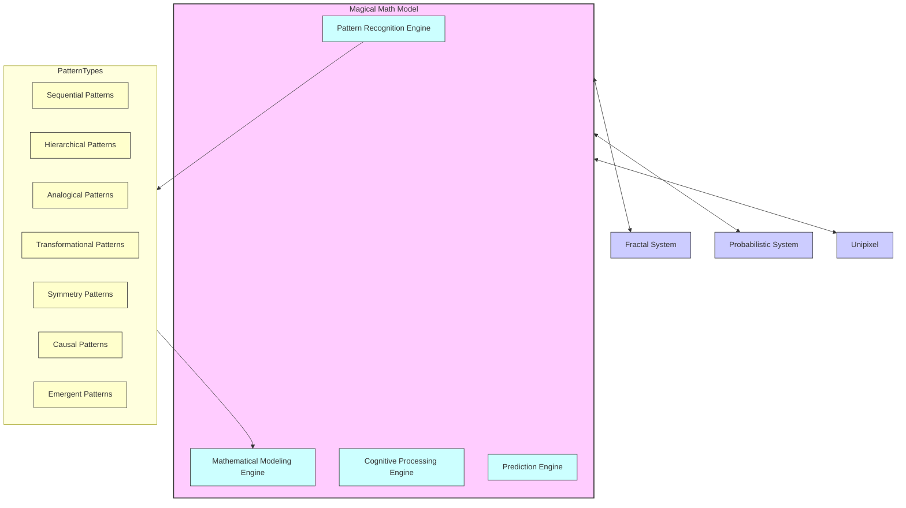
```mermaid
graph TD
    subgraph MMM[Magical Math Model]
        PatternRecognition[Pattern Recognition Engine]
        MathematicalModeling[Mathematical Modeling Engine]
        CognitiveProcessing[Cognitive Processing Engine]
        Prediction[Prediction Engine]
    end
    
    subgraph PatternTypes
        Sequential[Sequential Patterns]
        Hierarchical[Hierarchical Patterns]
        Analogical[Analogical Patterns]
        Transformational[Transformational Patterns]
        Symmetry[Symmetry Patterns]
        Causal[Causal Patterns]
        Emergent[Emergent Patterns]
    end
    
    MMM <--> FS[Fractal System]
    MMM <--> PS[Probabilistic System]
    MMM <--> UP[Unipixel]
    
    PatternRecognition --> PatternTypes
    PatternTypes --> MathematicalModeling
    
    classDef mmm fill:#ffccff,stroke:#333,stroke-width:2px
    classDef component fill:#ccffff,stroke:#333,stroke-width:1px
    classDef pattern fill:#ffffcc,stroke:#333,stroke-width:1px
    classDef system fill:#ccccff,stroke:#333,stroke-width:1px
    
    class MMM mmm
    class PatternRecognition,MathematicalModeling,CognitiveProcessing,Prediction component
    class Sequential,Hierarchical,Analogical,Transformational,Symmetry,Causal,Emergent pattern
    class FS,PS,UP system
```

### PEFF System

The Paradise Energy Fractal Force regulatory and ethical framework:

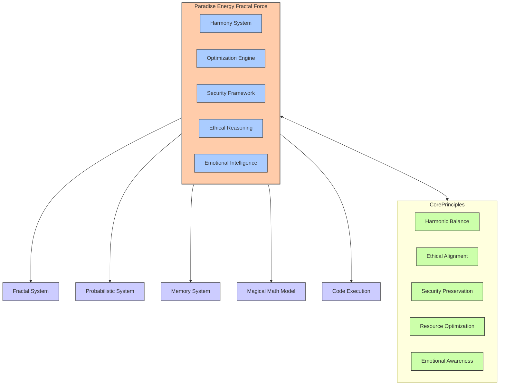
```mermaid
graph TD
    subgraph PEFF[Paradise Energy Fractal Force]
        HarmonySystem[Harmony System]
        OptimizationEngine[Optimization Engine]
        SecurityFramework[Security Framework]
        EthicalReasoning[Ethical Reasoning]
        EmotionalIntelligence[Emotional Intelligence]
    end
    
    PEFF --> FS[Fractal System]
    PEFF --> PS[Probabilistic System]
    PEFF --> MS[Memory System]
    PEFF --> MMM[Magical Math Model]
    PEFF --> CE[Code Execution]
    
    subgraph CorePrinciples
        HarmonicBalance[Harmonic Balance]
        EthicalAlignment[Ethical Alignment]
        SecurityPreservation[Security Preservation]
        ResourceOptimization[Resource Optimization]
        EmotionalAwareness[Emotional Awareness]
    end
    
    PEFF <--> CorePrinciples
    
    classDef peff fill:#ffccaa,stroke:#333,stroke-width:2px
    classDef component fill:#aaccff,stroke:#333,stroke-width:1px
    classDef principle fill:#ccffaa,stroke:#333,stroke-width:1px
    classDef system fill:#ccccff,stroke:#333,stroke-width:1px
    
    class PEFF peff
    class HarmonySystem,OptimizationEngine,SecurityFramework,EthicalReasoning,EmotionalIntelligence component
    class HarmonicBalance,EthicalAlignment,SecurityPreservation,ResourceOptimization,EmotionalAwareness principle
    class FS,PS,MS,MMM,CE system
```

### Code Execution System

The components of the Code Execution system:

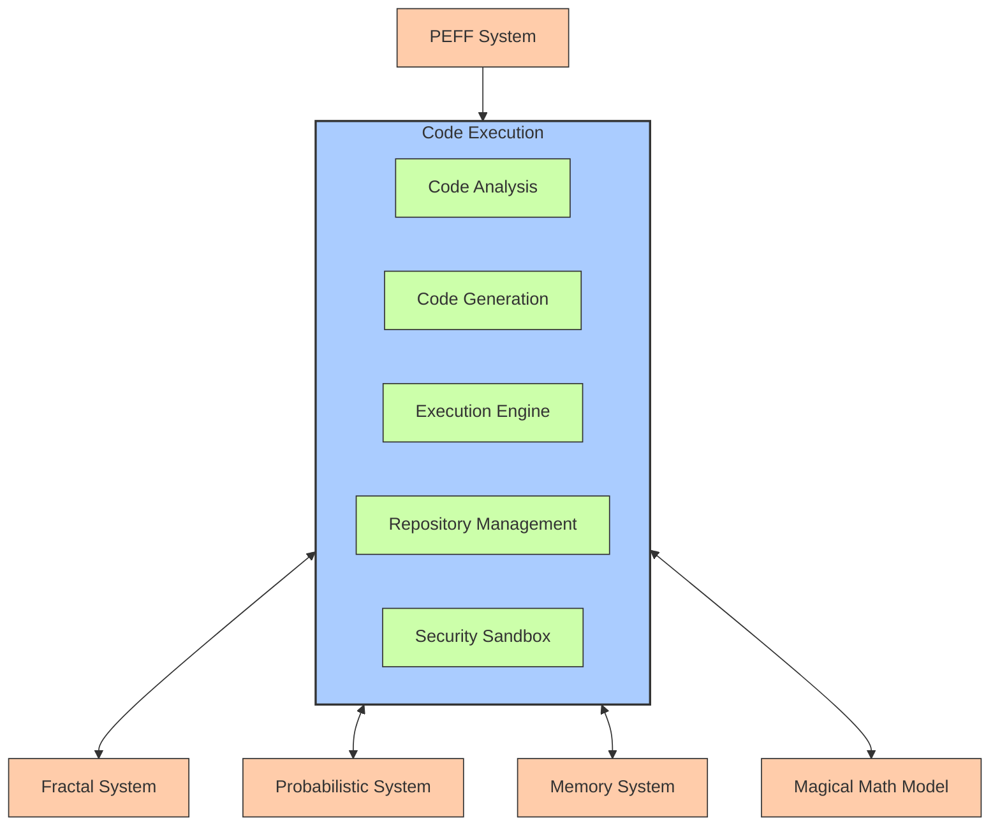
```mermaid
graph TD
    subgraph CE[Code Execution]
        Analysis[Code Analysis]
        Generation[Code Generation]
        Execution[Execution Engine]
        Repository[Repository Management]
        Sandbox[Security Sandbox]
    end
    
    CE <--> FS[Fractal System]
    CE <--> PS[Probabilistic System]
    CE <--> MS[Memory System]
    CE <--> MMM[Magical Math Model]
    
    PEFF[PEFF System] --> CE
    
    classDef ce fill:#aaccff,stroke:#333,stroke-width:2px
    classDef component fill:#ccffaa,stroke:#333,stroke-width:1px
    classDef system fill:#ffccaa,stroke:#333,stroke-width:1px
    
    class CE ce
    class Analysis,Generation,Execution,Repository,Sandbox component
    class FS,PS,MS,MMM,PEFF system
```

## Data Flow and Processing

### Query Processing Flow

This diagram shows how a query is processed through the Cognitive Engine:

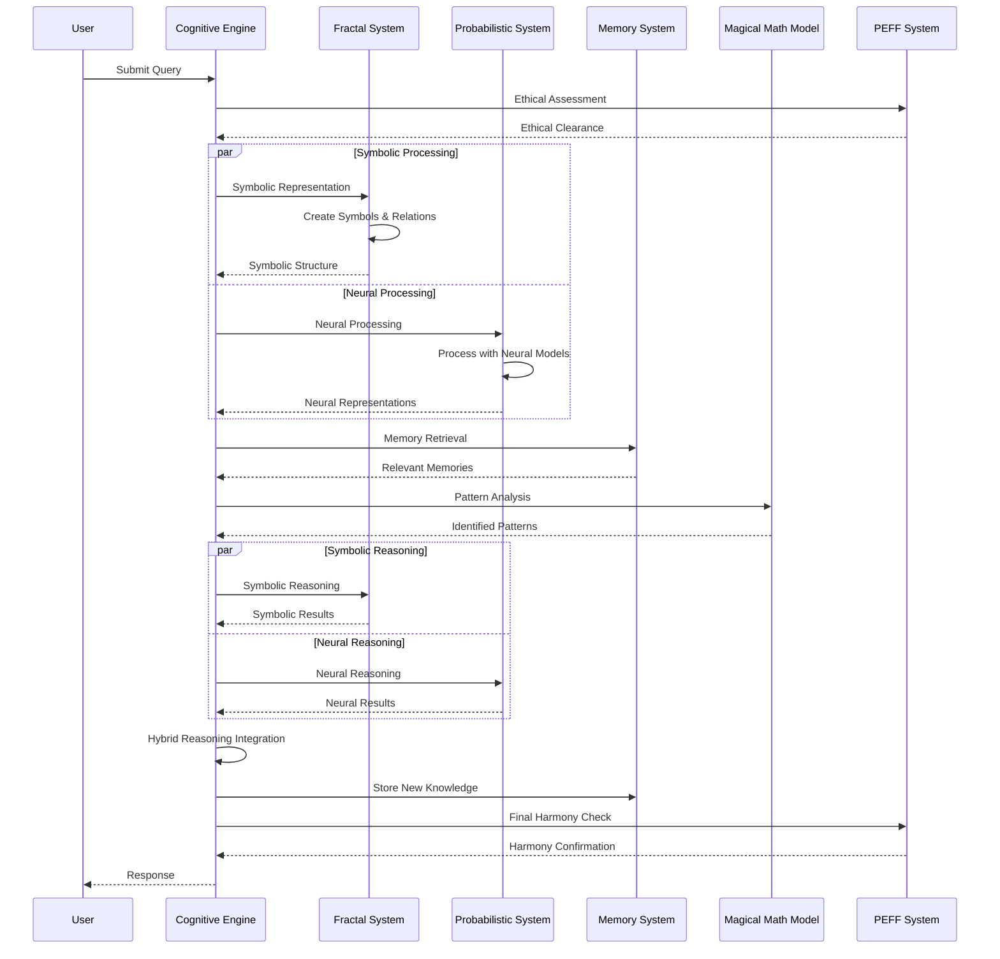
```mermaid
sequenceDiagram
    participant User
    participant CE as Cognitive Engine
    participant FS as Fractal System
    participant PS as Probabilistic System
    participant MS as Memory System
    participant MMM as Magical Math Model
    participant PEFF as PEFF System
    
    User->>CE: Submit Query
    
    CE->>PEFF: Ethical Assessment
    PEFF-->>CE: Ethical Clearance
    
    par Symbolic Processing
        CE->>FS: Symbolic Representation
        FS->>FS: Create Symbols & Relations
        FS-->>CE: Symbolic Structure
    and Neural Processing
        CE->>PS: Neural Processing
        PS->>PS: Process with Neural Models
        PS-->>CE: Neural Representations
    end
    
    CE->>MS: Memory Retrieval
    MS-->>CE: Relevant Memories
    
    CE->>MMM: Pattern Analysis
    MMM-->>CE: Identified Patterns
    
    par Symbolic Reasoning
        CE->>FS: Symbolic Reasoning
        FS-->>CE: Symbolic Results
    and Neural Reasoning
        CE->>PS: Neural Reasoning
        PS-->>CE: Neural Results
    end
    
    CE->>CE: Hybrid Reasoning Integration
    CE->>MS: Store New Knowledge
    
    CE->>PEFF: Final Harmony Check
    PEFF-->>CE: Harmony Confirmation
    
    CE-->>User: Response
```

### Learning and Adaptation Flow

How the Cognitive Engine learns and adapts over time:

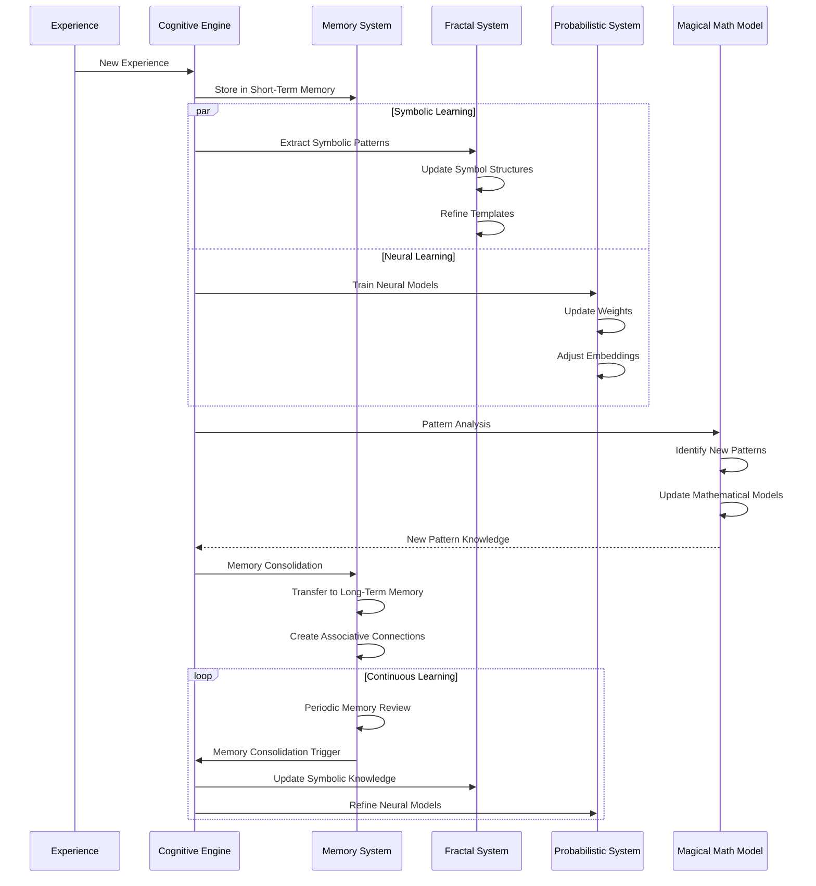
```mermaid
sequenceDiagram
    participant EXP as Experience
    participant CE as Cognitive Engine
    participant MS as Memory System
    participant FS as Fractal System
    participant PS as Probabilistic System
    participant MMM as Magical Math Model
    
    EXP->>CE: New Experience
    
    CE->>MS: Store in Short-Term Memory
    
    par Symbolic Learning
        CE->>FS: Extract Symbolic Patterns
        FS->>FS: Update Symbol Structures
        FS->>FS: Refine Templates
    and Neural Learning
        CE->>PS: Train Neural Models
        PS->>PS: Update Weights
        PS->>PS: Adjust Embeddings
    end
    
    CE->>MMM: Pattern Analysis
    MMM->>MMM: Identify New Patterns
    MMM->>MMM: Update Mathematical Models
    MMM-->>CE: New Pattern Knowledge
    
    CE->>MS: Memory Consolidation
    MS->>MS: Transfer to Long-Term Memory
    MS->>MS: Create Associative Connections
    
    loop Continuous Learning
        MS->>MS: Periodic Memory Review
        MS->>CE: Memory Consolidation Trigger
        CE->>FS: Update Symbolic Knowledge
        CE->>PS: Refine Neural Models
    end
```

## Cross-Module Interactions

### Pattern Discovery Process

How patterns are discovered across different modules:

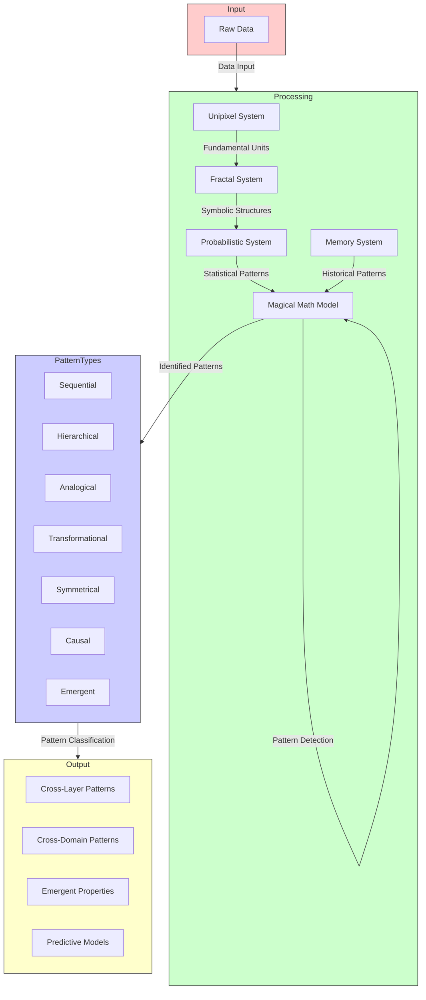
```mermaid
flowchart TB
    subgraph Input
        RawData[Raw Data]
    end
    
    subgraph Processing
        UP[Unipixel System] -->|Fundamental Units| FS
        FS[Fractal System] -->|Symbolic Structures| PS
        PS[Probabilistic System] -->|Statistical Patterns| MMM
        MS[Memory System] -->|Historical Patterns| MMM
        
        MMM[Magical Math Model] -->|Pattern Detection| MMM
    end
    
    subgraph PatternTypes
        Sequential[Sequential]
        Hierarchical[Hierarchical]
        Analogical[Analogical]
        Transformational[Transformational]
        Symmetrical[Symmetrical]
        Causal[Causal]
        Emergent[Emergent]
    end
    
    subgraph Output
        CrossLayerPatterns[Cross-Layer Patterns]
        CrossDomainPatterns[Cross-Domain Patterns]
        EmergentProperties[Emergent Properties]
        PredictiveModels[Predictive Models]
    end
    
    RawData -->|Data Input| Processing
    MMM -->|Identified Patterns| PatternTypes
    PatternTypes -->|Pattern Classification| Output
    
    style Input fill:#ffcccc,stroke:#333,stroke-width:1px
    style Processing fill:#ccffcc,stroke:#333,stroke-width:1px
    style PatternTypes fill:#ccccff,stroke:#333,stroke-width:1px
    style Output fill:#ffffcc,stroke:#333,stroke-width:1px
```

### Hybrid Reasoning Process

How symbolic and neural reasoning are combined:

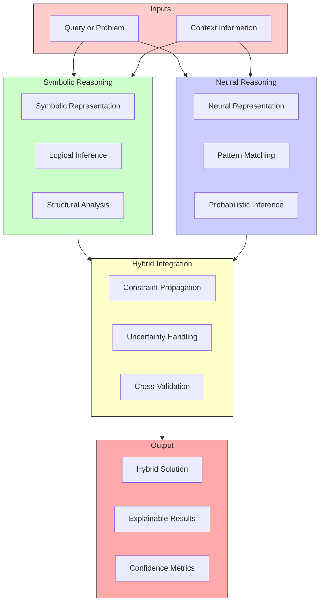
```mermaid
flowchart TB
    subgraph Inputs
        Query[Query or Problem]
        Context[Context Information]
    end
    
    subgraph SymbolicReasoning[Symbolic Reasoning]
        SymbolicRepresentation[Symbolic Representation]
        LogicalInference[Logical Inference]
        StructuralAnalysis[Structural Analysis]
    end
    
    subgraph NeuralReasoning[Neural Reasoning]
        NeuralRepresentation[Neural Representation]
        PatternMatching[Pattern Matching]
        ProbabilisticInference[Probabilistic Inference]
    end
    
    subgraph HybridIntegration[Hybrid Integration]
        ConstraintPropagation[Constraint Propagation]
        UncertaintyHandling[Uncertainty Handling]
        CrossValidation[Cross-Validation]
    end
    
    subgraph Output
        HybridSolution[Hybrid Solution]
        Explanation[Explainable Results]
        Confidence[Confidence Metrics]
    end
    
    Query --> SymbolicReasoning
    Query --> NeuralReasoning
    Context --> SymbolicReasoning
    Context --> NeuralReasoning
    
    SymbolicReasoning --> HybridIntegration
    NeuralReasoning --> HybridIntegration
    
    HybridIntegration --> Output
    
    style Inputs fill:#ffcccc,stroke:#333,stroke-width:1px
    style SymbolicReasoning fill:#ccffcc,stroke:#333,stroke-width:1px
    style NeuralReasoning fill:#ccccff,stroke:#333,stroke-width:1px
    style HybridIntegration fill:#ffffcc,stroke:#333,stroke-width:1px
    style Output fill:#ffaaaa,stroke:#333,stroke-width:1px
```

## System State and Transitions

### Cognitive Engine State Diagram

The various operational states of the Cognitive Engine:

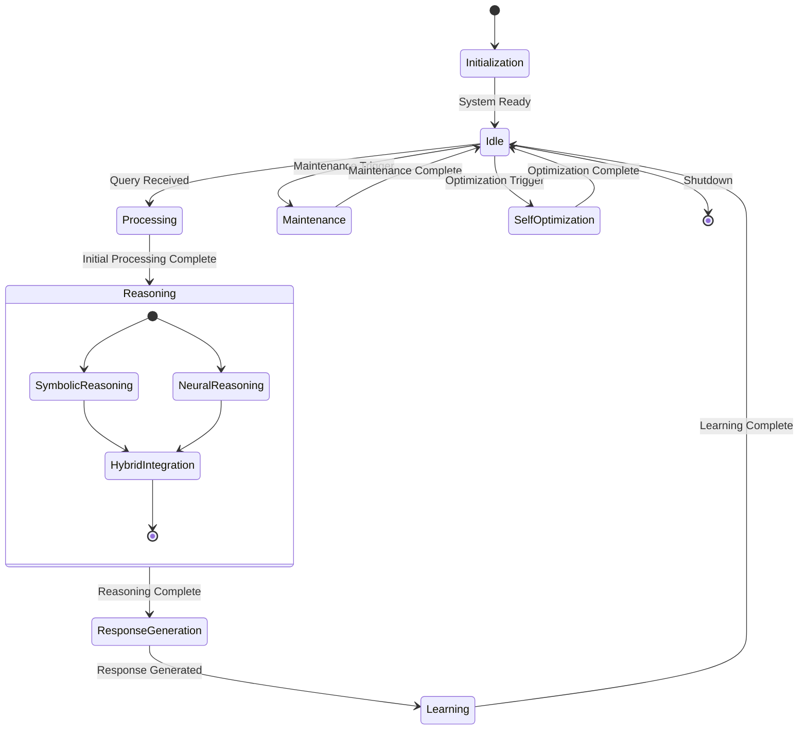
```mermaid
stateDiagram-v2
    [*] --> Initialization
    
    Initialization --> Idle: System Ready
    
    Idle --> Processing: Query Received
    Processing --> Reasoning: Initial Processing Complete
    
    state Reasoning {
        [*] --> SymbolicReasoning
        [*] --> NeuralReasoning
        
        SymbolicReasoning --> HybridIntegration
        NeuralReasoning --> HybridIntegration
        
        HybridIntegration --> [*]
    }
    
    Reasoning --> ResponseGeneration: Reasoning Complete
    ResponseGeneration --> Learning: Response Generated
    
    Learning --> Idle: Learning Complete
    
    Idle --> Maintenance: Maintenance Trigger
    Maintenance --> Idle: Maintenance Complete
    
    Idle --> SelfOptimization: Optimization Trigger
    SelfOptimization --> Idle: Optimization Complete
    
    Idle --> [*]: Shutdown
```

### Memory Consolidation Process

The process of memory consolidation over time:

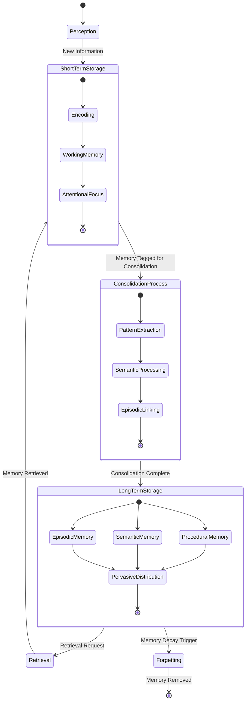
```mermaid
stateDiagram-v2
    [*] --> Perception
    
    Perception --> ShortTermStorage: New Information
    
    state ShortTermStorage {
        [*] --> Encoding
        Encoding --> WorkingMemory
        WorkingMemory --> AttentionalFocus
        AttentionalFocus --> [*]
    }
    
    ShortTermStorage --> ConsolidationProcess: Memory Tagged for Consolidation
    
    state ConsolidationProcess {
        [*] --> PatternExtraction
        PatternExtraction --> SemanticProcessing
        SemanticProcessing --> EpisodicLinking
        EpisodicLinking --> [*]
    }
    
    ConsolidationProcess --> LongTermStorage: Consolidation Complete
    
    state LongTermStorage {
        [*] --> EpisodicMemory
        [*] --> SemanticMemory
        [*] --> ProceduralMemory
        
        EpisodicMemory --> PervasiveDistribution
        SemanticMemory --> PervasiveDistribution
        ProceduralMemory --> PervasiveDistribution
        
        PervasiveDistribution --> [*]
    }
    
    LongTermStorage --> Retrieval: Retrieval Request
    Retrieval --> ShortTermStorage: Memory Retrieved
    
    LongTermStorage --> Forgetting: Memory Decay Trigger
    Forgetting --> [*]: Memory Removed
```

## System Hierarchy and Components

### Full Component Hierarchy

A comprehensive view of all components in the Cognitive Engine:

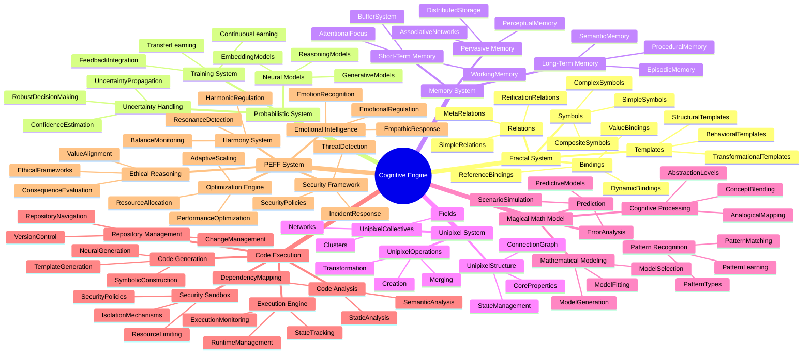
```mermaid
mindmap
  root((Cognitive Engine))
    Fractal System
      Symbols
        SimpleSymbols
        ComplexSymbols
        CompositeSymbols
      Relations
        SimpleRelations
        ReificationRelations
        MetaRelations
      Bindings
        ValueBindings
        ReferenceBindings
        DynamicBindings
      Templates
        StructuralTemplates
        BehavioralTemplates
        TransformationalTemplates
    Probabilistic System
      Neural Models
        EmbeddingModels
        ReasoningModels
        GenerativeModels
      Training System
        ContinuousLearning
        FeedbackIntegration
        TransferLearning
      Uncertainty Handling
        ConfidenceEstimation
        UncertaintyPropagation
        RobustDecisionMaking
    Memory System
      Short-Term Memory
        WorkingMemory
        AttentionalFocus
        BufferSystem
      Long-Term Memory
        EpisodicMemory
        SemanticMemory
        ProceduralMemory
      Pervasive Memory
        DistributedStorage
        AssociativeNetworks
        PerceptualMemory
    Unipixel System
      UnipixelStructure
        CoreProperties
        StateManagement
        ConnectionGraph
      UnipixelOperations
        Creation
        Transformation
        Merging
      UnipixelCollectives
        Clusters
        Networks
        Fields
    Magical Math Model
      Pattern Recognition
        PatternTypes
        PatternMatching
        PatternLearning
      Mathematical Modeling
        ModelGeneration
        ModelFitting
        ModelSelection
      Cognitive Processing
        AbstractionLevels
        AnalogicalMapping
        ConceptBlending
      Prediction
        PredictiveModels
        ScenarioSimulation
        ErrorAnalysis
    Code Execution
      Code Analysis
        StaticAnalysis
        SemanticAnalysis
        DependencyMapping
      Code Generation
        TemplateGeneration
        NeuralGeneration
        SymbolicConstruction
      Execution Engine
        RuntimeManagement
        StateTracking
        ExecutionMonitoring
      Repository Management
        RepositoryNavigation
        VersionControl
        ChangeManagement
      Security Sandbox
        IsolationMechanisms
        ResourceLimiting
        SecurityPolicies
    PEFF System
      Harmony System
        BalanceMonitoring
        HarmonicRegulation
        ResonanceDetection
      Optimization Engine
        ResourceAllocation
        PerformanceOptimization
        AdaptiveScaling
      Security Framework
        ThreatDetection
        SecurityPolicies
        IncidentResponse
      Ethical Reasoning
        EthicalFrameworks
        ValueAlignment
        ConsequenceEvaluation
      Emotional Intelligence
        EmotionRecognition
        EmotionalRegulation
        EmpathicResponse
```

## Resource Usage and Scalability

### Resource Allocation

How resources are allocated across components:

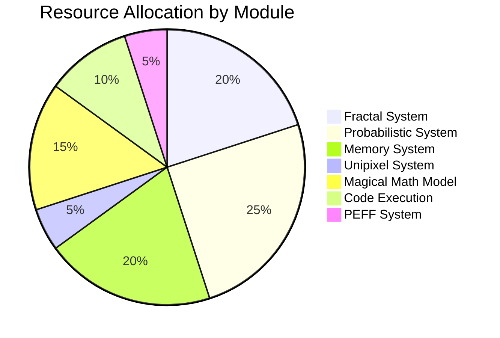
```mermaid
pie title Resource Allocation by Module
    "Fractal System" : 20
    "Probabilistic System" : 25
    "Memory System" : 20
    "Unipixel System" : 5
    "Magical Math Model" : 15
    "Code Execution" : 10
    "PEFF System" : 5
```

### Scaling Relationships

How the system scales with increased complexity:

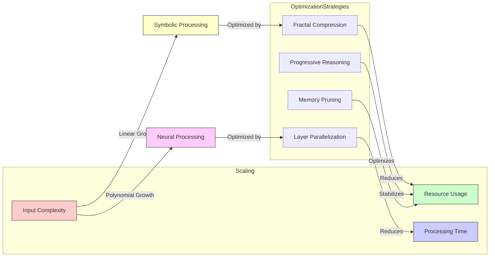
```mermaid
graph LR
    subgraph Scaling
        InputComplexity[Input Complexity]
        ResourceUsage[Resource Usage]
        ProcessingTime[Processing Time]
    end
    
    subgraph OptimizationStrategies
        FractalCompression[Fractal Compression]
        LayerParallelization[Layer Parallelization] 
        ProgressiveReasoning[Progressive Reasoning]
        MemoryPruning[Memory Pruning]
    end
    
    InputComplexity -->|Linear Growth| SymbolicProcessing[Symbolic Processing]
    InputComplexity -->|Polynomial Growth| NeuralProcessing[Neural Processing]
    
    SymbolicProcessing -->|Optimized by| FractalCompression
    NeuralProcessing -->|Optimized by| LayerParallelization
    
    FractalCompression -->|Reduces| ResourceUsage
    LayerParallelization -->|Reduces| ProcessingTime
    ProgressiveReasoning -->|Stabilizes| ResourceUsage
    MemoryPruning -->|Optimizes| ResourceUsage
    
    style InputComplexity fill:#ffcccc,stroke:#333,stroke-width:1px
    style ResourceUsage fill:#ccffcc,stroke:#333,stroke-width:1px
    style ProcessingTime fill:#ccccff,stroke:#333,stroke-width:1px
    style SymbolicProcessing fill:#ffffcc,stroke:#333,stroke-width:1px
    style NeuralProcessing fill:#ffccff,stroke:#333,stroke-width:1px
```

## Integration Points

### External System Integration

How the Cognitive Engine integrates with external systems:

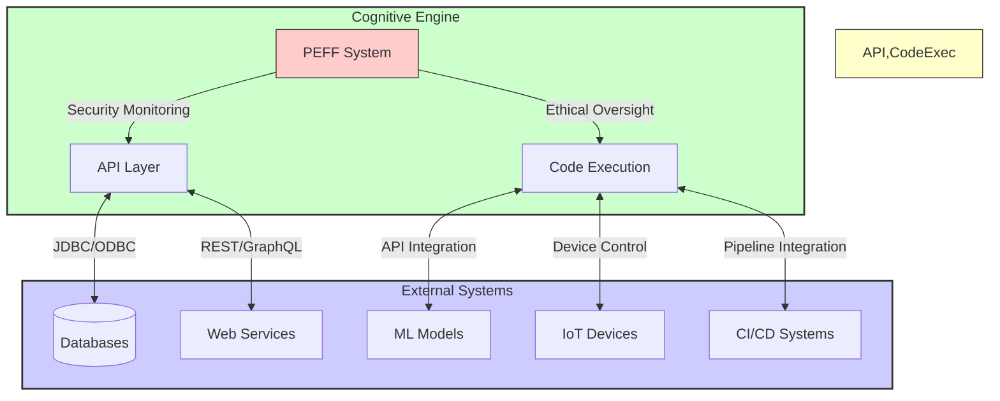
```mermaid
flowchart TB
    subgraph CE[Cognitive Engine]
        API[API Layer]
        CodeExec[Code Execution]
        PEFF[PEFF System]
    end
    
    subgraph ExternalSystems[External Systems]
        Databases[(Databases)]
        WebServices[Web Services]
        ML[ML Models]
        IoT[IoT Devices]
        CI[CI/CD Systems]
    end
    
    API <-->|REST/GraphQL| WebServices
    API <-->|JDBC/ODBC| Databases
    CodeExec <-->|API Integration| ML
    CodeExec <-->|Device Control| IoT
    CodeExec <-->|Pipeline Integration| CI
    
    PEFF -->|Security Monitoring| API
    PEFF -->|Ethical Oversight| CodeExec
    
    style CE fill:#ccffcc,stroke:#333,stroke-width:2px
    style ExternalSystems fill:#ccccff,stroke:#333,stroke-width:2px
    style API,CodeExec fill:#ffffcc,stroke:#333,stroke-width:1px
    style PEFF fill:#ffcccc,stroke:#333,stroke-width:1px
```

## Development and Extension

### Module Extension Points

The primary extension points for each module:

```mermaid
graph TD
    subgraph ExtensionPoints[Extension Points]
        FS[Fractal System Extensions]
        PS[Probabilistic System Extensions]
        MS[Memory System Extensions]
        MMM[MMM Extensions]
        CE[Code Execution Extensions]
        PEFF[PEFF Extensions]
    end
    
    FS -->|Custom Symbol Types| FS1[New Symbol Types]
    FS -->|Relation Patterns| FS2[Custom Relations]
    FS -->|Template Libraries| FS3[Domain Templates]
    
    PS -->|Custom Models| PS1[Neural Models]
    PS -->|Integration Adapters| PS2[External AI Integration]
    PS -->|Training Strategies| PS3[Learning Methods]
    
    MS -->|Storage Adapters| MS1[Custom Storage Backends]
    MS -->|Indexing Strategies| MS2[Custom Memory Indexing]
    MS -->|Retrieval Algorithms| MS3[Specialized Retrievers]
    
    MMM -->|Pattern Detectors| MMM1[Custom Pattern Types]
    MMM -->|Mathematical Models| MMM2[Domain-Specific Models]
    MMM -->|Predictive Engines| MMM3[Specialized Predictors]
    
    CE -->|Language Support| CE1[New Programming Languages]
    CE -->|Tool Integration| CE2[Development Tool Integration]
    CE -->|Code Generators| CE3[Domain-Specific Generators]
    
    PEFF -->|Ethical Frameworks| PEFF1[Custom Ethical Frameworks]
    PEFF -->|Security Policies| PEFF2[Security Extensions]
    PEFF -->|Optimization Strategies| PEFF3[Resource Optimizers]
    
    classDef extension fill:#ccffcc,stroke:#333,stroke-width:1px
    classDef implementation fill:#ccccff,stroke:#333,stroke-width:1px
    
    class ExtensionPoints extension
    class FS1,FS2,FS3,PS1,PS2,PS3,MS1,MS2,MS3,MMM1,MMM2,MMM3,CE1,CE2,CE3,PEFF1,PEFF2,PEFF3 implementation
```

## Advanced Visualizations

### Cross-Domain Pattern Discovery

How patterns are discovered across different domains:

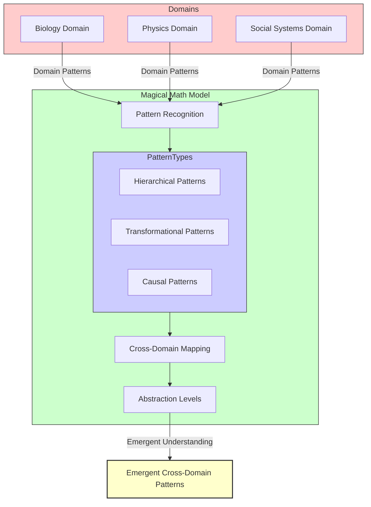
```mermaid
graph TB
    subgraph Domains
        Biology[Biology Domain]
        Physics[Physics Domain]
        Social[Social Systems Domain]
    end
    
    subgraph MMM[Magical Math Model]
        PatternRecognition[Pattern Recognition]
        
        subgraph PatternTypes
            Hierarchical[Hierarchical Patterns]
            Transformational[Transformational Patterns]
            Causal[Causal Patterns]
        end
        
        CrossDomainMapping[Cross-Domain Mapping]
        AbstractionLevels[Abstraction Levels]
    end
    
    Biology -->|Domain Patterns| PatternRecognition
    Physics -->|Domain Patterns| PatternRecognition
    Social -->|Domain Patterns| PatternRecognition
    
    PatternRecognition --> PatternTypes
    PatternTypes --> CrossDomainMapping
    CrossDomainMapping --> AbstractionLevels
    
    AbstractionLevels -->|Emergent Understanding| EmergentPatterns[Emergent Cross-Domain Patterns]
    
    style Domains fill:#ffcccc,stroke:#333,stroke-width:1px
    style MMM fill:#ccffcc,stroke:#333,stroke-width:1px
    style PatternTypes fill:#ccccff,stroke:#333,stroke-width:1px
    style EmergentPatterns fill:#ffffcc,stroke:#333,stroke-width:2px
```

### Hybrid Reasoning in Action

A detailed view of hybrid reasoning on a complex problem:

```mermaid
sequenceDiagram
    participant User
    participant CE as Cognitive Engine
    participant FS as Fractal System
    participant PS as Probabilistic System
    participant MS as Memory System
    participant MMM as Magical Math Model
    
    User->>CE: Complex Climate Question
    
    CE->>MS: Retrieve Domain Knowledge
    MS-->>CE: Climate Science Knowledge
    
    par Symbolic Processing
        CE->>FS: Create Climate Model Structure
        FS->>FS: Build Causal Network
        FS->>FS: Apply Climate Logic Rules
        FS-->>CE: Symbolic Climate Analysis
    and Neural Processing
        CE->>PS: Climate Data Analysis
        PS->>PS: Apply Climate Neural Models
        PS->>PS: Pattern Recognition
        PS-->>CE: Neural Climate Predictions
    end
    
    CE->>CE: Compare Approaches
    CE->>CE: Identify Conflicts
    
    CE->>MMM: Resolve Cross-Model Patterns
    MMM->>MMM: Find Harmonic Solution
    MMM-->>CE: Integrated Understanding
    
    CE->>FS: Refine Symbolic Model
    CE->>PS: Adjust Neural Weights
    
    CE->>CE: Generate Final Hybrid Solution
    
    CE-->>User: Comprehensive Climate Response
```

## Comprehensive System Interactions

### Full System Data Flow

The complete data flow across all components:

```mermaid
flowchart TB
    Input[User Input] --> Processing
    
    subgraph Processing[Query Processing]
        Parsing[Query Parsing]
        Interpretation[Semantic Interpretation]
        Planning[Response Planning]
    end
    
    Processing --> CoreSystems
    
    subgraph CoreSystems[Core Cognitive Systems]
        FS[Fractal System]
        PS[Probabilistic System]
        MS[Memory System]
    end
    
    CoreSystems --> SupportSystems
    
    subgraph SupportSystems[Specialized Systems]
        UP[Unipixel System]
        MMM[Magical Math Model]
        CE[Code Execution]
    end
    
    CoreSystems <--> SupportSystems
    
    SupportSystems --> Integration
    
    subgraph Integration[Integration & Regulation]
        HybridReasoning[Hybrid Reasoning]
        PatternIntegration[Pattern Integration]
        PEFF[PEFF System]
    end
    
    CoreSystems <--> Integration
    
    Integration --> ResponseGen
    
    subgraph ResponseGen[Response Generation]
        SolutionFormulation[Solution Formulation]
        Explanation[Explanation Generation]
        Validation[Solution Validation]
    end
    
    ResponseGen --> Output[User Output]
    
    style Input fill:#ffcccc,stroke:#333,stroke-width:1px
    style Processing fill:#ffddcc,stroke:#333,stroke-width:1px
    style CoreSystems fill:#ffeedd,stroke:#333,stroke-width:1px
    style SupportSystems fill:#ffffcc,stroke:#333,stroke-width:1px
    style Integration fill:#eeffdd,stroke:#333,stroke-width:1px
    style ResponseGen fill:#ddeeff,stroke:#333,stroke-width:1px
    style Output fill:#ccddff,stroke:#333,stroke-width:1px
```

## Conclusion

This visualization guide provides a comprehensive overview of the Cognitive Engine architecture, showing the complex interactions between components and the sophisticated processes that enable its advanced capabilities. Use these visualizations to understand how the different modules work together to achieve intelligent behavior through hybrid neuro-symbolic processing. 

### System State Transitions

The following diagram illustrates how the system transitions between different operational states:

```mermaid
stateDiagram-v2
    [*] --> Initialization
    
    state Initialization {
        [*] --> LoadingCore
        LoadingCore --> LoadingModules
        LoadingModules --> SystemReady
    }
    
    Initialization --> Idle
    
    state "Active Processing" as Active {
        Idle --> QueryAnalysis
        QueryAnalysis --> ResourceAllocation
        ResourceAllocation --> ParallelProcessing
        
        state ParallelProcessing {
            FractalProcessing
            ProbabilisticProcessing
            MemoryOperations
        }
        
        ParallelProcessing --> ResultIntegration
        ResultIntegration --> ResponseGeneration
    }
    
    Active --> Idle
    
    state "System Maintenance" as Maintenance {
        MemoryConsolidation
        PatternOptimization
        ResourceCleanup
    }
    
    Idle --> Maintenance
    Maintenance --> Idle
    
    state "Error Handling" as ErrorState {
        ErrorDetection
        ErrorRecovery
        StateRestoration
    }
    
    Active --> ErrorState
    ErrorState --> Idle
```

### Cross-Layer Information Flow

This diagram shows how information flows across different layers of the system:

```mermaid
flowchart TD
    subgraph L7[Layer 7: Self-Awareness]
        SA[Self-Awareness Engine]
        SM[System Monitoring]
    end
    
    subgraph L6[Layer 6: Integrative Understanding]
        IU[Integration Engine]
        EP[Emergent Properties]
    end
    
    subgraph L5[Layer 5: Meta Knowledge]
        MK[Meta Knowledge Base]
        CP[Cross-Pattern Analysis]
    end
    
    subgraph L4[Layer 4: Domain Knowledge]
        DK[Domain Knowledge Base]
        DM[Domain Models]
    end
    
    subgraph L3[Layer 3: Conceptual Systems]
        CS[Concept Engine]
        KG[Knowledge Graphs]
    end
    
    subgraph L2[Layer 2: Relational Structures]
        RS[Relation Engine]
        RB[Relation Bindings]
    end
    
    subgraph L1[Layer 1: Fundamental Units]
        UP[Unipixels]
        BE[Basic Elements]
    end
    
    %% Upward Flow
    UP & BE --> RS & RB
    RS & RB --> CS & KG
    CS & KG --> DK & DM
    DK & DM --> MK & CP
    MK & CP --> IU & EP
    IU & EP --> SA & SM
    
    %% Downward Flow
    SA & SM -.-> IU & EP
    IU & EP -.-> MK & CP
    MK & CP -.-> DK & DM
    DK & DM -.-> CS & KG
    CS & KG -.-> RS & RB
    RS & RB -.-> UP & BE
    
    %% Lateral Connections
    UP <--> BE
    RS <--> RB
    CS <--> KG
    DK <--> DM
    MK <--> CP
    IU <--> EP
    SA <--> SM
    
    classDef layer7 fill:#ffcccc,stroke:#333
    classDef layer6 fill:#ffd8cc,stroke:#333
    classDef layer5 fill:#ffe4cc,stroke:#333
    classDef layer4 fill:#fff0cc,stroke:#333
    classDef layer3 fill:#ffffcc,stroke:#333
    classDef layer2 fill:#e4ffcc,stroke:#333
    classDef layer1 fill:#ccffcc,stroke:#333
    
    class SA,SM layer7
    class IU,EP layer6
    class MK,CP layer5
    class DK,DM layer4
    class CS,KG layer3
    class RS,RB layer2
    class UP,BE layer1
```

### PEFF System Detailed Architecture

The following diagrams provide a deeper look into the Paradise Energy Fractal Force system:

```mermaid
graph TD
    subgraph PEFF[Paradise Energy Fractal Force Core]
        direction TB
        
        subgraph HarmonyEngine[Harmony Engine]
            HS[Harmony State]
            HO[Harmony Optimization]
            HC[Harmony Control]
        end
        
        subgraph EthicsEngine[Ethics Engine]
            EP[Ethical Principles]
            ER[Ethical Reasoning]
            ED[Ethical Decisions]
        end
        
        subgraph SecurityEngine[Security Engine]
            SA[Security Analysis]
            SP[Security Policies]
            SM[Security Monitoring]
        end
        
        subgraph EmotionalEngine[Emotional Intelligence]
            EA[Emotional Analysis]
            EM[Emotional Modeling]
            EE[Emotional Expression]
        end
    end
    
    subgraph Interfaces
        direction LR
        FSI[Fractal System Interface]
        PSI[Probabilistic System Interface]
        MSI[Memory System Interface]
        MMMI[MMM Interface]
        CEI[Code Execution Interface]
    end
    
    HarmonyEngine <--> FSI & PSI
    EthicsEngine <--> MSI & MMMI
    SecurityEngine <--> CEI
    EmotionalEngine <--> PSI & MSI
    
    classDef engine fill:#ffccaa,stroke:#333,stroke-width:2px
    classDef component fill:#aaccff,stroke:#333,stroke-width:1px
    classDef interface fill:#ccffaa,stroke:#333,stroke-width:1px
    
    class HarmonyEngine,EthicsEngine,SecurityEngine,EmotionalEngine engine
    class HS,HO,HC,EP,ER,ED,SA,SP,SM,EA,EM,EE component
    class FSI,PSI,MSI,MMMI,CEI interface
```

### PEFF Decision Flow

This diagram shows how PEFF makes decisions and maintains system harmony:

```mermaid
stateDiagram-v2
    [*] --> SystemMonitoring
    
    state "System Monitoring" as SystemMonitoring {
        [*] --> MetricCollection
        MetricCollection --> StateAnalysis
        StateAnalysis --> HarmonyEvaluation
    }
    
    state "Decision Making" as DecisionMaking {
        EthicalAssessment
        SecurityCheck
        EmotionalBalance
        ResourceOptimization
    }
    
    state "Action Implementation" as ActionImplementation {
        PolicyEnforcement
        SystemAdjustment
        FeedbackCollection
    }
    
    SystemMonitoring --> DecisionMaking: Harmony Threshold Crossed
    DecisionMaking --> ActionImplementation: Decision Made
    ActionImplementation --> SystemMonitoring: Action Complete
    
    state "Emergency Response" as EmergencyResponse {
        ThreatDetection
        ImmediateAction
        SystemProtection
    }
    
    SystemMonitoring --> EmergencyResponse: Critical Issue Detected
    EmergencyResponse --> SystemMonitoring: Emergency Resolved
```

### PEFF Optimization Flow

The following diagram illustrates how PEFF optimizes system resources and maintains balance:

```mermaid
flowchart TD
    subgraph ResourceMonitoring[Resource Monitoring]
        CPU[CPU Usage]
        Memory[Memory Usage]
        Storage[Storage Usage]
        Network[Network Usage]
    end
    
    subgraph Analysis[Resource Analysis]
        LoadAnalysis[Load Analysis]
        BottleneckDetection[Bottleneck Detection]
        PredictiveModeling[Predictive Modeling]
    end
    
    subgraph Optimization[Resource Optimization]
        Scaling[Dynamic Scaling]
        LoadBalancing[Load Balancing]
        CacheManagement[Cache Management]
    end
    
    subgraph Feedback[Optimization Feedback]
        PerformanceMetrics[Performance Metrics]
        SystemHealth[System Health]
        UserExperience[User Experience]
    end
    
    ResourceMonitoring --> Analysis
    Analysis --> Optimization
    Optimization --> Feedback
    Feedback -->|Continuous Improvement| ResourceMonitoring
    
    classDef monitoring fill:#ffcccc,stroke:#333
    classDef analysis fill:#ccffcc,stroke:#333
    classDef optimization fill:#ccccff,stroke:#333
    classDef feedback fill:#ffffcc,stroke:#333
    
    class CPU,Memory,Storage,Network monitoring
    class LoadAnalysis,BottleneckDetection,PredictiveModeling analysis
    class Scaling,LoadBalancing,CacheManagement optimization
    class PerformanceMetrics,SystemHealth,UserExperience feedback
```

### Memory System Architecture Details

The following diagrams provide a detailed view of the Memory System's architecture and operations:

```mermaid
graph TD
    subgraph MemorySystem[Memory System Core]
        direction TB
        
        subgraph STM[Short-Term Memory]
            WM[Working Memory]
            AF[Attentional Focus]
            TB[Temporary Buffers]
        end
        
        subgraph LTM[Long-Term Memory]
            EM[Episodic Memory]
            SM[Semantic Memory]
            PM[Procedural Memory]
        end
        
        subgraph MetaMemory[Meta Memory]
            MM[Memory Management]
            MI[Memory Indexing]
            MO[Memory Optimization]
        end
        
        subgraph MemoryOps[Memory Operations]
            Encoding[Encoding]
            Storage[Storage]
            Retrieval[Retrieval]
            Consolidation[Consolidation]
        end
    end
    
    STM <--> LTM
    LTM <--> MetaMemory
    MetaMemory --> MemoryOps
    MemoryOps --> STM
    MemoryOps --> LTM
    
    classDef stm fill:#ffcccc,stroke:#333
    classDef ltm fill:#ccffcc,stroke:#333
    classDef meta fill:#ccccff,stroke:#333
    classDef ops fill:#ffffcc,stroke:#333
    
    class WM,AF,TB stm
    class EM,SM,PM ltm
    class MM,MI,MO meta
    class Encoding,Storage,Retrieval,Consolidation ops
```

### Memory Consolidation Process

This diagram shows the memory consolidation process:

```mermaid
sequenceDiagram
    participant STM as Short-Term Memory
    participant HC as Hippocampus
    participant LTM as Long-Term Memory
    participant MM as Memory Management
    
    STM->>HC: New Information
    
    activate HC
    HC->>HC: Pattern Separation
    HC->>HC: Pattern Completion
    HC-->>STM: Immediate Recall
    
    loop Consolidation Cycle
        HC->>LTM: Gradual Transfer
        LTM->>LTM: Integration
        LTM-->>HC: Feedback
    end
    
    HC->>MM: Update Indices
    deactivate HC
    
    MM->>LTM: Optimize Storage
    LTM-->>MM: Storage Confirmed
    
    MM->>STM: Clear Buffer
    STM-->>MM: Buffer Cleared
```

### Memory Access Patterns

The following diagram illustrates different memory access patterns:

```mermaid
stateDiagram-v2
    [*] --> Idle
    
    state "Memory Access" as Access {
        DirectAccess: Immediate Retrieval
        AssociativeAccess: Pattern-Based Retrieval
        HierarchicalAccess: Structured Retrieval
    }
    
    state "Pattern Matching" as Matching {
        ExactMatch: Direct Pattern Match
        FuzzyMatch: Approximate Match
        SemanticMatch: Meaning-Based Match
    }
    
    state "Result Processing" as Processing {
        Filtering: Remove Irrelevant Results
        Ranking: Sort by Relevance
        Integration: Combine Results
    }
    
    Idle --> Access: Query Received
    Access --> Matching: Access Pattern Selected
    Matching --> Processing: Matches Found
    Processing --> Idle: Results Returned
    
    state "Error Recovery" as Recovery {
        ErrorDetection
        AlternativeAccess
        GracefulDegradation
    }
    
    Access --> Recovery: Access Failed
    Matching --> Recovery: No Matches
    Recovery --> Access: Retry Access
```

### Memory Optimization Flow

This diagram shows how the Memory System optimizes its operations:

```mermaid
flowchart TD
    subgraph Monitoring[Memory Monitoring]
        Usage[Memory Usage]
        Access[Access Patterns]
        Performance[Performance Metrics]
    end
    
    subgraph Analysis[Memory Analysis]
        UsageAnalysis[Usage Analysis]
        PatternAnalysis[Pattern Analysis]
        BottleneckDetection[Bottleneck Detection]
    end
    
    subgraph Optimization[Memory Optimization]
        Compression[Data Compression]
        Indexing[Index Optimization]
        Caching[Cache Management]
        Defragmentation[Memory Defragmentation]
    end
    
    subgraph Validation[Optimization Validation]
        PerformanceCheck[Performance Check]
        IntegrityCheck[Data Integrity]
        AccessCheck[Access Speed]
    end
    
    Monitoring --> Analysis
    Analysis --> Optimization
    Optimization --> Validation
    Validation -->|Feedback Loop| Monitoring
    
    classDef monitoring fill:#ffcccc,stroke:#333
    classDef analysis fill:#ccffcc,stroke:#333
    classDef optimization fill:#ccccff,stroke:#333
    classDef validation fill:#ffffcc,stroke:#333
    
    class Usage,Access,Performance monitoring
    class UsageAnalysis,PatternAnalysis,BottleneckDetection analysis
    class Compression,Indexing,Caching,Defragmentation optimization
    class PerformanceCheck,IntegrityCheck,AccessCheck validation
``` 