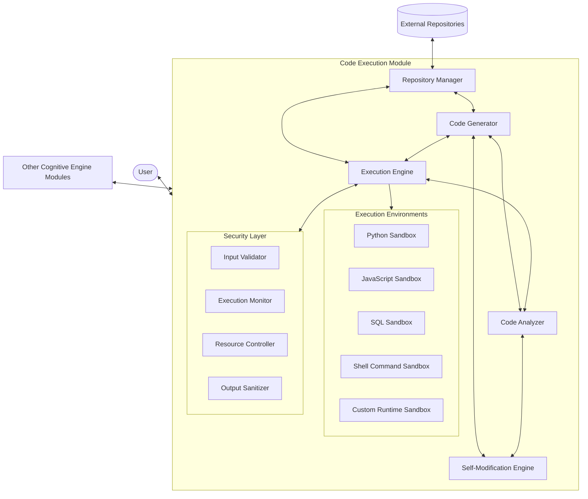
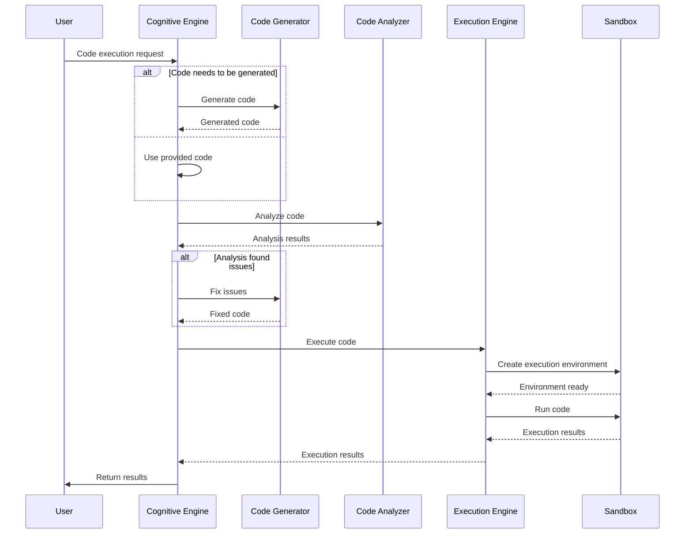
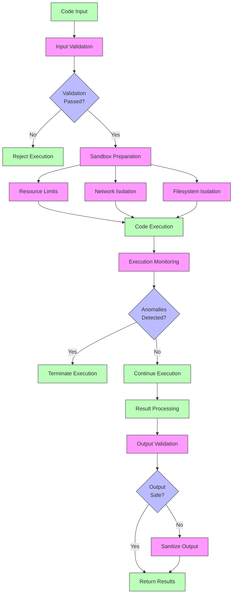

# Code Execution

The Code Execution module is a specialized component of the Cognitive Engine that enables the system to execute, manage, and operate code, providing self-modification capabilities and integration with external code repositories.

## Overview

The Code Execution module provides critical capabilities for working with code:

- **Code Generation**: Creating code to solve specific problems or implement solutions
- **Code Execution**: Safely running code in various languages and environments
- **Code Analysis**: Understanding and evaluating code structure and functionality
- **Self-Modification**: Enabling the system to modify its own code and functionality
- **Repository Integration**: Working with external code repositories and version control

```mermaid
graph TD
    A[Code Execution] --> B[Code Generator]
    A --> C[Execution Engine]
    A --> D[Code Analyzer]
    A --> E[Self-Modification]
    A --> F[Repository Manager]
    
    B --> B1[Template-Based]
    B --> B2[Neural Generation]
    B --> B3[Hybrid Generation]
    B --> B4[Library Adaptation]
    
    C --> C1[Sandbox Environment]
    C --> C2[Language Runtimes]
    C --> C3[Execution Monitors]
    C --> C4[Result Handlers]
    
    D --> D1[Static Analysis]
    D --> D2[Dynamic Analysis]
    D --> D3[Security Scanning]
    D --> D4[Performance Profiling]
    
    E --> E1[Code Patches]
    E --> E2[Feature Additions]
    E --> E3[Architecture Mods]
    E --> E4[Self-Improvement]
    
    F --> F1[Git Integration]
    F --> F2[Dependency Management]
    F --> F3[Version Control]
    F --> F4[Deploy Pipelines]
```



## System Architecture

The Code Execution module has a comprehensive architecture designed for safety, flexibility, and power:



## Components

### Code Generator (`generator.py`)

The Code Generator creates code to solve problems or implement solutions:

- **TemplateBasedGenerator**: Creates code from pre-defined templates
- **NeuralCodeGenerator**: Generates code using neural models
- **HybridGenerator**: Combines template and neural approaches
- **LibraryAdapter**: Adapts existing libraries and code snippets

Example:
```python
from cognitive_engine.code_execution import CodeGenerator

# Initialize code generator
generator = CodeGenerator(
    generation_type="hybrid",  # "template", "neural", or "hybrid"
    language="python",
    model="gpt-4" if generation_type in ["neural", "hybrid"] else None
)

# Generate code with a prompt
code = generator.generate(
    prompt="Create a function that calculates the Fibonacci sequence up to n terms",
    context={"language": "python", "style": "functional"},
    requirements=["efficiency", "readability"]
)

print(code)

# Generate code with specifications
code = generator.generate_from_spec(
    inputs=[{"name": "n", "type": "int", "description": "Number of terms"}],
    outputs=[{"type": "list[int]", "description": "Fibonacci sequence"}],
    behavior="Calculate the Fibonacci sequence from 0 to n-1 terms",
    examples=[
        {"input": {"n": 5}, "output": [0, 1, 1, 2, 3]},
        {"input": {"n": 1}, "output": [0]}
    ]
)
```

### Execution Engine (`executor.py`)

The Execution Engine safely runs code in various environments:

- **SandboxEnvironment**: Creates isolated environments for safe execution
- **LanguageRuntime**: Manages runtime environments for different languages
- **ExecutionMonitor**: Monitors execution for errors, resource usage, etc.
- **ResultHandler**: Processes and formats execution results

Example:
```python
from cognitive_engine.code_execution import ExecutionEngine

# Initialize execution engine
executor = ExecutionEngine(
    sandbox_type="container",  # "process", "container", or "vm"
    timeout_seconds=30,
    max_memory_mb=500
)

# Define code to execute
python_code = """
def fibonacci(n):
    result = [0, 1]
    for i in range(2, n):
        result.append(result[i-1] + result[i-2])
    return result[:n]

result = fibonacci(10)
print(result)
"""

# Execute code
execution_result = executor.execute(
    code=python_code,
    language="python",
    input_data=None,
    execution_context={"allow_stdout": True, "allow_file_access": False}
)

print(f"Execution successful: {execution_result.success}")
print(f"Output: {execution_result.stdout}")
print(f"Error: {execution_result.stderr}")
print(f"Return value: {execution_result.return_value}")
print(f"Execution time: {execution_result.execution_time_ms}ms")
```

### Code Analyzer (`analyzer.py`)

The Code Analyzer evaluates and understands code:

- **StaticAnalyzer**: Analyzes code without execution
- **DynamicAnalyzer**: Analyzes code behavior during execution
- **SecurityScanner**: Identifies security vulnerabilities
- **PerformanceProfiler**: Profiles code performance

Example:
```python
from cognitive_engine.code_execution import CodeAnalyzer

# Initialize code analyzer
analyzer = CodeAnalyzer()

# Analyze code statically
static_analysis = analyzer.analyze_static(
    code=python_code,
    language="python",
    analysis_types=["syntax", "complexity", "style", "security"]
)

print(f"Code complexity: {static_analysis.complexity_score}")
print(f"Style compliance: {static_analysis.style_compliance}")
print(f"Security issues: {static_analysis.security_issues}")

# Analyze code dynamically
dynamic_analysis = analyzer.analyze_dynamic(
    code=python_code,
    language="python",
    execution_context={"input_size": 1000},
    analysis_types=["performance", "memory", "coverage"]
)

print(f"Execution time: {dynamic_analysis.execution_time_ms}ms")
print(f"Memory usage: {dynamic_analysis.peak_memory_usage_mb}MB")
print(f"Code coverage: {dynamic_analysis.code_coverage_percentage}%")
```

### Self-Modification Engine (`self_mod.py`)

The Self-Modification Engine enables the system to modify its own code:

- **CodePatcher**: Applies patches to existing code
- **FeatureAdder**: Adds new features to the system
- **ArchitectureModifier**: Makes structural changes to the system
- **SelfImprover**: Implements self-improvement capabilities

Example:
```python
from cognitive_engine.code_execution import SelfModificationEngine

# Initialize self-modification engine
self_mod = SelfModificationEngine(
    safety_level="high",  # "low", "medium", "high"
    modification_scope=["feature_additions", "bug_fixes"],
    approval_required=True
)

# Create a code modification
modification = self_mod.create_modification(
    target_module="cognitive_engine.memory",
    modification_type="feature_addition",
    description="Add caching mechanism to improve retrieval performance",
    code_changes={
        "memory.py": {
            "additions": [
                (120, "def get_cached_item(self, key):\n    if key in self._cache:\n        return self._cache[key]\n    return None"),
                (245, "self._cache[key] = value  # Cache the retrieved item")
            ],
            "removals": [(246, 246)]
        }
    }
)

# Validate the modification
validation = self_mod.validate_modification(modification)
print(f"Validation passed: {validation.is_valid}")
print(f"Issues found: {validation.issues}")

# Apply the modification if valid
if validation.is_valid:
    result = self_mod.apply_modification(modification)
    print(f"Modification applied: {result.success}")
    print(f"Applied changes: {result.applied_changes}")
```

### Repository Manager (`repo_manager.py`)

The Repository Manager integrates with external code repositories:

- **GitIntegration**: Works with Git repositories
- **DependencyManager**: Manages code dependencies
- **VersionControl**: Handles version control operations
- **DeploymentPipeline**: Manages deployment processes

Example:
```python
from cognitive_engine.code_execution import RepositoryManager

# Initialize repository manager
repo_manager = RepositoryManager()

# Clone a repository
repo = repo_manager.clone_repository(
    url="https://github.com/example/repository.git",
    branch="main",
    local_path="./repos/example"
)

# Analyze repository structure
repo_structure = repo_manager.analyze_repository(repo)
print(f"Repository files: {len(repo_structure.files)}")
print(f"Main technologies: {repo_structure.technologies}")

# Create a branch for changes
branch = repo_manager.create_branch(repo, "feature/new-functionality")

# Make changes
repo_manager.add_file(
    repo=repo,
    file_path="new_module.py",
    content="# New module\n\ndef new_function():\n    return 'Hello world'\n"
)

# Commit and push changes
commit = repo_manager.commit(repo, "Add new module with greeting function")
repo_manager.push(repo, branch)

# Create pull request
pr = repo_manager.create_pull_request(
    repo=repo,
    title="Add new greeting functionality",
    description="This PR adds a new module with greeting functionality",
    base_branch="main",
    head_branch="feature/new-functionality"
)
```

## Execution Flow

The Code Execution module follows a structured flow for executing code:



## Safety and Security

The Code Execution module implements multiple layers of security to ensure safe execution:



## Integration with Other Modules

### Code Execution and Fractal System

Code Execution integrates with the Fractal System to provide executable representations of symbolic structures:

```python
from cognitive_engine.code_execution import CodeGenerator
from cognitive_engine.fractal import FractalSystem, Symbol

# Initialize systems
generator = CodeGenerator()
fractal = FractalSystem(levels=7)

# Create a symbolic algorithm representation
algorithm_symbol = Symbol("quicksort", properties={"type": "algorithm", "complexity": "O(n log n)"})
fractal.add_symbol(algorithm_symbol, layer=4)

# Create related symbols for components
partition_symbol = Symbol("partition", properties={"type": "function", "role": "divide"})
fractal.add_symbol(partition_symbol, layer=3)
fractal.add_relation(algorithm_symbol, partition_symbol, "contains")

# Generate executable code from symbolic representation
code = generator.generate_from_symbol(
    symbol=algorithm_symbol,
    fractal_system=fractal,
    language="python",
    style="functional"
)

print(code)
```

### Code Execution and Probabilistic System

Code Execution works with the Probabilistic System for neural code generation and understanding:

```python
from cognitive_engine.code_execution import CodeGenerator
from cognitive_engine.probabilistic import LLMInterface

# Initialize systems
llm = LLMInterface(model="gpt-4")
generator = CodeGenerator(llm=llm)

# Generate code with LLM assistance
code = generator.generate(
    prompt="Write a function to implement a binary search tree with insert, delete, and search operations",
    language="python",
    style="object-oriented"
)

# Analyze code semantics
code_semantics = llm.analyze_code(
    code=code,
    analysis_type="semantic",
    language="python"
)

print(f"Code purpose: {code_semantics.purpose}")
print(f"Main functionality: {code_semantics.functionality}")
print(f"Design patterns: {code_semantics.design_patterns}")
```

### Code Execution and Memory System

Code Execution integrates with the Memory System to store and retrieve code snippets:

```python
from cognitive_engine.code_execution import CodeGenerator
from cognitive_engine.memory import PervasiveMemory

# Initialize systems
memory = PervasiveMemory()
generator = CodeGenerator()

# Store code in memory
code_snippet = """
def fibonacci(n):
    result = [0, 1]
    for i in range(2, n):
        result.append(result[i-1] + result[i-2])
    return result[:n]
"""

memory_id = memory.store(
    content=code_snippet,
    metadata={
        "type": "code_snippet",
        "language": "python",
        "function": "fibonacci",
        "algorithm_type": "sequence_generation"
    }
)

# Retrieve code from memory
retrieved_snippets = memory.retrieve(
    query="python fibonacci sequence",
    filter={"type": "code_snippet"},
    limit=5
)

# Generate new code based on retrieved snippets
enhanced_code = generator.enhance_code(
    base_code=retrieved_snippets[0].content,
    enhancements=["optimization", "documentation", "error_handling"]
)

print(enhanced_code)
```

## API Reference

### Code Generation

```python
# Initialize code generator
generator = CodeGenerator(
    generation_type="hybrid",
    language="python",
    model="gpt-4"
)

# Generate code from natural language
code = generator.generate(
    prompt="Create a REST API endpoint for user registration",
    context={"framework": "flask", "database": "sqlalchemy"},
    requirements=["input_validation", "error_handling", "password_hashing"]
)

# Generate code from specifications
code = generator.generate_from_spec(
    function_name="register_user",
    inputs=[
        {"name": "username", "type": "str"},
        {"name": "password", "type": "str"},
        {"name": "email", "type": "str"}
    ],
    outputs=[{"type": "dict", "description": "Registration result"}],
    behavior="Register a new user with validation"
)

# Modify existing code
modified_code = generator.modify_code(
    original_code=existing_code,
    modifications=["add_logging", "improve_error_handling"]
)
```

### Code Execution

```python
# Initialize execution engine
executor = ExecutionEngine(
    sandbox_type="container",
    timeout_seconds=30,
    max_memory_mb=500
)

# Execute code with different languages
python_result = executor.execute(
    code=python_code,
    language="python"
)

javascript_result = executor.execute(
    code=javascript_code,
    language="javascript"
)

# Execute with input data
result = executor.execute(
    code="def process(data): return {k: v * 2 for k, v in data.items()}",
    language="python",
    input_data={"a": 1, "b": 2, "c": 3}
)

# Execute with specific permissions
result = executor.execute(
    code=code,
    language="python",
    permissions={"file_read": ["./data"], "network": False}
)
```

### Code Analysis

```python
# Initialize code analyzer
analyzer = CodeAnalyzer()

# Analyze code quality
quality_analysis = analyzer.analyze_quality(
    code=code,
    language="python",
    metrics=["complexity", "maintainability", "documentation"]
)

# Analyze security
security_analysis = analyzer.analyze_security(
    code=code,
    language="python",
    vulnerability_types=["injection", "overflow", "data_exposure"]
)

# Analyze performance
performance_analysis = analyzer.analyze_performance(
    code=code,
    language="python",
    test_cases=[
        {"input": small_input, "name": "small_case"},
        {"input": large_input, "name": "large_case"}
    ]
)
```

### Self-Modification

```python
# Initialize self-modification engine
self_mod = SelfModificationEngine(
    safety_level="high",
    modification_scope=["feature_additions", "optimizations"]
)

# Propose a modification
modification = self_mod.propose_modification(
    target="cognitive_engine.memory.retrieval",
    improvement_type="performance",
    description="Improve retrieval speed for large datasets"
)

# Validate modification
validation = self_mod.validate_modification(modification)

# Apply modification
if validation.is_valid:
    result = self_mod.apply_modification(modification)
```

### Repository Management

```python
# Initialize repository manager
repo_manager = RepositoryManager()

# Clone repository
repo = repo_manager.clone_repository(
    url="https://github.com/example/repo.git",
    branch="main"
)

# Browse repository
files = repo_manager.list_files(repo, path="/src")

# Read file
file_content = repo_manager.read_file(repo, path="/src/main.py")

# Create branch and commit changes
branch = repo_manager.create_branch(repo, "feature/new-function")
repo_manager.edit_file(repo, path="/src/main.py", content=new_content)
repo_manager.commit(repo, message="Add new function")
```

## Example Applications

### Automated Bug Fixing

```python
from cognitive_engine.code_execution import CodeExecutor, CodeAnalyzer, CodeGenerator

# Initialize components
executor = CodeExecutor()
analyzer = CodeAnalyzer()
generator = CodeGenerator()

# Code with a bug
buggy_code = """
def calculate_average(numbers):
    total = 0
    for num in numbers:
        total += num
    return total / len(numbers)  # Bug: Division by zero if numbers is empty
"""

# Identify bug
analysis = analyzer.analyze_security(
    code=buggy_code,
    language="python",
    vulnerability_types=["arithmetic_error"]
)

# Generate fix
if analysis.issues:
    fixed_code = generator.fix_issues(
        code=buggy_code,
        issues=analysis.issues,
        language="python"
    )
    
    # Verify fix
    test_cases = [
        {"input": [1, 2, 3, 4, 5], "expected": 3.0},
        {"input": [], "expected": None}  # Should handle empty list
    ]
    
    for test_case in test_cases:
        result = executor.execute(
            code=fixed_code + f"\nresult = calculate_average({test_case['input']})",
            language="python"
        )
        
        print(f"Test case {test_case['input']}: {'Passed' if result.success else 'Failed'}")
```

### Code Translation

```python
from cognitive_engine.code_execution import CodeGenerator, CodeAnalyzer

# Initialize components
generator = CodeGenerator()
analyzer = CodeAnalyzer()

# Original JavaScript code
javascript_code = """
function quickSort(arr) {
    if (arr.length <= 1) {
        return arr;
    }
    
    const pivot = arr[Math.floor(arr.length / 2)];
    const left = arr.filter(x => x < pivot);
    const middle = arr.filter(x => x === pivot);
    const right = arr.filter(x => x > pivot);
    
    return [...quickSort(left), ...middle, ...quickSort(right)];
}
"""

# Analyze the code to understand its functionality
analysis = analyzer.analyze_static(
    code=javascript_code,
    language="javascript",
    analysis_types=["semantics", "structure"]
)

# Translate to Python
python_code = generator.translate_code(
    source_code=javascript_code,
    source_language="javascript",
    target_language="python",
    preserve_comments=True,
    maintain_style=True
)

print("Translated Python code:")
print(python_code)

# Translate to other languages
languages = ["java", "rust", "go"]
for lang in languages:
    translated_code = generator.translate_code(
        source_code=javascript_code,
        source_language="javascript",
        target_language=lang
    )
    print(f"\nTranslated {lang} code:")
    print(translated_code)
```

### Automated Testing

```python
from cognitive_engine.code_execution import CodeExecutor, CodeGenerator, CodeAnalyzer

# Initialize components
executor = CodeExecutor()
generator = CodeGenerator()
analyzer = CodeAnalyzer()

# Code to test
code = """
def is_prime(n):
    if n <= 1:
        return False
    if n <= 3:
        return True
    if n % 2 == 0 or n % 3 == 0:
        return False
    i = 5
    while i * i <= n:
        if n % i == 0 or n % (i + 2) == 0:
            return False
        i += 6
    return True
"""

# Generate test cases
test_cases = generator.generate_test_cases(
    code=code,
    function_name="is_prime",
    language="python",
    test_coverage=["edge_cases", "normal_cases", "random_cases"],
    num_tests=10
)

# Create test suite
test_suite = generator.create_test_suite(
    code=code,
    test_cases=test_cases,
    test_framework="pytest",
    language="python"
)

# Execute tests
test_result = executor.execute(
    code=test_suite,
    language="python",
    execution_context={"testing": True}
)

# Analyze test results
coverage = analyzer.analyze_test_coverage(
    code=code,
    test_suite=test_suite,
    test_results=test_result,
    language="python"
)

print(f"Test pass rate: {coverage.pass_rate}%")
print(f"Code coverage: {coverage.code_coverage}%")
print(f"Edge cases tested: {coverage.edge_cases_count}")
```

## Best Practices

1. **Safety First**: Always use sandboxed environments for code execution
2. **Resource Limits**: Set appropriate timeout and memory limits
3. **Validation**: Validate all inputs and outputs
4. **Error Handling**: Implement comprehensive error handling for execution failures
5. **Version Control**: Maintain proper version control for generated code
6. **Documentation**: Generate code with clear documentation
7. **Testing**: Validate generated code with automated tests

## Troubleshooting

### Common Issues

- **Sandbox Escape**: Code attempting to break out of execution sandbox
  - Solution: Implement multiple security layers and strict permission models

- **Resource Exhaustion**: Code consuming excessive resources
  - Solution: Set and enforce strict resource limits with monitoring

- **Generation Quality**: Poor quality of generated code
  - Solution: Enhance prompts, use hybrid generation, and implement post-generation quality checks

- **Language Compatibility**: Issues with specific programming languages
  - Solution: Ensure appropriate language-specific runtimes are properly configured

## Extending the System

The Code Execution module can be extended with:

- Custom language support for additional programming languages
- Specialized execution environments for specific use cases
- Enhanced code generation templates for domain-specific applications
- Custom static analysis rules for specific code quality standards

## References

- Software engineering best practices
- Secure coding standards
- Sandboxing technologies
- Static and dynamic code analysis
- Neural code generation research 