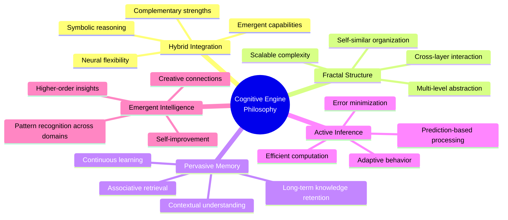
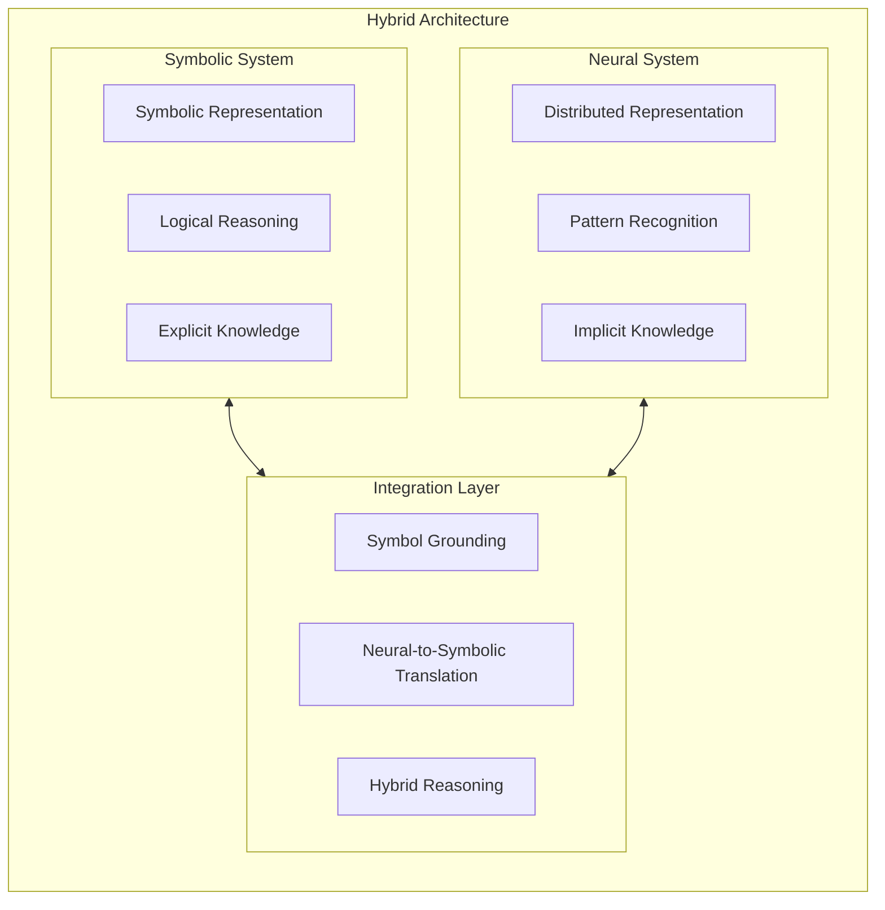
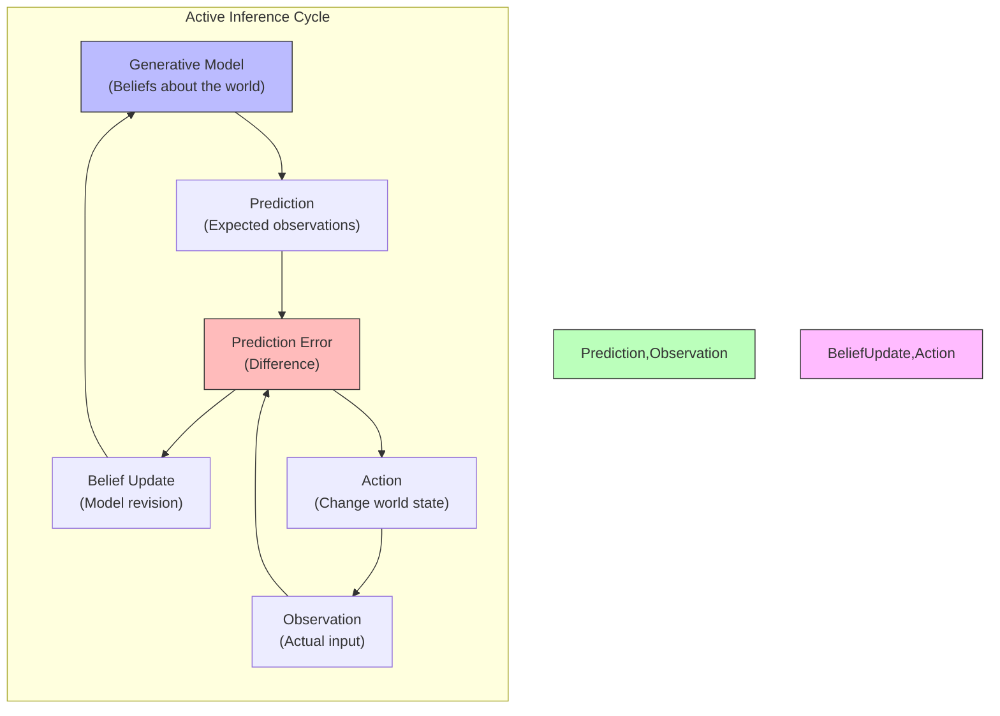
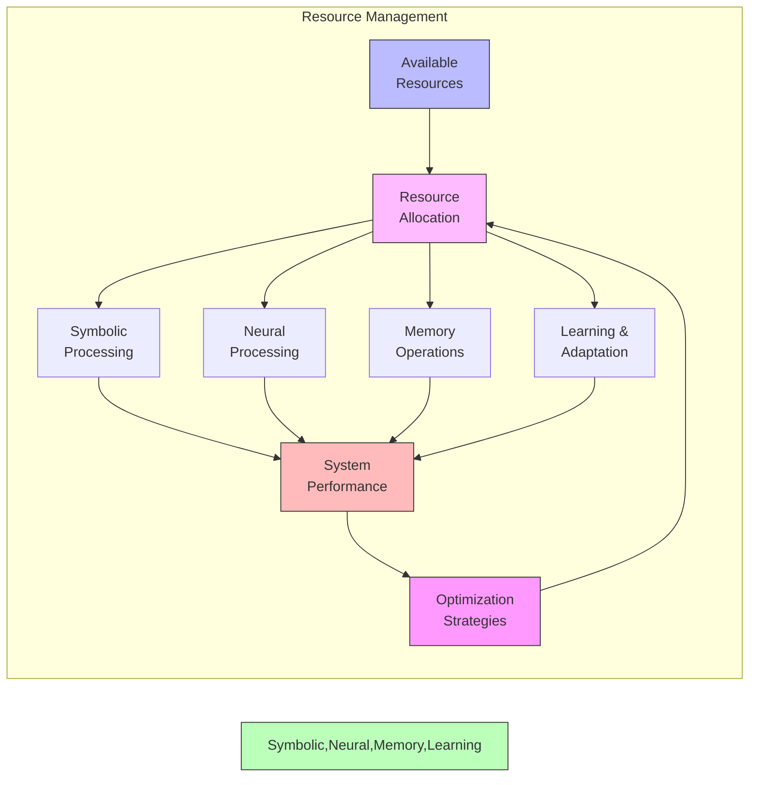
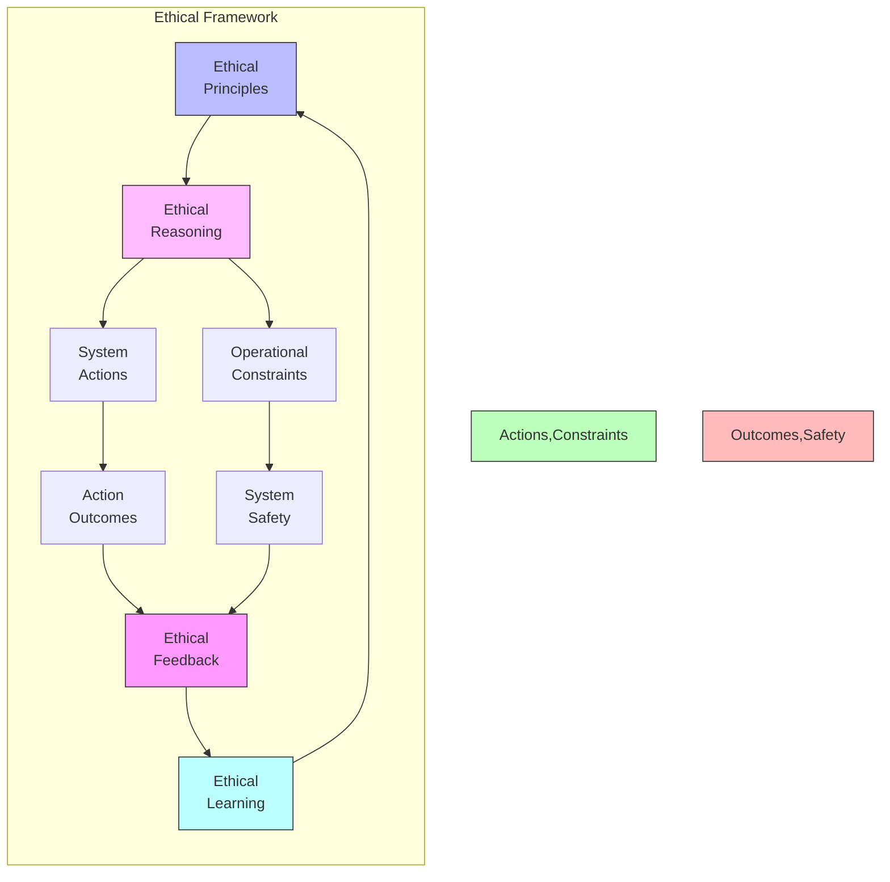
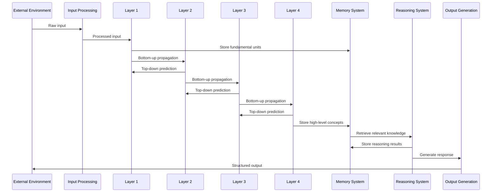

# Design Principles

This document outlines the core design principles that guide the development of the Cognitive Engine. These principles form the foundation of the system architecture and inform technical decisions across all components.

## Core Philosophy

The Cognitive Engine is built on the philosophy of creating a hybrid AI system that combines the best aspects of symbolic and neural approaches, organized in a fractal structure across multiple layers of abstraction. The design strives for a balance between power, flexibility, interpretability, and efficiency.



## Key Design Principles

### 1. Hybrid Neuro-Symbolic Architecture

The Cognitive Engine integrates symbolic and neural approaches, leveraging the strengths of each while mitigating their weaknesses.



**Key Aspects:**
- **Symbolic System**: Handles explicit knowledge representation, logical reasoning, and interpretable operations
- **Neural System**: Manages pattern recognition, learning from data, and handling uncertainty
- **Integration Layer**: Connects symbolic and neural components through symbol grounding and bidirectional translation

**Benefits:**
- Combines precision of symbolic systems with the flexibility of neural networks
- Enables both deductive reasoning and learning from data
- Provides interpretability while maintaining adaptability
- Allows for both knowledge-based and data-driven approaches

### 2. Fractal Organization

The system is organized fractally across seven layers of abstraction, with self-similar structures at each level.

```mermaid
graph TD
    L1[Layer 1:<br/>Fundamental Units] --> L2[Layer 2:<br/>Relational Structures]
    L2 --> L3[Layer 3:<br/>Conceptual Systems]
    L3 --> L4[Layer 4:<br/>Domain Knowledge]
    L4 --> L5[Layer 5:<br/>Meta Knowledge]
    L5 --> L6[Layer 6:<br/>Integrative Understanding]
    L6 --> L7[Layer 7:<br/>Self-awareness]
    
    subgraph "Layer Structure"
        direction TB
        
        Symbols --> Relations
        Relations --> Unipixels
        Unipixels --> Patterns
    end
    
    L3 -.-> "Layer Structure"
    
    style L1 fill:#f9f,stroke:#333,stroke-width:2px
    style L2 fill:#bbf,stroke:#333,stroke-width:2px
    style L3 fill:#bfb,stroke:#333,stroke-width:2px
    style L4 fill:#fbf,stroke:#333,stroke-width:2px
    style L5 fill:#fbb,stroke:#333,stroke-width:2px
    style L6 fill:#bff,stroke:#333,stroke-width:2px
    style L7 fill:#ffb,stroke:#333,stroke-width:2px
```

**Fractal Properties:**
- Each layer contains the same types of components (symbols, relations, unipixels, patterns)
- Higher layers represent more abstract concepts and integrate information from lower layers
- Information flows both upward (abstraction) and downward (specification)
- Cross-layer patterns create rich representational capabilities

**Benefits:**
- Scalable complexity management
- Hierarchical abstraction with consistent principles
- Self-similar architecture simplifies implementation
- Natural framework for cross-layer pattern recognition

### 3. Active Inference and Free Energy Principle

The system operates on active inference principles, using prediction and error minimization to efficiently process information.



**Key Components:**
- **Generative Model**: Internal model predicting expected observations
- **Prediction Error**: Discrepancy between predictions and observations
- **Belief Update**: Revising the model to minimize prediction errors
- **Action**: Modifying the environment to align with predictions

**Benefits:**
- Efficient information processing through error minimization
- Bidirectional processing (top-down and bottom-up)
- Unified framework for perception, cognition, and action
- Computationally efficient approach to handling uncertainty

### 4. Pervasive Memory

The system implements a unified, pervasive memory system that spans all layers and components.

```mermaid
graph TB
    subgraph "Pervasive Memory System"
        direction TB
        
        subgraph "Memory Types"
            direction LR
            Episodic["Episodic Memory<br/>(Experiences)"]
            Semantic["Semantic Memory<br/>(Facts & Concepts)"]
            Procedural["Procedural Memory<br/>(Skills & Procedures)"]
        end
        
        subgraph "Memory Operations"
            direction LR
            Storage["Storage"]
            Retrieval["Retrieval"]
            Consolidation["Consolidation"]
            Association["Association"]
            Forgetting["Forgetting"]
        end
        
        subgraph "Memory Organization"
            direction LR
            Temporal["Temporal Organization"]
            Hierarchical["Hierarchical Organization"]
            Associative["Associative Network"]
            MultiModal["Multi-modal Indexing"]
        end
        
        "Memory Types" <--> "Memory Operations"
        "Memory Operations" <--> "Memory Organization"
    end
    
    Components["System Components"] <--> "Memory Types"
    Layers["System Layers"] <--> "Memory Organization"
    
    class Components,Layers external
```

**Key Features:**
- **Multi-modal Storage**: Storing different types of information in a unified framework
- **Associative Retrieval**: Finding information based on context and relevance
- **Memory Consolidation**: Transferring information from short-term to long-term memory
- **Adaptive Forgetting**: Strategically removing less important information

**Benefits:**
- Long-term knowledge retention
- Contextual information retrieval
- Cross-domain associations
- Experience-based learning
- Continuous knowledge accumulation

### 5. Magical Math Model (Pattern Recognition)

The MMM provides multi-level pattern recognition capabilities across all system layers.

```mermaid
graph TD
    subgraph "Pattern Recognition System"
        direction TB
        
        subgraph "Pattern Types"
            direction LR
            Sequential["Sequential Patterns"]
            Hierarchical["Hierarchical Patterns"]
            Analogical["Analogical Patterns"]
            Structural["Structural Patterns"]
            Temporal["Temporal Patterns"]
            Causal["Causal Patterns"]
            Emergent["Emergent Patterns"]
        end
        
        subgraph "Pattern Operations"
            direction LR
            Detection["Pattern Detection"]
            Extraction["Pattern Extraction"]
            Matching["Pattern Matching"]
            Generation["Pattern Generation"]
            Transfer["Pattern Transfer"]
        end
        
        "Pattern Types" <--> "Pattern Operations"
    end
    
    L1 --> "Pattern Types"
    L2 --> "Pattern Types"
    L3 --> "Pattern Types"
    L4 --> "Pattern Types"
    L5 --> "Pattern Types"
    L6 --> "Pattern Types"
    L7 --> "Pattern Types"
    
    "Pattern Operations" --> Insights["Domain Insights"]
    "Pattern Operations" --> Creation["Creative Connections"]
    "Pattern Operations" --> Predictions["Predictive Models"]
    
    classDef external fill:#f5f5f5,stroke:#333,stroke-width:1px
    class L1,L2,L3,L4,L5,L6,L7,Insights,Creation,Predictions external
```

**Key Capabilities:**
- **Multi-level Pattern Detection**: Finding patterns across different abstraction layers
- **Cross-domain Pattern Recognition**: Identifying similar patterns in different domains
- **Pattern Generation**: Creating new patterns based on existing ones
- **Emergence Detection**: Recognizing emergent properties and patterns

**Benefits:**
- Discovery of non-obvious relationships
- Cross-domain knowledge transfer
- Creative problem-solving
- Prediction and anticipation
- Higher-order understanding

### 6. Modular and Extensible Architecture

The system is designed with a modular, extensible architecture that allows for flexibility and expansion.

```mermaid
flowchart TB
    subgraph "Core Architecture"
        direction TB
        
        FractalSystem["Fractal System"]
        ProbabilisticSystem["Probabilistic System"]
        MemorySystem["Memory System"]
        UnipixelSystem["Unipixel System"]
        MMMSystem["MMM System"]
        CodeExecSystem["Code Execution"]
        PEFFSystem["PEFF System"]
        
        FractalSystem <--> ProbabilisticSystem
        FractalSystem <--> MemorySystem
        FractalSystem <--> UnipixelSystem
        FractalSystem <--> MMMSystem
        ProbabilisticSystem <--> MemorySystem
        ProbabilisticSystem <--> UnipixelSystem
        ProbabilisticSystem <--> MMMSystem
        MemorySystem <--> UnipixelSystem
        MemorySystem <--> MMMSystem
        UnipixelSystem <--> MMMSystem
        
        CodeExecSystem <--> FractalSystem
        CodeExecSystem <--> ProbabilisticSystem
        CodeExecSystem <--> MemorySystem
        
        PEFFSystem <--> FractalSystem
        PEFFSystem <--> ProbabilisticSystem
        PEFFSystem <--> MemorySystem
        PEFFSystem <--> CodeExecSystem
    end
    
    ExtensionA["Domain-Specific<br/>Extensions"] <--> "Core Architecture"
    ExtensionB["Custom<br/>Components"] <--> "Core Architecture"
    ExtensionC["External<br/>Integrations"] <--> "Core Architecture"
    
    classDef external fill:#f5f5f5,stroke:#333,stroke-width:1px
    class ExtensionA,ExtensionB,ExtensionC external
```

**Modularity Features:**
- **Component Interfaces**: Well-defined interfaces between system components
- **Replaceable Modules**: Individual components can be replaced or upgraded
- **Extension Points**: Designated points for adding new functionality
- **Plugin Architecture**: Support for custom plugins and extensions

**Benefits:**
- Flexibility to adapt to different use cases
- Ability to incorporate new technologies and approaches
- Customizability for specific domains
- Maintainability through clear component boundaries

### 7. Balanced Resource Efficiency

The system is designed to efficiently balance computational resources with cognitive capabilities.



**Efficiency Strategies:**
- **Selective Processing**: Focus computational resources on relevant parts of a problem
- **Lazy Evaluation**: Compute information only when needed
- **Caching and Reuse**: Store and reuse intermediate results
- **Hierarchical Processing**: Handle problems at the appropriate level of abstraction
- **Resource Monitoring**: Continuously track and optimize resource usage

**Benefits:**
- Ability to operate within resource constraints
- Scalability across different hardware capabilities
- Graceful degradation under resource pressure
- Optimization of computational efficiency

### 8. Ethical Foundation (PEFF)

The system incorporates ethical principles and guidelines through the Paradise Energy Fractal Force (PEFF).



**Ethical Components:**
- **Value Alignment**: Ensuring system actions align with human values
- **Harm Prevention**: Avoiding actions that cause harm
- **Fairness and Equity**: Treating information and decisions with fairness
- **Transparency**: Providing explanations for system decisions
- **Privacy Protection**: Respecting information privacy and confidentiality

**Benefits:**
- Responsible AI operation
- Trust and reliability
- Alignment with human values
- Prevention of harmful outcomes
- Ethical decision-making

## Design Principles in Practice

### System Architecture Implementation

The following diagram illustrates how the design principles manifest in the system architecture:

```mermaid
graph TB
    subgraph "Cognitive Engine Architecture"
        direction TB
        
        subgraph Layer7["Layer 7: Self-awareness"]
            L7Symbolic["Symbolic<br/>Structures"]
            L7Neural["Neural<br/>Networks"]
            L7Unipixels["Unipixels"]
            L7Memory["Memory"]
            L7PEFF["PEFF"]
        end
        
        subgraph Layer6["Layer 6: Integrative Understanding"]
            L6Symbolic["Symbolic<br/>Structures"]
            L6Neural["Neural<br/>Networks"]
            L6Unipixels["Unipixels"]
            L6Memory["Memory"]
            L6PEFF["PEFF"]
        end
        
        subgraph Layer5["Layer 5: Meta Knowledge"]
            L5Symbolic["Symbolic<br/>Structures"]
            L5Neural["Neural<br/>Networks"]
            L5Unipixels["Unipixels"]
            L5Memory["Memory"]
            L5PEFF["PEFF"]
        end
        
        subgraph Layer4["Layer 4: Domain Knowledge"]
            L4Symbolic["Symbolic<br/>Structures"]
            L4Neural["Neural<br/>Networks"]
            L4Unipixels["Unipixels"]
            L4Memory["Memory"]
            L4PEFF["PEFF"]
        end
        
        subgraph Layer3["Layer 3: Conceptual Systems"]
            L3Symbolic["Symbolic<br/>Structures"]
            L3Neural["Neural<br/>Networks"]
            L3Unipixels["Unipixels"]
            L3Memory["Memory"]
            L3PEFF["PEFF"]
        end
        
        subgraph Layer2["Layer 2: Relational Structures"]
            L2Symbolic["Symbolic<br/>Structures"]
            L2Neural["Neural<br/>Networks"]
            L2Unipixels["Unipixels"]
            L2Memory["Memory"]
            L2PEFF["PEFF"]
        end
        
        subgraph Layer1["Layer 1: Fundamental Units"]
            L1Symbolic["Symbolic<br/>Structures"]
            L1Neural["Neural<br/>Networks"]
            L1Unipixels["Unipixels"]
            L1Memory["Memory"]
            L1PEFF["PEFF"]
        end
        
        subgraph CrossCutting["Cross-Cutting Components"]
            MMM["Magical Math<br/>Model"]
            CodeExec["Code<br/>Execution"]
            External["External<br/>Integration"]
        end
        
        Layer1 <--> Layer2
        Layer2 <--> Layer3
        Layer3 <--> Layer4
        Layer4 <--> Layer5
        Layer5 <--> Layer6
        Layer6 <--> Layer7
        
        CrossCutting <--> Layer1
        CrossCutting <--> Layer2
        CrossCutting <--> Layer3
        CrossCutting <--> Layer4
        CrossCutting <--> Layer5
        CrossCutting <--> Layer6
        CrossCutting <--> Layer7
    end
    
    style Layer7 fill:#ffb,stroke:#333,stroke-width:2px
    style Layer6 fill:#bff,stroke:#333,stroke-width:2px
    style Layer5 fill:#fbb,stroke:#333,stroke-width:2px
    style Layer4 fill:#fbf,stroke:#333,stroke-width:2px
    style Layer3 fill:#bfb,stroke:#333,stroke-width:2px
    style Layer2 fill:#bbf,stroke:#333,stroke-width:2px
    style Layer1 fill:#f9f,stroke:#333,stroke-width:2px
    style CrossCutting fill:#ddd,stroke:#333,stroke-width:2px
```



### Information Flow

This diagram illustrates how information flows through the system according to the design principles:



## Design Tradeoffs

### Balance of Design Considerations

The Cognitive Engine design involves several tradeoffs that are carefully balanced:

```mermaid
radar
    title "Design Priority Balance"
    Flexibility: 80
    Interpretability: 70
    Computational Efficiency: 65
    Learning Capability: 85
    Reasoning Power: 90
    Memory Capacity: 75
    Ethical Alignment: 80
    Simplicity: 40
```

**Key Tradeoffs:**

1. **Complexity vs. Simplicity**
   - **Tradeoff**: The fractal, multi-layer architecture increases complexity but enables richer representational capabilities
   - **Balance**: Consistent principles across layers and self-similar structures mitigate complexity

2. **Symbolic vs. Neural**
   - **Tradeoff**: Symbolic systems offer interpretability but less flexibility; neural systems offer flexibility but less interpretability
   - **Balance**: Integration layer creates a hybrid system that leverages the strengths of both approaches

3. **Efficiency vs. Capability**
   - **Tradeoff**: More sophisticated capabilities often require more computational resources
   - **Balance**: Hierarchical processing and selective attention focus resources where needed most

4. **Specialization vs. Generalization**
   - **Tradeoff**: Specialized components excel at specific tasks but may not generalize well
   - **Balance**: Modular architecture allows both specialized components and general principles

## Implementation Guidelines

When implementing components that follow these design principles:

1. **Maintain Fractal Structure**
   - Ensure components work consistently across all seven layers
   - Implement self-similar patterns at different levels of abstraction
   - Preserve the integrity of the layered architecture

2. **Support Hybrid Processing**
   - Design components to work with both symbolic and neural representations
   - Implement translation mechanisms between different representation types
   - Enable flexible switching between processing modes

3. **Enable Active Inference**
   - Incorporate prediction and error-correction mechanisms
   - Design bidirectional information flow (top-down and bottom-up)
   - Optimize for prediction error minimization

4. **Integrate with Memory**
   - Ensure all components can store and retrieve from the memory system
   - Implement appropriate indexing for efficient retrieval
   - Support associative memory connections

5. **Facilitate Pattern Recognition**
   - Design data structures that support pattern detection
   - Enable cross-layer and cross-domain pattern matching
   - Support the creation of new patterns and templates

6. **Maintain Modularity**
   - Define clear interfaces between components
   - Minimize dependencies between modules
   - Design for potential component replacement or extension

7. **Optimize Resources**
   - Implement resource monitoring and allocation
   - Support graceful degradation under resource constraints
   - Use lazy evaluation and caching where appropriate

8. **Enforce Ethical Guidelines**
   - Incorporate PEFF principles in component design
   - Implement ethical checks and balances
   - Provide transparency in decision processes

## Conclusion

The design principles of the Cognitive Engine represent a holistic approach to creating an AI system that integrates the strengths of different paradigms. By combining symbolic and neural approaches within a fractal structure, implementing active inference across multiple layers, and maintaining a pervasive memory system, the Cognitive Engine aims to achieve a balance of power, flexibility, and efficiency.

These principles guide not only the architectural design but also the implementation details and extension mechanisms of the system. They provide a foundation for creating a truly hybrid AI system capable of sophisticated reasoning, learning, and adaptation while maintaining interpretability and alignment with human values. 