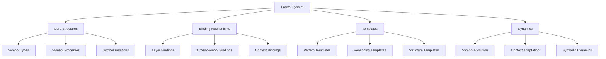

# Fractal System

The Fractal System is a core component of the Cognitive Engine that provides symbolic representation, hierarchical reasoning, and structured knowledge organization.

## Overview

The Fractal System enables:

- **Nested Symbol Structures**: Creating and manipulating hierarchical symbolic representations
- **Binding Mechanisms**: Connecting symbols across different layers and contexts
- **Templating**: Using patterns for reusable reasoning structures
- **Dynamic Symbol Evolution**: Symbols that can adapt and change based on context



## Components

### Core Structures (`core.py`)

Core structures define the fundamental building blocks of the fractal symbolic system:

- **Symbol**: Basic unit of representation
- **SymbolRelation**: Connection between symbols
- **SymbolSet**: Collection of related symbols
- **SymbolSpace**: Multi-dimensional space for organizing symbols

Example:
```python
from cognitive_engine.fractal import Symbol, SymbolRelation, SymbolSpace

# Create symbols
apple = Symbol("apple", properties={"type": "fruit", "color": "red"})
fruit = Symbol("fruit", properties={"type": "category"})

# Create a relation
is_a = SymbolRelation(apple, fruit, relation_type="is_a")

# Create a symbol space
food_space = SymbolSpace("food")
food_space.add_symbol(apple)
food_space.add_symbol(fruit)
food_space.add_relation(is_a)
```

### Binding Mechanisms (`binding.py`)

Binding mechanisms connect symbols across different contexts and layers:

- **SymbolBinder**: Creates and manages bindings between symbols
- **LayerConnector**: Connects symbols across different fractal layers
- **ContextualBinder**: Creates context-dependent bindings

Example:
```python
from cognitive_engine.fractal import SymbolBinder

# Create a binder
binder = SymbolBinder()

# Bind symbols across contexts
binder.bind(symbol1, symbol2, binding_type="represents")

# Get bound symbols
bound_symbols = binder.get_bound_symbols(symbol1)
```

### Templates (`templates.py`)

Templates provide reusable patterns for symbol structures:

- **SymbolTemplate**: Pattern for creating similar symbols
- **RelationTemplate**: Pattern for creating similar relations
- **StructureTemplate**: Pattern for entire symbol structures

Example:
```python
from cognitive_engine.fractal import SymbolTemplate, StructureTemplate

# Create a template for fruit symbols
fruit_template = SymbolTemplate(
    name_pattern="{fruit_name}",
    properties={"type": "fruit", "color": "{color}"}
)

# Create symbols from the template
banana = fruit_template.instantiate(fruit_name="banana", color="yellow")
orange = fruit_template.instantiate(fruit_name="orange", color="orange")

# Create a template for a taxonomic structure
taxonomy_template = StructureTemplate()
taxonomy_template.add_relation_pattern("{item}", "{category}", "is_a")

# Instantiate the taxonomy
taxonomy_template.instantiate(item=banana, category=fruit)
```

## Fractal Layers

The Fractal System organizes symbols across 7 nested layers:

1. **Base Layer**: Fundamental units and atomic symbols
2. **Relation Layer**: Basic relations between symbols
3. **Concept Layer**: Higher-level conceptual groupings
4. **Domain Layer**: Domain-specific knowledge structures
5. **Meta Layer**: Patterns and abstractions across domains
6. **System Layer**: System-level organization and control
7. **Awareness Layer**: Self-referential symbols and system awareness

Each layer has its own symbol types, relations, and dynamics.

## Integration with Other Modules

The Fractal System integrates with other modules in the Cognitive Engine:

- **Probabilistic System**: Symbols can be associated with probabilistic distributions
- **Memory System**: Symbols are stored and retrieved from memory
- **Unipixel**: Fractal units provide the building blocks for each layer
- **MMM**: Pattern recognition across symbolic structures

## API Reference

### Creating and Managing Symbols

```python
# Create a symbol
symbol = Symbol(name, properties={}, layer=1)

# Create a symbol set
symbol_set = SymbolSet(name)
symbol_set.add(symbol)

# Create a relation
relation = SymbolRelation(source, target, relation_type, properties={})
```

### Working with Fractal Layers

```python
# Create a fractal system with all 7 layers
fractal_system = FractalSystem(levels=7)

# Add a symbol to a specific layer
fractal_system.add_symbol(symbol, layer=2)

# Find symbols across layers
cross_layer_symbols = fractal_system.find_related_symbols(
    symbol, 
    relation_type="represents", 
    layers=[1, 2, 3]
)
```

### Symbol Binding and Templates

```python
# Create a binding between symbols
binder = SymbolBinder()
binding = binder.bind(symbol1, symbol2, binding_type="represents")

# Create a template
template = SymbolTemplate(name_pattern="{name}", properties={})
new_symbol = template.instantiate(name="example")
```

## Examples

### Building a Knowledge Graph

```python
from cognitive_engine.fractal import FractalSystem, Symbol, SymbolRelation

# Initialize the fractal system
fs = FractalSystem(levels=7)

# Create symbols
dog = Symbol("dog", properties={"type": "animal"})
mammal = Symbol("mammal", properties={"type": "category"})
pet = Symbol("pet", properties={"type": "category"})

# Create relations
dog_is_mammal = SymbolRelation(dog, mammal, "is_a")
dog_is_pet = SymbolRelation(dog, pet, "is_a")

# Add to the fractal system
fs.add_symbol(dog, layer=3)
fs.add_symbol(mammal, layer=4)
fs.add_symbol(pet, layer=4)
fs.add_relation(dog_is_mammal)
fs.add_relation(dog_is_pet)

# Query the knowledge
mammals = fs.find_symbols_by_relation(mammal, "is_a", reverse=True)
```

### Cross-Layer Reasoning

```python
from cognitive_engine.fractal import FractalSystem

# Initialize
fs = FractalSystem(levels=7)

# Add symbols at different layers
fs.add_symbol(Symbol("neuron", layer=1))
fs.add_symbol(Symbol("neural_network", layer=3))
fs.add_symbol(Symbol("intelligence", layer=5))

# Connect across layers
fs.bind_symbols_across_layers("neuron", "neural_network", "composes")
fs.bind_symbols_across_layers("neural_network", "intelligence", "enables")

# Perform cross-layer reasoning
path = fs.find_cross_layer_path("neuron", "intelligence")
```

## Advanced Concepts

### Symbolic Dynamics

Symbols in the Fractal System are not static; they evolve based on:

- **Context**: The meaning of symbols changes with context
- **Learning**: New patterns are discovered and incorporated
- **Feedback**: System performance influences symbol evolution

### Fractal Recursion

The Fractal System supports recursive symbol structures:

- **Self-Similar Patterns**: Patterns repeating at different scales
- **Nested Representation**: Symbols that contain other symbols
- **Recursion Limits**: Mechanisms to prevent infinite recursion

## Best Practices

1. **Layer Appropriately**: Place symbols at the correct layer based on their abstraction level
2. **Use Templates**: Create templates for common patterns
3. **Minimize Cross-Layer Bindings**: Use cross-layer bindings sparingly
4. **Balance Specificity**: Symbols should be neither too specific nor too general
5. **Document Symbol Properties**: Maintain clear documentation for symbol properties

## Troubleshooting

### Common Issues

- **Symbol Explosion**: Too many similar symbols
  - Solution: Use templates and more abstract representations
  
- **Binding Conflicts**: Contradictory bindings
  - Solution: Use contextual bindings

- **Layer Confusion**: Symbols in inappropriate layers
  - Solution: Review layer assignments regularly

## References

- Fractal Theory in Cognitive Science
- Symbol Grounding Problem
- Knowledge Representation Techniques
- Hierarchical Modeling 