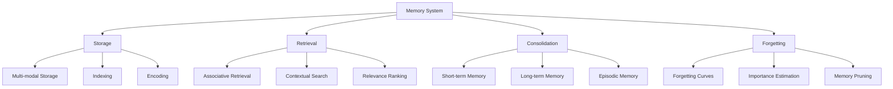

# Memory System

The Memory System is a core component of the Cognitive Engine that provides long-term pervasive memory storage and retrieval capabilities, enabling the system to retain and access information over time.

## Overview

The Memory System enables:

- **Multi-modal Storage**: Storing diverse types of information in a unified framework
- **Associative Retrieval**: Finding information based on contextual relevance
- **Memory Consolidation**: Transferring information from short-term to long-term memory
- **Temporal Reasoning**: Understanding time-based relationships between memories



## Components

### Storage Mechanisms (`storage.py`)

Handles the storage of information in various formats and contexts:

- **MemoryStore**: Core storage system for different types of memory
- **MemoryEncoder**: Encodes information for efficient storage
- **MemoryIndexer**: Creates indexes for fast retrieval

Example:
```python
from cognitive_engine.memory import MemoryStore, MemoryEncoder

# Initialize the memory store
memory_store = MemoryStore(storage_path="./memory_database")

# Encode and store information
encoder = MemoryEncoder()
encoded_memory = encoder.encode(
    content="The Eiffel Tower is 330 meters tall and was completed in 1889.",
    content_type="text",
    metadata={
        "topic": "landmarks",
        "location": "Paris",
        "importance": 0.7
    }
)

# Store the encoded memory
memory_id = memory_store.store(encoded_memory)
print(f"Stored memory with ID: {memory_id}")
```

### Retrieval Algorithms (`retrieval.py`)

Provides mechanisms for finding and accessing stored information:

- **MemoryRetriever**: Finds memories based on queries and context
- **RelevanceEstimator**: Ranks memories by relevance to the current context
- **AssociativeNetwork**: Identifies associations between memories

Example:
```python
from cognitive_engine.memory import MemoryRetriever, RelevanceEstimator

# Initialize the retriever
retriever = MemoryRetriever(memory_store)
relevance = RelevanceEstimator()

# Search for memories
results = retriever.retrieve(
    query="Eiffel Tower height",
    limit=5,
    context={"current_topic": "architecture"}
)

# Rank by relevance
ranked_results = relevance.rank(results, context={"task": "information_retrieval"})

# Display top results
for memory in ranked_results[:3]:
    print(f"Content: {memory.content}")
    print(f"Relevance: {memory.relevance_score}")
    print(f"Metadata: {memory.metadata}")
    print("---")
```

## Memory Types

The Memory System supports different types of memory:

### Episodic Memory

Stores experiences and events with temporal context:

```python
from cognitive_engine.memory import EpisodicMemoryStore

# Create episodic memory store
episodic = EpisodicMemoryStore()

# Record an episodic memory
episodic.record_episode(
    content="User asked about climate change impacts on agriculture",
    timestamp="2023-08-15T14:30:00",
    actors=["user", "system"],
    context={"conversation_id": "conv123", "emotion": "curious"}
)

# Retrieve recent episodes
recent_episodes = episodic.retrieve_recent(limit=5)
```

### Semantic Memory

Stores facts, concepts, and general knowledge:

```python
from cognitive_engine.memory import SemanticMemoryStore

# Create semantic memory store
semantic = SemanticMemoryStore()

# Store factual information
semantic.store_fact(
    fact="Water boils at 100 degrees Celsius at standard atmospheric pressure",
    domain="physics",
    confidence=0.98
)

# Query semantic memory
water_facts = semantic.query("water boiling point")
```

### Procedural Memory

Stores sequences of actions and procedures:

```python
from cognitive_engine.memory import ProceduralMemoryStore

# Create procedural memory store
procedural = ProceduralMemoryStore()

# Store a procedure
procedural.store_procedure(
    name="database_backup",
    steps=[
        {"order": 1, "action": "Connect to database", "params": {"db_name": "main"}},
        {"order": 2, "action": "Export data", "params": {"format": "dump"}},
        {"order": 3, "action": "Compress files", "params": {"algorithm": "gzip"}}
    ],
    metadata={"domain": "system_administration"}
)

# Retrieve procedure
backup_procedure = procedural.retrieve_procedure("database_backup")
```

## Memory Operations

### Memory Consolidation

The process of transferring information from short-term to long-term memory:

```python
from cognitive_engine.memory import MemoryConsolidator

# Initialize consolidator
consolidator = MemoryConsolidator()

# Add items to short-term memory
consolidator.add_to_short_term(
    content="The meeting is scheduled for 3 PM tomorrow",
    importance=0.8
)

# Manually trigger consolidation
consolidator.consolidate()

# Or set up automatic consolidation at intervals
consolidator.schedule_consolidation(interval_minutes=60)
```

### Forgetting Curves

Mechanisms for managing memory decay over time:

```python
from cognitive_engine.memory import ForgettingCurve

# Initialize forgetting curve
forgetting = ForgettingCurve(
    model_type="exponential",
    base_retention=0.9,
    decay_rate=0.1
)

# Calculate retention probability
retention = forgetting.calculate_retention(
    memory_age_days=30,
    rehearsals=2,
    importance=0.7
)

# Apply forgetting
memories_to_forget = forgetting.apply_forgetting(
    memories=all_memories,
    threshold=0.3  # Forget memories with retention below 0.3
)
```

### Memory Associations

Creating and leveraging associations between memories:

```python
from cognitive_engine.memory import AssociativeNetwork

# Create associative network
network = AssociativeNetwork()

# Add associations
network.add_association(
    source_id="memory123",
    target_id="memory456",
    association_type="related_to",
    strength=0.75
)

# Find associated memories
related_memories = network.find_associations(
    memory_id="memory123",
    min_strength=0.5,
    limit=10
)
```

## Integration with Other Modules

### Fractal System Integration

The Memory System integrates with the Fractal System to store symbolic structures:

```python
from cognitive_engine.memory import PervasiveMemory
from cognitive_engine.fractal import FractalSystem, Symbol

# Initialize systems
memory = PervasiveMemory()
fractal = FractalSystem(levels=7)

# Create symbols
dog = Symbol("dog", properties={"type": "animal"})
mammal = Symbol("mammal", properties={"type": "category"})

# Store symbols in memory
dog_id = memory.store_symbol(dog)
mammal_id = memory.store_symbol(mammal)

# Store relations
memory.store_relation(dog_id, mammal_id, "is_a")

# Retrieve symbolic structures
animal_symbols = memory.retrieve_symbols(
    query="type:animal",
    include_relations=True
)
```

### Probabilistic System Integration

The Memory System integrates with the Probabilistic System for neural retrieval:

```python
from cognitive_engine.memory import PervasiveMemory
from cognitive_engine.probabilistic import Embedding

# Initialize
memory = PervasiveMemory()
embedding = Embedding()

# Store with embedding
vector = embedding.encode("Climate change is causing sea levels to rise")
memory.store_with_embedding(
    content="Climate change is causing sea levels to rise",
    embedding=vector,
    metadata={"topic": "climate_change"}
)

# Neural search
results = memory.neural_search(
    query_embedding=embedding.encode("rising ocean levels"),
    similarity_threshold=0.7,
    limit=5
)
```

## API Reference

### Core Memory Operations

```python
# Initialize memory system
memory = PervasiveMemory(storage_path="./memory_store")

# Store information
memory_id = memory.store(
    content="Important information to remember",
    metadata={"topic": "example", "importance": 0.8}
)

# Retrieve information
results = memory.retrieve(
    query="important information",
    limit=10,
    sort_by="relevance"
)

# Update memory
memory.update(memory_id, {"importance": 0.9})

# Delete memory
memory.delete(memory_id)
```

### Advanced Retrieval

```python
# Query by metadata
results = memory.query_by_metadata(
    filters={"topic": "climate_change", "importance": {"$gt": 0.7}},
    limit=20
)

# Time-based query
results = memory.time_range_query(
    start_time="2023-01-01T00:00:00",
    end_time="2023-07-31T23:59:59",
    metadata_filters={"domain": "science"}
)

# Associative retrieval
related_memories = memory.find_related(
    memory_id="mem123",
    association_types=["similar_to", "referenced_by"],
    max_distance=2
)
```

### Memory Management

```python
# Memory consolidation
memory.consolidate_short_term()

# Apply forgetting curves
memory.apply_forgetting(retention_threshold=0.3)

# Memory optimization
memory.optimize_storage()

# Memory backup
memory.create_backup(backup_path="./backups/memory_backup_20230809.bak")
```

## Example Applications

### Conversation History

```python
from cognitive_engine.memory import PervasiveMemory

memory = PervasiveMemory()

# Store conversation turn
memory.store_conversation_turn(
    conversation_id="conv123",
    speaker="user",
    content="What is the capital of France?",
    timestamp="2023-08-09T10:15:30"
)

memory.store_conversation_turn(
    conversation_id="conv123",
    speaker="system",
    content="The capital of France is Paris.",
    timestamp="2023-08-09T10:15:35"
)

# Retrieve conversation history
history = memory.get_conversation_history(
    conversation_id="conv123",
    limit=10
)
```

### Knowledge Accumulation

```python
from cognitive_engine.memory import PervasiveMemory

memory = PervasiveMemory()

# Accumulate knowledge over time
memory.store_knowledge(
    fact="The Great Barrier Reef is the world's largest coral reef system",
    source="National Geographic",
    confidence=0.95,
    domain="geography"
)

# Query accumulated knowledge
reef_knowledge = memory.query_knowledge(
    query="Great Barrier Reef",
    min_confidence=0.7
)
```

### Learning from Interactions

```python
from cognitive_engine.memory import PervasiveMemory

memory = PervasiveMemory()

# Record user preference
memory.store_user_preference(
    user_id="user123",
    preference_type="communication_style",
    value="technical",
    confidence=0.8
)

# Use preferences to personalize responses
user_preferences = memory.get_user_preferences(user_id="user123")
```

## Best Practices

1. **Metadata Usage**: Always include rich metadata with stored memories
2. **Consolidation Strategy**: Balance between immediate and periodic consolidation
3. **Forgetting Curves**: Implement appropriate forgetting mechanisms to prevent memory bloat
4. **Backup Policy**: Regularly backup important memories
5. **Index Optimization**: Create indexes for frequently queried attributes

## Troubleshooting

### Common Issues

- **Retrieval Latency**: Slow retrieval times for large memory stores
  - Solution: Optimize indexes and use caching

- **Memory Duplication**: Duplicate or near-duplicate memories
  - Solution: Implement deduplication during storage

- **Context Loss**: Losing context when retrieving memories
  - Solution: Store additional contextual information with memories

## Extending the System

The Memory System can be extended with:

- Custom memory types for specialized domains
- Advanced neural retrieval algorithms
- Distributed memory storage for scalability
- Multi-agent memory sharing capabilities

## References

- Cognitive memory models
- Associative memory networks
- Memory consolidation theory
- Information retrieval systems 