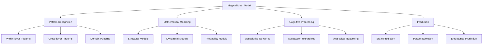

# Magical Math Model (MMM)

The Magical Math Model (MMM) is a specialized module within the Cognitive Engine that enables pattern recognition within and across the seven layers of the system, providing mechanisms for identifying complex relationships and emerging structures.

## Overview

The MMM provides key capabilities for pattern recognition, mathematical modeling, and cognitive processing:

- **Multi-layer Pattern Recognition**: Finding patterns within and across different abstraction layers
- **Emergent Property Detection**: Identifying properties that emerge from system interactions
- **Cross-domain Mapping**: Establishing connections between different knowledge domains
- **Predictive Modeling**: Forecasting potential system states and evolutions



## Core Concepts

### The Seven Cognitive Layers

The MMM operates across the seven nested layers of the Cognitive Engine, with each layer representing a different level of abstraction:

1. **Fundamental Units**: Basic symbols and raw data
2. **Relational Structures**: Connections between units
3. **Conceptual Systems**: Coherent conceptual structures
4. **Domain Knowledge**: Domain-specific knowledge structures
5. **Meta Knowledge**: Knowledge about knowledge
6. **Integrative Understanding**: Cross-domain integrations
7. **Self-awareness**: System-level awareness and reflection

### Pattern Types

The MMM recognizes several types of patterns:

- **Sequential Patterns**: Ordered sequences of elements
- **Hierarchical Patterns**: Nested organizational structures
- **Analogical Patterns**: Similarities between different domains
- **Transformational Patterns**: Systematic changes over time
- **Symmetry Patterns**: Balance and proportional relationships
- **Causal Patterns**: Cause-effect relationships
- **Emergent Patterns**: Properties arising from interactions

## Components

### Pattern Recognition Engine (`pattern.py`)

The core pattern recognition capabilities:

- **PatternDetector**: Identifies patterns within data sources
- **PatternMatcher**: Matches detected patterns against known templates
- **PatternLanguage**: Formal language for describing patterns

Example:
```python
from cognitive_engine.mmm import PatternDetector

# Initialize a pattern detector
detector = PatternDetector(
    min_confidence=0.7,
    pattern_types=["sequential", "hierarchical", "causal"]
)

# Detect patterns in symbolic structures
patterns = detector.detect_patterns(
    symbols=engine.symbolic_system.get_symbols(layer=3),
    relations=engine.symbolic_system.get_relations()
)

# Display detected patterns
for pattern in patterns:
    print(f"Pattern: {pattern.name}")
    print(f"Type: {pattern.type}")
    print(f"Confidence: {pattern.confidence}")
    print(f"Elements: {pattern.elements}")
```

### Mathematical Modeling Engine (`modeling.py`)

Creates mathematical models for identified patterns:

- **ModelBuilder**: Constructs formal models of patterns
- **ModelEvaluator**: Assesses models for fit and predictive power
- **ModelOptimizer**: Refines models to better capture patterns

Example:
```python
from cognitive_engine.mmm import ModelBuilder

# Create a model builder
model_builder = ModelBuilder(model_types=["graph", "bayesian", "dynamical"])

# Build a model from a pattern
model = model_builder.build_model(
    pattern=detected_pattern,
    complexity_level="medium"
)

# Evaluate the model
evaluation = model.evaluate(
    metrics=["accuracy", "parsimony", "predictive_power"]
)

print(f"Model evaluation: {evaluation}")
```

### Cognitive Processing Engine (`cognitive.py`)

Higher-level cognitive operations for pattern analysis:

- **AnalogicalReasoner**: Draws analogies between patterns
- **AbstractionHierarchy**: Organizes patterns in abstraction hierarchies
- **AssociativeNetwork**: Creates associative networks between patterns

Example:
```python
from cognitive_engine.mmm import AnalogicalReasoner

# Initialize analogical reasoner
analogical = AnalogicalReasoner()

# Find analogies between domains
analogies = analogical.find_analogies(
    source_domain="biology",
    target_domain="social_systems",
    min_similarity=0.6
)

# Display analogical mappings
for analogy in analogies:
    print(f"Source: {analogy.source}")
    print(f"Target: {analogy.target}")
    print(f"Mapping: {analogy.mapping}")
    print(f"Similarity: {analogy.similarity}")
```

### Prediction Engine (`prediction.py`)

Forecasts future states and emerging patterns:

- **StatePredictor**: Predicts future states of a system
- **PatternEvolution**: Models how patterns evolve over time
- **EmergenceDetector**: Identifies emerging properties

Example:
```python
from cognitive_engine.mmm import StatePredictor

# Create a state predictor
predictor = StatePredictor(
    model_type="recurrent",
    time_steps=10
)

# Predict future states
future_states = predictor.predict(
    current_state=system_state,
    confidence_threshold=0.7
)

# Analyze predicted states
for step, state in enumerate(future_states, 1):
    print(f"Step {step}:")
    for entity, properties in state.items():
        print(f"  {entity}: {properties}")
```

## Pattern Recognition Across Layers

### Within-Layer Pattern Recognition

Detects patterns within a single layer:

```python
from cognitive_engine.mmm import PatternDetector

# Detect patterns within Layer 3 (Conceptual Systems)
layer3_patterns = detector.detect_within_layer(
    layer=3,
    pattern_types=["sequential", "hierarchical"],
    min_elements=3
)

print(f"Found {len(layer3_patterns)} patterns in Layer 3")
```

### Cross-Layer Pattern Recognition

Identifies patterns that span multiple layers:

```python
from cognitive_engine.mmm import CrossLayerPatternDetector

# Initialize cross-layer detector
cross_detector = CrossLayerPatternDetector(
    layers=[2, 3, 4],
    min_confidence=0.7
)

# Detect cross-layer patterns
cross_patterns = cross_detector.detect_patterns(
    min_span=2  # Patterns must span at least 2 layers
)

print(f"Found {len(cross_patterns)} cross-layer patterns")
for pattern in cross_patterns:
    print(f"Pattern spans layers: {pattern.layers}")
    print(f"Type: {pattern.type}")
```

### Domain-Specific Pattern Recognition

Finds patterns within specific knowledge domains:

```python
from cognitive_engine.mmm import DomainPatternDetector

# Initialize domain-specific detector
domain_detector = DomainPatternDetector(
    domains=["physics", "biology", "economics"],
    pattern_types=["causal", "structural"]
)

# Detect patterns in physics domain
physics_patterns = domain_detector.detect_patterns(
    domain="physics",
    min_confidence=0.75
)

print(f"Found {len(physics_patterns)} patterns in physics domain")
```

## Integration with Other Modules

### Fractal System Integration

The MMM works with the Fractal System to analyze symbolic structures:

```python
from cognitive_engine.mmm import MMM
from cognitive_engine.fractal import FractalSystem

# Initialize systems
mmm = MMM()
fractal = FractalSystem(levels=7)

# Create symbols and relations
# [Symbol creation code...]

# Analyze fractal structures
structural_patterns = mmm.analyze_fractal_structures(
    fractal_system=fractal,
    layers=[3, 4, 5]
)

print(f"Found {len(structural_patterns)} structural patterns")
```

### Unipixel Integration

The MMM analyzes patterns within unipixel networks:

```python
from cognitive_engine.mmm import MMM
from cognitive_engine.unipixel import UnipixelRegistry

# Initialize systems
mmm = MMM()
registry = UnipixelRegistry()

# Create unipixels
# [Unipixel creation code...]

# Analyze unipixel networks
network_patterns = mmm.analyze_unipixel_networks(
    registry=registry,
    connection_types=["feeds", "influences", "relates_to"]
)

print(f"Found {len(network_patterns)} network patterns")
```

### Memory System Integration

The MMM identifies patterns in stored memories:

```python
from cognitive_engine.mmm import MMM
from cognitive_engine.memory import PervasiveMemory

# Initialize systems
mmm = MMM()
memory = PervasiveMemory()

# Store memories
# [Memory storage code...]

# Analyze memory patterns
temporal_patterns = mmm.analyze_memory_patterns(
    memory_system=memory,
    time_range={"start": "2023-01-01", "end": "2023-12-31"},
    pattern_types=["temporal", "associative"]
)

print(f"Found {len(temporal_patterns)} temporal patterns in memories")
```

## Advanced Pattern Analysis

### Emergent Property Detection

Identifies properties that emerge from pattern interactions:

```python
from cognitive_engine.mmm import EmergenceAnalyzer

# Initialize emergence analyzer
emergence = EmergenceAnalyzer(
    sensitivity=0.8,
    property_types=["structural", "functional", "behavioral"]
)

# Analyze a system for emergent properties
emergent_properties = emergence.analyze(
    patterns=detected_patterns,
    interactions=pattern_interactions
)

print("Emergent properties:")
for prop in emergent_properties:
    print(f"- {prop.name}: {prop.description} (Confidence: {prop.confidence})")
```

### Analogical Mapping Between Domains

Creates mappings between different knowledge domains:

```python
from cognitive_engine.mmm import AnalogicalMapper

# Initialize analogical mapper
mapper = AnalogicalMapper()

# Create a mapping between domains
mapping = mapper.create_mapping(
    source_domain="fluid_dynamics",
    target_domain="economic_flows",
    mapping_constraints={"preserve_structure": True}
)

print("Analogical mapping:")
for source, target in mapping.mappings.items():
    print(f"  {source} ⟷ {target} (Similarity: {mapping.similarities[source]})")
```

### Pattern Evolution Prediction

Predicts how patterns will evolve over time:

```python
from cognitive_engine.mmm import PatternEvolutionPredictor

# Initialize evolution predictor
evolution = PatternEvolutionPredictor(
    prediction_horizon=5,
    confidence_threshold=0.7
)

# Predict pattern evolution
future_patterns = evolution.predict_evolution(
    current_patterns=detected_patterns,
    environmental_factors={"domain_growth": 0.3, "new_connections": 0.5}
)

print("Predicted pattern evolution:")
for time_step, patterns in enumerate(future_patterns, 1):
    print(f"Time step {time_step}:")
    for pattern in patterns:
        print(f"  - {pattern.name} (Confidence: {pattern.confidence})")
```

## API Reference

### Pattern Detection

```python
# Initialize the MMM
mmm = MagicalMathModel()

# Detect patterns
patterns = mmm.detect_patterns(
    data_source="fractal_system",  # or "unipixel_network", "memory_system"
    pattern_types=["sequential", "hierarchical", "causal"],
    min_confidence=0.7
)

# Find cross-domain patterns
cross_domain_patterns = mmm.find_cross_domain_patterns(
    domains=["physics", "biology", "economics"],
    pattern_types=["structural", "functional"],
    min_similarity=0.6
)

# Detect cross-layer patterns
cross_layer_patterns = mmm.find_cross_layer_patterns(
    layers=[2, 3, 4, 5],
    min_span=2,
    min_confidence=0.7
)
```

### Pattern Analysis

```python
# Analyze pattern structure
structure_analysis = mmm.analyze_pattern_structure(
    pattern=detected_pattern,
    metrics=["complexity", "modularity", "hierarchy_depth"]
)

# Compare patterns
comparison = mmm.compare_patterns(
    pattern1=pattern1,
    pattern2=pattern2,
    comparison_metrics=["structural_similarity", "functional_similarity"]
)

# Analyze emergent properties
emergent_properties = mmm.analyze_emergence(
    patterns=related_patterns,
    property_types=["structural", "functional", "behavioral"]
)
```

### Prediction and Modeling

```python
# Build a mathematical model
model = mmm.build_model(
    pattern=detected_pattern,
    model_type="dynamical_system",
    complexity="medium"
)

# Predict pattern evolution
evolution = mmm.predict_evolution(
    pattern=detected_pattern,
    time_steps=5,
    confidence_threshold=0.7
)

# Simulate pattern interactions
simulation = mmm.simulate_interactions(
    patterns=related_patterns,
    interaction_rules={"competition": 0.3, "cooperation": 0.7},
    simulation_steps=10
)
```

## Example Applications

### Scientific Discovery

```python
from cognitive_engine.mmm import MMM

mmm = MMM()

# Analyze scientific literature
scientific_patterns = mmm.analyze_domain_knowledge(
    domain="quantum_physics",
    sources=["research_papers", "textbooks", "lectures"],
    pattern_types=["theoretical", "experimental", "predictive"]
)

# Find potential discoveries
discoveries = mmm.identify_knowledge_gaps(
    domain_patterns=scientific_patterns,
    novelty_threshold=0.8,
    validation_methods=["experimental_design", "theoretical_consistency"]
)

print("Potential scientific discoveries:")
for discovery in discoveries:
    print(f"- {discovery.name}: {discovery.description}")
    print(f"  Novelty: {discovery.novelty}")
    print(f"  Validation approach: {discovery.validation_approach}")
```

### Cross-domain Knowledge Transfer

```python
from cognitive_engine.mmm import MMM

mmm = MMM()

# Identify deep analogies between domains
analogies = mmm.find_deep_analogies(
    source_domain="ecosystem_dynamics",
    target_domain="economic_systems",
    mapping_depth="structural"
)

# Transfer knowledge between domains
knowledge_transfer = mmm.transfer_knowledge(
    analogies=analogies,
    source_domain_knowledge=ecosystem_knowledge,
    transfer_constraints={"preserve_causal_structure": True}
)

print("Knowledge transfer insights:")
for insight in knowledge_transfer.insights:
    print(f"- {insight.name}: {insight.description}")
    print(f"  Confidence: {insight.confidence}")
    print(f"  Potential applications: {insight.applications}")
```

### Pattern-based Prediction

```python
from cognitive_engine.mmm import MMM

mmm = MMM()

# Learn patterns from historical data
historical_patterns = mmm.learn_historical_patterns(
    domain="financial_markets",
    time_range={"start": "2010-01-01", "end": "2023-01-01"},
    pattern_types=["cyclical", "trend", "volatility"]
)

# Generate predictions
predictions = mmm.generate_predictions(
    patterns=historical_patterns,
    prediction_horizon="1 year",
    scenario_analysis=True,
    confidence_levels=True
)

print("Predictions:")
for scenario, prediction in predictions.scenarios.items():
    print(f"Scenario: {scenario}")
    print(f"  Probability: {prediction.probability}")
    for outcome in prediction.outcomes:
        print(f"  - {outcome.description} (Confidence: {outcome.confidence})")
```

## Best Practices

1. **Start Simple**: Begin with single-layer pattern detection before moving to cross-layer analysis
2. **Validate Patterns**: Always validate detected patterns with multiple metrics
3. **Combine Approaches**: Use both top-down and bottom-up pattern recognition
4. **Consider Context**: Patterns may depend heavily on context and environment
5. **Balance Abstraction**: Too little abstraction misses patterns, too much creates false patterns

## Troubleshooting

### Common Issues

- **Pattern Overdetection**: Finding too many spurious patterns
  - Solution: Increase confidence thresholds and require more evidence

- **Missing Cross-layer Patterns**: Failing to detect patterns across layers
  - Solution: Ensure proper connections between layers and reduce layer isolation

- **Computational Complexity**: Pattern detection becoming too resource-intensive
  - Solution: Use hierarchical detection approaches and limit search spaces

## Extending the System

The MMM system can be extended with:

- Custom pattern detectors for domain-specific patterns
- New mathematical modeling techniques
- Advanced prediction algorithms
- Specialized emergence detection methods

## References

- Pattern Recognition Theory
- Complex Systems Analysis
- Emergence in Multi-level Systems
- Analogical Reasoning
- Predictive Modeling
- Fractal Mathematics 