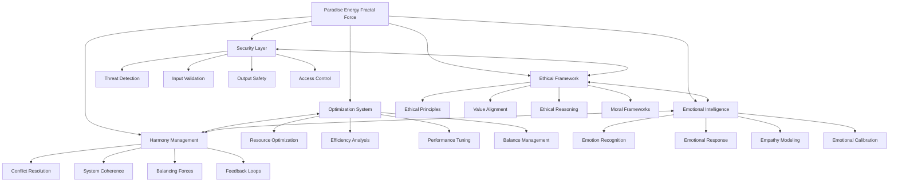
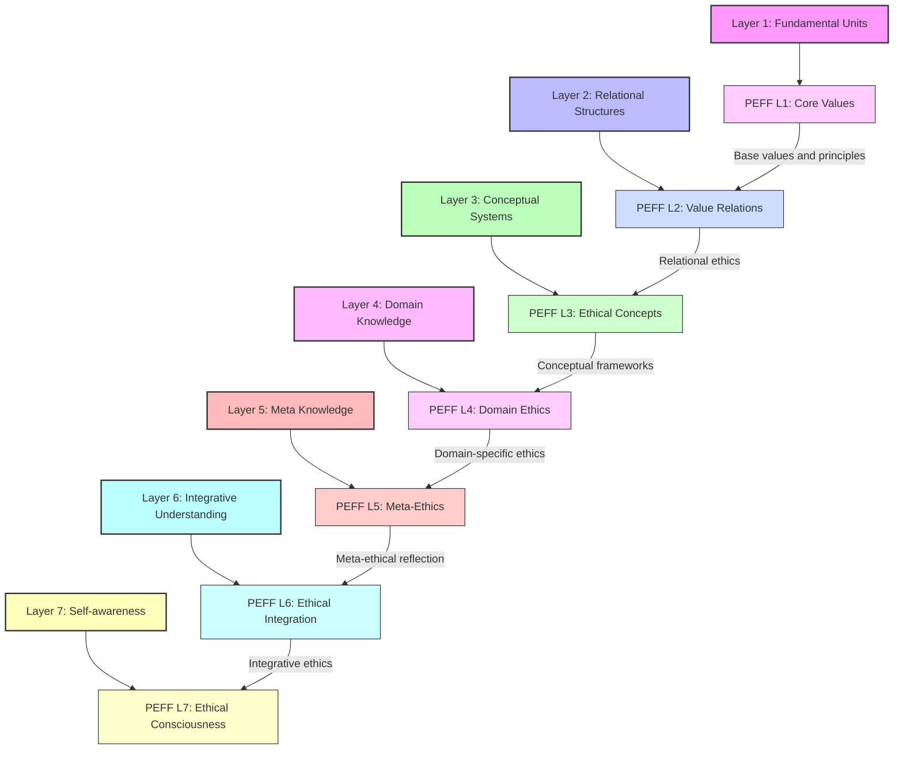
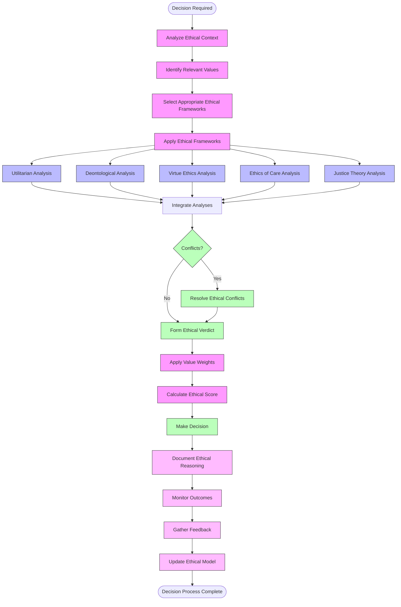

# Paradise Energy Fractal Force (PEFF)

The Paradise Energy Fractal Force (PEFF) is a specialized module within the Cognitive Engine that manages harmony, optimization, security, ethics, and emotional intelligence. It serves as the system's ethical framework and ensures balanced, secure, and emotionally-aware operation.

## Overview

PEFF provides critical capabilities for system harmony and ethical operation:

- **Ethical Reasoning**: Applying ethical frameworks to decision-making
- **System Optimization**: Balancing efficiency, effectiveness, and resource usage
- **Security Management**: Ensuring system security and safe operation
- **Emotional Intelligence**: Understanding and generating appropriate emotional responses
- **Conflict Resolution**: Resolving contradictions and conflicts between system components



## Architecture and Components

The PEFF module is organized in a fractal structure, with five main components that mirror the overall system architecture:

```mermaid
flowchart TB
    PEFF[Paradise Energy Fractal Force] --> Ethics[Ethical Framework]
    PEFF --> Optimization[Optimization System]
    PEFF --> Security[Security Layer]
    PEFF --> Emotional[Emotional Intelligence]
    PEFF --> Harmony[Harmony Management]
    
    subgraph EthicsSystem[Ethical System]
        Ethics --> EthicsL1[L1: Basic Values]
        Ethics --> EthicsL2[L2: Ethical Rules]
        Ethics --> EthicsL3[L3: Moral Principles]
        Ethics --> EthicsL4[L4: Ethical Frameworks]
        Ethics --> EthicsL5[L5: Meta-Ethics]
        Ethics --> EthicsL6[L6: Ethical Integration]
        Ethics --> EthicsL7[L7: Ethical Consciousness]
    end
    
    subgraph OptimizationSystem[Optimization System]
        Optimization --> OptL1[L1: Resource Tracking]
        Optimization --> OptL2[L2: Efficiency Metrics]
        Optimization --> OptL3[L3: Performance Models]
        Optimization --> OptL4[L4: System Balancing]
        Optimization --> OptL5[L5: Meta-Optimization]
        Optimization --> OptL6[L6: Adaptive Tuning]
        Optimization --> OptL7[L7: Self-Improvement]
    end
    
    subgraph SecuritySystem[Security System]
        Security --> SecL1[L1: Input Validation]
        Security --> SecL2[L2: Threat Detection]
        Security --> SecL3[L3: Access Control]
        Security --> SecL4[L4: Security Policies]
        Security --> SecL5[L5: Anomaly Detection]
        Security --> SecL6[L6: Defense Strategy]
        Security --> SecL7[L7: Security Awareness]
    end
    
    subgraph EmotionalSystem[Emotional System]
        Emotional --> EmoL1[L1: Basic Emotions]
        Emotional --> EmoL2[L2: Emotional Patterns]
        Emotional --> EmoL3[L3: Emotional Context]
        Emotional --> EmoL4[L4: Emotional Intelligence]
        Emotional --> EmoL5[L5: Empathy Models]
        Emotional --> EmoL6[L6: Emotional Wisdom]
        Emotional --> EmoL7[L7: Emotional Awareness]
    end
    
    subgraph HarmonySystem[Harmony System]
        Harmony --> HarL1[L1: Conflict Detection]
        Harmony --> HarL2[L2: Balance Analysis]
        Harmony --> HarL3[L3: Harmony Patterns]
        Harmony --> HarL4[L4: Coherence Policies]
        Harmony --> HarL5[L5: System Harmony]
        Harmony --> HarL6[L6: Evolutionary Balance]
        Harmony --> HarL7[L7: Harmony Awareness]
    end
    
    class EthicsSystem,OptimizationSystem,SecuritySystem,EmotionalSystem,HarmonySystem subfractal
```



Each component is further structured into 7 layers that align with the overall system's fractal structure.

### Ethical Framework (`ethics.py`)

The Ethical Framework provides the moral guidance system:

- **EthicalPrinciples**: Core ethical values and principles
- **ValueAlignmentSystem**: Ensures alignment with human values
- **EthicalReasoner**: Applies ethical reasoning to decisions
- **MoralFrameworks**: Implements various ethical frameworks

Example:
```python
from cognitive_engine.peff import EthicalFramework, MoralFramework

# Initialize ethical framework
ethics = EthicalFramework(
    base_principles=["beneficence", "non-maleficence", "autonomy", "justice"],
    framework_type="principlist"
)

# Create a moral framework
utilitarianism = MoralFramework(
    name="utilitarianism",
    core_principle="greatest happiness principle",
    evaluation_method="consequence_based"
)

# Add framework to ethics system
ethics.add_framework(utilitarianism)

# Evaluate an action ethically
action = {
    "type": "data_collection", 
    "context": "health monitoring",
    "scope": "personal data",
    "purpose": "health improvement"
}

evaluation = ethics.evaluate_action(action)
print(f"Ethical assessment: {evaluation.verdict}")
print(f"Ethical score: {evaluation.score}")
print(f"Reasoning: {evaluation.reasoning}")
```

### Optimization System (`optimization.py`)

The Optimization System manages resource usage and system efficiency:

- **ResourceMonitor**: Tracks system resource usage
- **EfficiencyAnalyzer**: Analyzes and improves efficiency
- **PerformanceTuner**: Optimizes system performance
- **BalanceManager**: Maintains system balance

Example:
```python
from cognitive_engine.peff import OptimizationSystem, ResourceAllocation

# Initialize optimization system
optimization = OptimizationSystem(
    monitoring_interval=60,  # seconds
    optimization_targets=["memory", "compute", "latency"]
)

# Create a resource allocation plan
allocation = ResourceAllocation(
    resources={
        "memory": {"max": "8GB", "priority": "high"},
        "compute": {"max": "4 cores", "priority": "medium"},
        "storage": {"max": "10GB", "priority": "low"}
    },
    allocation_strategy="dynamic"
)

# Run optimization
optimization.optimize(allocation)

# Get optimization metrics
metrics = optimization.get_metrics()
print(f"Efficiency score: {metrics.efficiency}")
print(f"Resource utilization: {metrics.utilization}")
print(f"Performance impact: {metrics.performance_delta}")
```

### Security Layer (`security.py`)

The Security Layer ensures safe and secure system operation:

- **ThreatDetector**: Identifies security threats
- **InputValidator**: Validates and sanitizes inputs
- **OutputSafety**: Ensures safe system outputs
- **AccessController**: Manages access control

Example:
```python
from cognitive_engine.peff import SecurityLayer, SecurityPolicy

# Initialize security layer
security = SecurityLayer(
    security_level="high",
    monitoring_enabled=True
)

# Create a security policy
policy = SecurityPolicy(
    name="data_access_policy",
    rules=[
        {"resource": "personal_data", "access_level": "restricted", "requirements": ["authentication", "authorization"]},
        {"resource": "system_functions", "access_level": "admin_only", "requirements": ["admin_role", "audit_logging"]}
    ]
)

# Apply security policy
security.apply_policy(policy)

# Validate an input
input_data = {"command": "retrieve_data", "data_type": "personal", "user_id": "user123"}
validation_result = security.validate_input(input_data)

if validation_result.is_valid:
    print("Input is safe to process")
else:
    print(f"Security violation: {validation_result.violation_reason}")
```

### Emotional Intelligence (`emotional.py`)

The Emotional Intelligence component enables understanding and generating appropriate emotional responses:

- **EmotionRecognizer**: Identifies emotions in text and data
- **EmotionalResponder**: Generates emotionally appropriate responses
- **EmpathyModel**: Models empathetic understanding
- **EmotionalCalibration**: Calibrates emotional responses

Example:
```python
from cognitive_engine.peff import EmotionalIntelligence, EmotionProfile

# Initialize emotional intelligence
emotional = EmotionalIntelligence(
    emotion_model="dimensional",  # vs "categorical"
    empathy_level=0.8
)

# Create an emotion profile
profile = EmotionProfile(
    base_temper="balanced",
    emotional_range=0.7,  # 0-1 scale
    primary_emotions=["joy", "interest", "curiosity"]
)

# Set the active profile
emotional.set_profile(profile)

# Analyze emotional content
text = "I'm really disappointed with the service I received today."
emotional_analysis = emotional.analyze_emotion(text)
print(f"Primary emotion: {emotional_analysis.primary_emotion}")
print(f"Emotion intensity: {emotional_analysis.intensity}")
print(f"Emotional valence: {emotional_analysis.valence}")

# Generate an empathetic response
response = emotional.generate_empathetic_response(
    emotional_analysis,
    context={"conversation_history": ["previous messages"], "user_profile": {"preference": "direct"}}
)
print(f"Empathetic response: {response}")
```

### Harmony Management (`harmony.py`)

The Harmony Management component ensures coherence and balance across the system:

- **ConflictResolver**: Resolves conflicts between components
- **SystemCoherence**: Maintains logical coherence
- **BalancingForce**: Balances competing system forces
- **FeedbackSystem**: Processes and integrates feedback

Example:
```python
from cognitive_engine.peff import HarmonyManager, ConflictResolution

# Initialize harmony manager
harmony = HarmonyManager(
    coherence_threshold=0.7,
    balance_targets=["performance", "ethics", "security"]
)

# Define a conflict
conflict = {
    "type": "goal_conflict",
    "components": ["efficiency_optimizer", "ethical_framework"],
    "description": "Efficiency requires data collection that raises privacy concerns",
    "severity": 0.8  # 0-1 scale
}

# Create a resolution strategy
resolution = ConflictResolution(
    strategy="compromise",
    priority_framework="ethical_first",
    balance_point=0.6  # 0-1 scale between competing goals
)

# Resolve the conflict
result = harmony.resolve_conflict(conflict, resolution)
print(f"Conflict resolved: {result.is_resolved}")
print(f"Resolution description: {result.resolution}")
print(f"System coherence after resolution: {result.coherence_score}")

# Check system harmony
harmony_status = harmony.check_system_harmony()
print(f"System harmony score: {harmony_status.overall_score}")
for component, score in harmony_status.component_scores.items():
    print(f"- {component}: {score}")
```

## Cross-Layer Integration

The PEFF module integrates across the seven fractal layers of the Cognitive Engine:



## Integration with Other Modules

### PEFF and Fractal System

PEFF integrates with the Fractal System to provide ethical grounding for symbolic operations:

```python
from cognitive_engine.peff import EthicalFramework
from cognitive_engine.fractal import FractalSystem, Symbol

# Initialize systems
ethics = EthicalFramework()
fractal = FractalSystem(levels=7)

# Create an ethical symbol
privacy = Symbol("privacy", properties={"type": "ethical_principle", "importance": "high"})
fractal.add_symbol(privacy, layer=4)

# Associate ethical properties with symbols
ethics.associate_ethics(
    symbol=privacy,
    ethical_properties={
        "principle_type": "protection",
        "value_category": "individual_rights",
        "conflicts_with": ["public_safety", "transparency"]
    }
)

# Evaluate an operation against ethical principles
operation = {
    "type": "collect_data",
    "data_type": "personal",
    "purpose": "service_improvement"
}

ethical_assessment = ethics.evaluate_symbolic_operation(
    operation=operation,
    relevant_symbols=[privacy]
)

print(f"Operation ethical: {ethical_assessment.is_ethical}")
print(f"Ethical score: {ethical_assessment.score}")
print(f"Required modifications: {ethical_assessment.recommended_changes}")
```

### PEFF and Probabilistic System

PEFF works with the Probabilistic System to ensure ethical neural processing:

```python
from cognitive_engine.peff import EthicalFramework
from cognitive_engine.probabilistic import LLMInterface

# Initialize components
ethics = EthicalFramework()
llm = LLMInterface(model="gpt-4")

# Create an ethical constraint
ethical_constraint = ethics.create_constraint(
    name="bias_mitigation",
    description="Prevent gender, racial, and other biases in outputs",
    enforcement_level="strict"
)

# Apply constraint to LLM
llm.apply_ethical_constraint(ethical_constraint)

# Generate constrained output
prompt = "Write a job description for a software engineer"
result = llm.generate(prompt)

# Verify ethical compliance
compliance = ethics.verify_output_compliance(result)
print(f"Output complies with ethical constraints: {compliance.complies}")
print(f"Compliance score: {compliance.score}")
```

### PEFF and Memory System

PEFF integrates with the Memory System to manage ethically sensitive information:

```python
from cognitive_engine.peff import SecurityLayer
from cognitive_engine.memory import PervasiveMemory

# Initialize components
security = SecurityLayer()
memory = PervasiveMemory()

# Create privacy policy
privacy_policy = security.create_privacy_policy(
    data_categories=["personal", "health", "financial"],
    retention_periods={"personal": "1 year", "health": "5 years", "financial": "7 years"},
    access_controls={"personal": "user_only", "health": "authorized_medical", "financial": "authorized_financial"}
)

# Apply policy to memory system
memory.apply_privacy_policy(privacy_policy)

# Store with privacy consideration
memory_id = memory.store(
    content="User health information",
    metadata={"type": "health", "sensitivity": "high"}
)

# Verify privacy policy enforcement
verification = security.verify_memory_privacy(memory_id)
print(f"Privacy policy enforced: {verification.is_enforced}")
print(f"Privacy measures: {verification.applied_measures}")
```

## Ethical Decision-Making Process

The PEFF module follows a comprehensive ethical decision-making process:



## API Reference

### Ethical Framework

```python
# Initialize ethical framework
ethics = EthicalFramework(
    base_principles=["autonomy", "beneficence", "non-maleficence", "justice"],
    prioritization_method="weighted"
)

# Create ethical policy
policy = ethics.create_policy(
    name="data_ethics",
    rules=[
        {"principle": "privacy", "action": "data_collection", "verdict": "conditional", "conditions": ["explicit_consent", "minimal_collection"]},
        {"principle": "transparency", "action": "algorithm_use", "verdict": "required", "conditions": ["explainability", "auditability"]}
    ]
)

# Evaluate action against policy
evaluation = ethics.evaluate_action_against_policy(
    action="collect_user_location",
    context={"purpose": "service_improvement", "consent_obtained": True},
    policy=policy
)
```

### Optimization System

```python
# Initialize optimization system
optimization = OptimizationSystem()

# Define optimization targets
optimization.set_targets({
    "memory": {"max": "4GB", "weight": 0.8},
    "latency": {"max": "200ms", "weight": 0.9},
    "throughput": {"min": "100 requests/sec", "weight": 0.7}
})

# Run optimization
status = optimization.optimize_system(
    current_state=system_state,
    optimization_strategy="balanced"
)

# Apply recommended changes
optimization.apply_optimizations(
    recommendations=status.recommendations,
    apply_immediately=True
)
```

### Security Layer

```python
# Initialize security layer
security = SecurityLayer()

# Configure security settings
security.configure({
    "input_validation": {"level": "strict", "sanitize": True},
    "threat_detection": {"sensitivity": "high", "response": "block"},
    "output_safety": {"check_level": "thorough", "unsafe_handling": "redact"}
})

# Validate input
validation = security.validate_input(
    input_data=user_input,
    validation_rules={"type": "string", "max_length": 1000, "forbidden_patterns": ["<script>", "DROP TABLE"]}
)

# Check output safety
safety_check = security.check_output_safety(
    output=system_response,
    safety_criteria={"harmful_content": True, "privacy_leaks": True, "sensitivity": "high"}
)
```

### Emotional Intelligence

```python
# Initialize emotional intelligence
emotional = EmotionalIntelligence()

# Analyze emotion in text
emotion_analysis = emotional.analyze(
    text="I'm really frustrated with this problem that keeps happening.",
    analysis_depth="detailed"
)

# Generate emotionally appropriate response
response = emotional.generate_response(
    input_emotion=emotion_analysis,
    desired_emotional_effect="calming",
    response_type="empathetic"
)

# Calculate emotional resonance
resonance = emotional.calculate_resonance(
    emotion1=user_emotion,
    emotion2=system_emotion
)
```

### Harmony Management

```python
# Initialize harmony manager
harmony = HarmonyManager()

# Check system harmony
harmony_status = harmony.check_harmony(
    components=["ethics", "optimization", "security", "emotion"],
    detail_level="comprehensive"
)

# Detect conflicts
conflicts = harmony.detect_conflicts(
    current_state=system_state,
    threshold=0.7
)

# Resolve conflict
resolution = harmony.resolve_conflict(
    conflict=conflicts[0],
    resolution_strategy="weighted_compromise",
    priorities={"ethics": 0.9, "performance": 0.7, "security": 0.8}
)
```

## Example Applications

### Ethical Content Moderation

```python
from cognitive_engine.peff import EthicalFramework, ContentModerationPolicy

# Create ethical framework for content moderation
ethics = EthicalFramework()

# Define moderation policy
moderation_policy = ContentModerationPolicy(
    categories=["hate_speech", "violence", "harassment", "misinformation"],
    severity_levels=["low", "medium", "high", "extreme"],
    actions={
        "low": "flag",
        "medium": "review",
        "high": "filter",
        "extreme": "block"
    }
)

# Apply policy to content
content = "This is example content to evaluate"
moderation_result = ethics.moderate_content(
    content=content,
    policy=moderation_policy
)

print(f"Moderation verdict: {moderation_result.verdict}")
print(f"Detected categories: {moderation_result.categories}")
print(f"Recommended action: {moderation_result.recommended_action}")
print(f"Explanation: {moderation_result.explanation}")
```

### Adaptive Resource Management

```python
from cognitive_engine.peff import OptimizationSystem, ResourceAdaptationPolicy

# Initialize optimization system
optimization = OptimizationSystem()

# Create adaptive resource policy
adaptive_policy = ResourceAdaptationPolicy(
    resources=["memory", "compute", "network"],
    adaptation_triggers={
        "memory": {"high_usage": 0.85, "low_usage": 0.3},
        "compute": {"high_usage": 0.9, "low_usage": 0.2},
        "network": {"high_usage": 0.7, "low_usage": 0.1}
    },
    adaptation_actions={
        "memory": {"scale_up": 1.5, "scale_down": 0.7},
        "compute": {"scale_up": 2.0, "scale_down": 0.5},
        "network": {"scale_up": 1.3, "scale_down": 0.8}
    }
)

# Monitor and adapt resources
while True:
    # Get current resource usage
    usage = optimization.get_resource_usage()
    
    # Apply adaptive policy
    adaptation = optimization.apply_adaptive_policy(
        current_usage=usage,
        policy=adaptive_policy
    )
    
    # Implement resource changes
    if adaptation.has_changes:
        optimization.execute_resource_changes(adaptation.changes)
    
    # Wait for next monitoring cycle
    time.sleep(60)
```

### Empathetic Response Generation

```python
from cognitive_engine.peff import EmotionalIntelligence, ConversationContext

# Initialize emotional intelligence
emotional = EmotionalIntelligence()

# Set up conversation context
context = ConversationContext(
    user_profile={
        "emotional_state": "frustrated",
        "communication_style": "direct",
        "issue_history": ["repeated technical problems"]
    },
    conversation_history=[
        {"speaker": "user", "content": "This isn't working again!", "emotion": "frustration"},
        {"speaker": "system", "content": "I understand this is frustrating. Let me help you fix it.", "emotion": "calm"}
    ],
    current_topic="technical support"
)

# Current user input
user_input = "I've tried everything you suggested and nothing works!"

# Analyze emotional content
emotion = emotional.analyze(user_input)

# Generate empathetic response
response = emotional.generate_empathetic_response(
    user_emotion=emotion,
    context=context,
    response_goals={
        "acknowledge_emotion": True,
        "provide_solution": True,
        "maintain_relationship": True
    }
)

print(f"Empathetic response: {response.content}")
print(f"Response emotion: {response.emotion}")
print(f"Empathy level: {response.empathy_score}")
```

## Best Practices

1. **Ethical Prioritization**: Establish clear priorities between competing ethical principles
2. **Resource Balance**: Balance resource optimization with system reliability and ethical constraints
3. **Security Integration**: Integrate security measures throughout the system, not as an afterthought
4. **Emotional Calibration**: Calibrate emotional responses to user context and needs
5. **Harmony Monitoring**: Continuously monitor and maintain system harmony

## Troubleshooting

### Common Issues

- **Ethical Conflicts**: Contradictions between ethical principles
  - Solution: Implement explicit conflict resolution protocols with clear priorities

- **Resource Imbalance**: Optimization that favors one resource over others
  - Solution: Use balanced optimization with configurable weights

- **Overprotective Security**: Security measures blocking legitimate operations
  - Solution: Implement contextual security with adjustable thresholds

- **Emotional Miscalibration**: Inappropriate emotional responses
  - Solution: Regular calibration against user feedback and cultural norms

- **System Incoherence**: Components working against each other
  - Solution: Strengthen harmony management and conflict detection

## Extending the System

The PEFF module can be extended with:

- Custom ethical frameworks for domain-specific applications
- Specialized optimization strategies for different resource types
- Advanced security models for emerging threats
- Cultural-specific emotional intelligence models
- Domain-specific harmony management rules

## References

- Ethical AI frameworks and guidelines
- Resource optimization and efficiency modeling
- Computer security and threat modeling
- Emotional intelligence and affective computing
- System harmony and coherence theory
- Value alignment in AI systems 