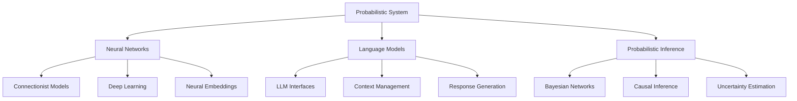

# Probabilistic System

The Probabilistic System is a core component of the Cognitive Engine that handles neural networks, language models, and probabilistic inference capabilities.

## Overview

The Probabilistic System enables:

- **Neural Network Integration**: Working with pre-trained and custom neural networks
- **Language Model Interaction**: Leveraging the capabilities of large language models
- **Probabilistic Inference**: Reasoning under uncertainty using probabilistic methods
- **Pattern Recognition**: Identifying patterns in data across modalities



## Components

### Neural Networks (`neural.py`)

Integration with neural network frameworks for connectionist approaches:

- **NetworkManager**: Manages different neural network architectures
- **Embedding**: Creates vector representations of symbols and concepts
- **NeuralProcessor**: Processes information through neural pathways

Example:
```python
from cognitive_engine.probabilistic import NetworkManager, Embedding

# Initialize a network manager
network_manager = NetworkManager()

# Load a pre-trained model
network = network_manager.load_model("transformer", "path/to/model")

# Create embeddings
embedding = Embedding()
vector = embedding.encode("conceptual information")

# Process through the network
output = network.process(vector)
```

### Language Models (`llm.py`)

Interfaces with large language models for text generation and understanding:

- **LLMInterface**: Provides a unified interface to different LLMs
- **PromptManager**: Designs and optimizes prompts for LLMs
- **ResponseProcessor**: Processes and structures LLM responses

Example:
```python
from cognitive_engine.probabilistic import LLMInterface, PromptManager

# Initialize LLM interface
llm = LLMInterface(model="gpt-4")

# Create a prompt manager
prompt_manager = PromptManager()
formatted_prompt = prompt_manager.format_prompt(
    template="answer_question",
    question="What are the implications of quantum computing for cryptography?",
    context="Focus on post-quantum cryptography approaches."
)

# Generate response
response = llm.generate(formatted_prompt)
```

### Probabilistic Inference (`inference.py`)

Engines for probabilistic reasoning and uncertainty management:

- **InferenceEngine**: Core engine for probabilistic inference
- **BayesianNetwork**: Representation of probabilistic knowledge
- **UncertaintyEstimator**: Quantifies uncertainty in judgments

Example:
```python
from cognitive_engine.probabilistic import InferenceEngine, BayesianNetwork

# Create a Bayesian network
network = BayesianNetwork()
network.add_node("Rain", states=["Yes", "No"])
network.add_node("Sprinkler", states=["On", "Off"])
network.add_node("Grass_Wet", states=["Yes", "No"])
network.add_edge("Rain", "Grass_Wet")
network.add_edge("Sprinkler", "Grass_Wet")

# Set probabilities
network.set_probability("Rain", {"Yes": 0.2, "No": 0.8})
network.set_probability("Sprinkler", {"On": 0.4, "Off": 0.6})
network.set_conditional_probability("Grass_Wet", 
    {"Yes": 0.99, "No": 0.01}, {"Rain": "Yes", "Sprinkler": "On"})
# ... set other conditional probabilities

# Create inference engine
engine = InferenceEngine(network)

# Perform inference
result = engine.infer("Grass_Wet", evidence={"Rain": "Yes"})
print(f"Probability grass is wet given it's raining: {result['Yes']}")
```

## Integration with Symbolic System

The Probabilistic System works closely with the Fractal System through:

### Symbol Grounding

Neural networks and embeddings provide grounding for symbolic representations:

```python
from cognitive_engine.probabilistic import Embedding
from cognitive_engine.fractal import Symbol

# Create a symbol
apple_symbol = Symbol("apple")

# Ground the symbol with an embedding
embedding = Embedding()
apple_vector = embedding.encode("apple")
apple_symbol.set_grounding(apple_vector)
```

### Neural-Symbolic Translation

Methods for translating between symbolic and neural representations:

```python
from cognitive_engine.probabilistic import NeuralSymbolicTranslator

translator = NeuralSymbolicTranslator()

# Neural to symbolic
text = "The capital of France is Paris"
symbols = translator.text_to_symbols(text)

# Symbolic to neural
response_text = translator.symbols_to_text(symbols)
```

### Hybrid Reasoning

Combining symbolic and neural methods for enhanced reasoning:

```python
from cognitive_engine import HybridCognitiveEngine

engine = HybridCognitiveEngine()

# Hybrid reasoning process
result = engine.hybrid_reason(
    query="How will climate change affect agricultural production?",
    symbolic_steps=["decompose", "structure"],
    neural_steps=["elaborate", "evaluate"],
    uncertainty_threshold=0.7
)
```

## API Reference

### Neural Network Management

```python
# Initialize a neural network
network = NetworkManager()
model = network.load_model(architecture="transformer", source="huggingface", model_name="bert-base-uncased")

# Encode data
embeddings = model.encode(["text data", "more text data"])

# Fine-tune a model
network.fine_tune(model, training_data, epochs=5)
```

### Working with Language Models

```python
# Initialize LLM interface
llm = LLMInterface(model="gpt-4", api_key="your-api-key")

# Generate text
response = llm.generate("Explain the concept of quantum entanglement", max_tokens=500)

# Analyze text
analysis = llm.analyze("This is a sample text for sentiment analysis", analysis_type="sentiment")
```

### Probabilistic Inference

```python
# Create an inference engine
engine = InferenceEngine()

# Add knowledge
engine.add_fact("It is cloudy", confidence=0.9)
engine.add_rule("If it is cloudy, it might rain", confidence=0.7)

# Query
result = engine.query("Will it rain?")
print(f"Confidence: {result.confidence}")
```

## Example Applications

### Sentiment Analysis

```python
from cognitive_engine.probabilistic import LLMInterface

llm = LLMInterface(model="gpt-4")

# Analyze sentiment
text = "I absolutely love the new features in this software update!"
sentiment = llm.analyze(text, analysis_type="sentiment")
print(f"Sentiment: {sentiment['label']}, Confidence: {sentiment['confidence']}")
```

### Knowledge Extraction

```python
from cognitive_engine.probabilistic import LLMInterface
from cognitive_engine.fractal import FractalSystem

llm = LLMInterface(model="gpt-4")
fs = FractalSystem(levels=7)

# Extract structured knowledge from text
text = "The human brain contains approximately 86 billion neurons, connected by trillions of synapses."
knowledge = llm.extract_knowledge(text)

# Convert to symbols and add to fractal system
for entity in knowledge['entities']:
    symbol = fs.create_symbol(entity['text'], properties=entity['properties'])
    fs.add_symbol(symbol, layer=3)

for relation in knowledge['relations']:
    fs.add_relation(relation['source'], relation['target'], relation['type'])
```

### Question Answering with Uncertainty

```python
from cognitive_engine import HybridCognitiveEngine

engine = HybridCognitiveEngine()

# Answer a question with uncertainty estimates
result = engine.answer_question(
    "What will be the economic impact of artificial general intelligence?",
    include_uncertainty=True
)

print(f"Answer: {result['answer']}")
print(f"Confidence: {result['confidence']}")
print("Uncertainty factors:")
for factor in result['uncertainty_factors']:
    print(f"- {factor}")
```

## Best Practices

1. **Model Selection**: Choose the appropriate neural model or LLM for the specific task
2. **Context Management**: Provide sufficient context when working with LLMs
3. **Uncertainty Handling**: Always consider and quantify uncertainty in probabilistic reasoning
4. **Hybrid Approaches**: Combine symbolic and neural methods for complex tasks
5. **Efficiency**: Use embeddings and caching to reduce computational requirements

## Troubleshooting

### Common Issues

- **Hallucination in LLMs**: LLMs generating incorrect information
  - Solution: Use grounding techniques and fact-checking

- **Computational Overhead**: High resource usage with large models
  - Solution: Use model quantization or smaller specialized models

- **Integration Challenges**: Difficulties connecting neural and symbolic systems
  - Solution: Use the NeuralSymbolicTranslator with clear interface definitions

## Extending the System

The Probabilistic System can be extended with:

- Custom neural network architectures
- New LLM integrations
- Domain-specific probabilistic inference engines
- Multi-modal processing capabilities

## References

- Neural-Symbolic Computation
- Large Language Model Research
- Bayesian Networks and Probabilistic Reasoning
- Uncertainty Quantification in AI 