# Development Roadmap

This document outlines the development roadmap for the Cognitive Engine, detailing planned enhancements, feature additions, and research directions. The roadmap provides a strategic view of how the system will evolve over time to reach its full potential.

## Vision

The Cognitive Engine aims to become a fully integrated hybrid AI system that combines the best aspects of symbolic AI and neural networks, organized in a fractal structure across multiple layers of abstraction. The long-term vision is to create a system capable of sophisticated reasoning, continuous learning, and cross-domain knowledge transfer while maintaining interpretability and alignment with human values.

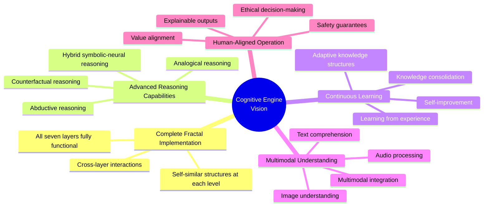

## Development Phases

The development is organized into four major phases, each building upon the previous phase and adding new capabilities to the system.

```mermaid
gantt
    title Cognitive Engine Development Phases
    dateFormat YYYY-Q#
    
    section Foundation Phase
    Core Architecture Development      :done, 2023-Q1, 2023-Q4
    Initial Module Implementation      :done, 2023-Q2, 2024-Q1
    Basic Integration                  :done, 2023-Q3, 2024-Q1
    
    section Expansion Phase
    Advanced Module Development        :active, 2024-Q1, 2024-Q4
    Enhanced Integration               :active, 2024-Q2, 2025-Q1
    Performance Optimization           :2024-Q3, 2025-Q1
    
    section Maturity Phase
    Full Fractal Implementation        :2025-Q1, 2025-Q4
    Advanced Reasoning Capabilities    :2025-Q1, 2026-Q1
    Large-scale Knowledge Integration  :2025-Q2, 2026-Q2
    
    section Evolution Phase
    Self-improvement Capabilities      :2026-Q1, 2026-Q4
    Continuous Learning Systems        :2026-Q2, 2027-Q1
    Multi-agent Collaboration          :2026-Q3, 2027-Q2
```

### Phase 1: Foundation (2023-2024)

The Foundation Phase establishes the core architecture and essential components of the Cognitive Engine.

**Key Milestones:**
- Core architecture design and implementation
- Basic implementation of key modules (Fractal, Probabilistic, Memory, Unipixel)
- Initial integration between modules
- Development of fundamental APIs
- Basic demonstration applications

**Current Status:** Completed

### Phase 2: Expansion (2024-2025)

The Expansion Phase builds upon the foundation to enhance capabilities and improve integration.

**Key Milestones:**
- Advanced module development (MMM, Code Execution, PEFF)
- Enhanced integration between all modules
- Performance optimization across the system
- Expanded API capabilities
- Broader range of demonstration applications
- Initial developer tools and documentation

**Current Status:** In Progress

### Phase 3: Maturity (2025-2026)

The Maturity Phase completes the implementation of all planned features and ensures robust integration.

**Key Milestones:**
- Full implementation of the seven-layer fractal structure
- Advanced reasoning capabilities across domains
- Large-scale knowledge integration
- Comprehensive developer tools and documentation
- Production-ready stability and performance
- Enterprise integration capabilities

**Current Status:** Planned

### Phase 4: Evolution (2026-2027)

The Evolution Phase focuses on self-improvement capabilities and continuous learning.

**Key Milestones:**
- Self-improvement mechanisms
- Continuous learning systems
- Multi-agent collaboration capabilities
- Adaptive knowledge structures
- Extended domain support
- Ecosystem of extensions and applications

**Current Status:** Planned

## Module-Specific Roadmaps

### Fractal System Roadmap

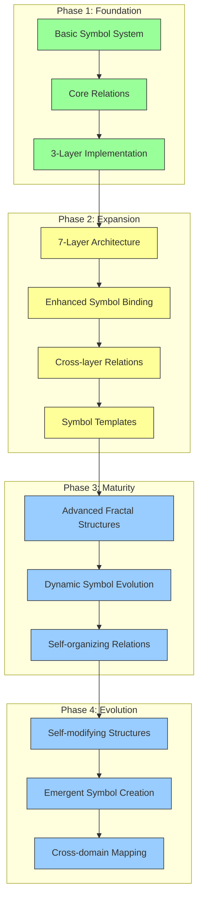

**Current Focus:**
- Implementing all seven layers with self-similar structures
- Enhancing symbol binding capabilities
- Developing cross-layer relation mechanisms
- Creating symbol templates for common patterns

### Probabilistic System Roadmap

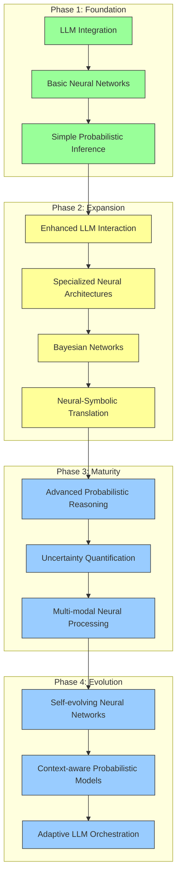

**Current Focus:**
- Enhancing LLM interaction with better context management
- Implementing specialized neural architectures for different tasks
- Developing Bayesian networks for probabilistic reasoning
- Creating robust neural-symbolic translation mechanisms

### Memory System Roadmap

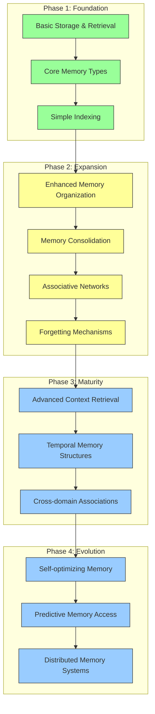

**Current Focus:**
- Implementing enhanced memory organization structures
- Developing memory consolidation processes
- Creating associative networks for related memories
- Implementing intelligent forgetting mechanisms

### Unipixel System Roadmap

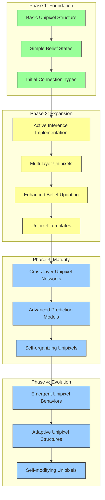

**Current Focus:**
- Implementing active inference mechanisms
- Creating unipixels for all seven layers
- Enhancing belief updating algorithms
- Developing unipixel templates for common patterns

### Magical Math Model (MMM) Roadmap

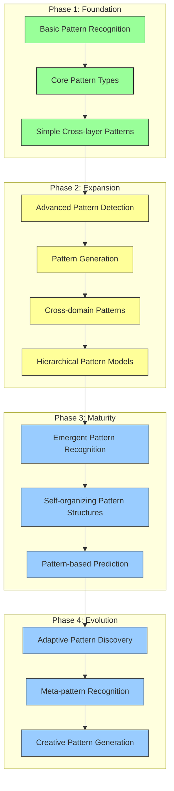

**Current Focus:**
- Implementing advanced pattern detection algorithms
- Developing pattern generation capabilities
- Creating cross-domain pattern recognition
- Building hierarchical pattern models

### Code Execution Roadmap

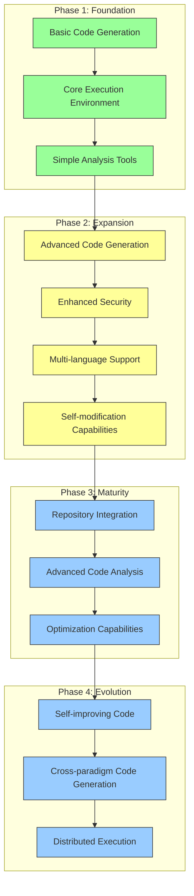

**Current Focus:**
- Improving advanced code generation techniques
- Enhancing execution environment security
- Expanding multi-language support
- Developing self-modification capabilities

### PEFF System Roadmap

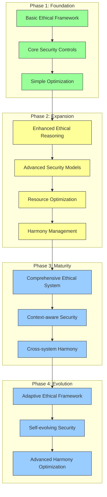

**Current Focus:**
- Enhancing ethical reasoning capabilities
- Implementing advanced security models
- Developing resource optimization techniques
- Creating harmony management systems

## Cross-Module Integration Roadmap

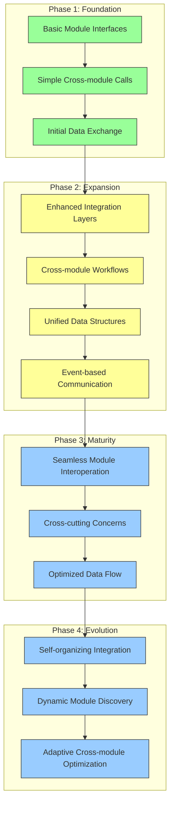

**Current Focus:**
- Developing enhanced integration layers between modules
- Creating cross-module workflows for common tasks
- Implementing unified data structures
- Building event-based communication systems

## Feature Development Timeline

The following chart shows planned feature development over time:

```mermaid
gantt
    title Feature Development Timeline
    dateFormat YYYY-Q#
    
    section Core Features
    Advanced Symbolic Reasoning        :active, 2024-Q1, 2024-Q4
    Neural-Symbolic Integration        :active, 2024-Q1, 2025-Q1
    Cross-layer Pattern Recognition    :active, 2024-Q2, 2025-Q1
    Continuous Learning Systems        :2025-Q1, 2026-Q1
    Self-modification Capabilities     :2025-Q2, 2026-Q2
    
    section Advanced Capabilities
    Analogical Reasoning              :2024-Q3, 2025-Q2
    Counterfactual Reasoning          :2024-Q4, 2025-Q3
    Abductive Reasoning               :2025-Q1, 2025-Q4
    Creative Generation               :2025-Q3, 2026-Q2
    Self-improvement                  :2026-Q1, 2027-Q1
    
    section Integrations
    Enhanced LLM Integration          :active, 2024-Q1, 2024-Q3
    External Repository Integration   :2024-Q3, 2025-Q1
    Multi-modal Input Processing      :2025-Q1, 2025-Q4
    External API Ecosystem            :2025-Q3, 2026-Q2
    Multi-agent Collaboration         :2026-Q1, 2027-Q1
```

## Research Directions

Alongside development, several research directions are being explored to enhance the Cognitive Engine:

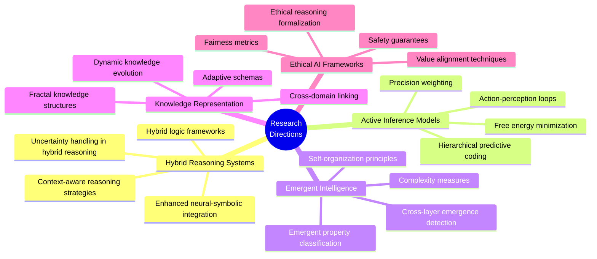

## Risks and Mitigations

Major risks to the roadmap and planned mitigations:

```mermaid
flowchart TD
    subgraph "Technical Risks"
        T1[Architecture Scalability Issues]
        T2[Integration Complexity]
        T3[Performance Bottlenecks]
        T4[Security Vulnerabilities]
    end
    
    subgraph "Project Risks"
        P1[Resource Constraints]
        P2[Technical Debt]
        P3[Scope Creep]
        P4[Knowledge Dependencies]
    end
    
    subgraph "External Risks"
        E1[Technology Evolution]
        E2[Regulatory Changes]
        E3[Market Adoption]
        E4[Competitive Landscape]
    end
    
    subgraph "Mitigations"
        M1[Modular Architecture]
        M2[Continuous Integration]
        M3[Performance Profiling]
        M4[Security Reviews]
        M5[Agile Development]
        M6[Technical Debt Management]
        M7[Scope Management]
        M8[Knowledge Sharing]
        M9[Technology Monitoring]
        M10[Regulatory Engagement]
        M11[User-centered Design]
        M12[Competitive Analysis]
    end
    
    T1 --> M1
    T2 --> M2
    T3 --> M3
    T4 --> M4
    
    P1 --> M5
    P2 --> M6
    P3 --> M7
    P4 --> M8
    
    E1 --> M9
    E2 --> M10
    E3 --> M11
    E4 --> M12
    
    classDef risks fill:#fbb,stroke:#333,stroke-width:1px
    classDef mitigations fill:#bfb,stroke:#333,stroke-width:1px
    
    class T1,T2,T3,T4,P1,P2,P3,P4,E1,E2,E3,E4 risks
    class M1,M2,M3,M4,M5,M6,M7,M8,M9,M10,M11,M12 mitigations
```

## Milestones and Success Criteria

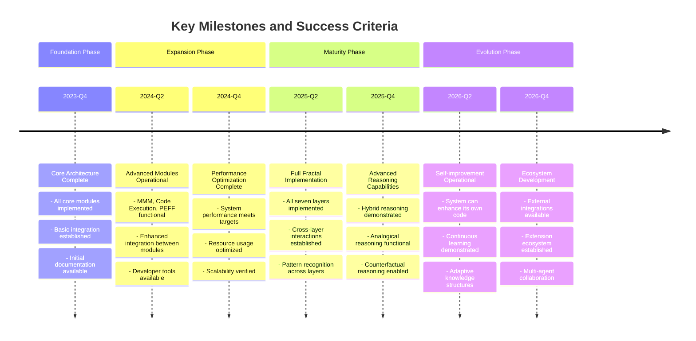

## How to Contribute

The Cognitive Engine is an open development project that welcomes contributions in various forms:

1. **Code Contributions**
   - Implement new features
   - Fix bugs
   - Optimize performance
   - Enhance documentation

2. **Research Contributions**
   - Explore new integration techniques
   - Investigate pattern recognition methods
   - Research ethical AI approaches
   - Develop reasoning algorithms

3. **Use Case Development**
   - Create domain-specific applications
   - Develop demonstration projects
   - Test the system in real-world scenarios
   - Provide feedback on usability

4. **Documentation and Education**
   - Improve documentation
   - Create tutorials and examples
   - Develop educational resources
   - Write articles and case studies

### Contribution Process

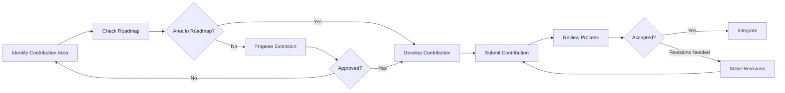

## Conclusion

The Cognitive Engine development roadmap outlines an ambitious but achievable path toward creating a truly hybrid AI system that combines symbolic and neural approaches within a fractal structure. By following this roadmap, the system will evolve from its current foundation into a mature, powerful, and flexible cognitive architecture capable of sophisticated reasoning, continuous learning, and knowledge transfer across domains.

The roadmap is designed to be adaptive, with regular reviews and adjustments based on progress, research findings, and changing requirements. Through collaborative development and research, the Cognitive Engine aims to push the boundaries of AI capability while maintaining alignment with human values and ethical principles. 