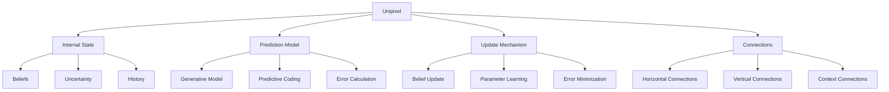
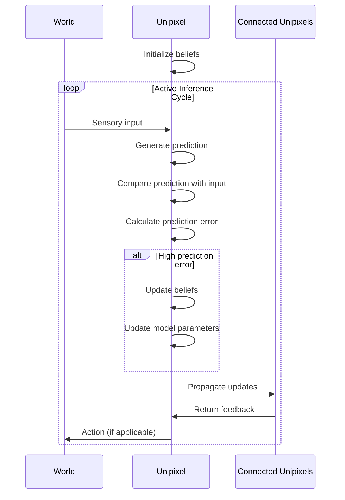

# Unipixel

The Unipixel is a specialized module within the Cognitive Engine that serves as the fundamental unit or atom for each layer of the system, based on Active Inference and Free Energy Principle concepts.

## Overview

Unipixels serve as the basic building blocks for symbolic-neural integration in the Cognitive Engine, providing:

- **Multi-level Representation**: Functioning at different abstraction layers
- **Active Inference**: Maintaining internal models and predictions
- **State Management**: Tracking internal states and beliefs
- **Cross-layer Communication**: Enabling information flow between layers



## Theoretical Foundation

Unipixels are based on the **Active Inference** framework and the **Free Energy Principle**, which suggests that cognitive systems work to minimize prediction errors through perception and action.

### Key Concepts

- **Free Energy**: A measure of the discrepancy between a system's beliefs and reality
- **Active Inference**: A process where systems act to minimize surprise
- **Predictive Coding**: A method of encoding information based on prediction errors
- **Markov Blanket**: A statistical boundary that separates a system from its environment

## Unipixel Architecture

### Core Components (`engine.py`)

- **UnipixelRegistry**: Manages the creation and tracking of unipixels across layers
- **Unipixel**: The fundamental unit with internal states and models
- **UnipixelConnection**: Links between unipixels for information exchange

Example:
```python
from cognitive_engine.unipixel import UnipixelRegistry, Unipixel

# Initialize the registry
registry = UnipixelRegistry()

# Create a unipixel
pixel = registry.create_unipixel(
    name="concept_detector",
    layer=3,
    properties={
        "domain": "language",
        "function": "concept_detection",
        "activation_threshold": 0.7
    }
)

# Register state update handlers
pixel.register_update_handler(my_update_function)

# Access a unipixel
retrieved_pixel = registry.get_unipixel(pixel.id)
```

### Internal State Management

Unipixels maintain internal states and beliefs about the world:

```python
from cognitive_engine.unipixel import Unipixel

# Create a unipixel
pixel = Unipixel(name="temperature_sensor", layer=1)

# Set initial beliefs
pixel.set_belief("temperature", 22.5, confidence=0.9)
pixel.set_belief("trend", "stable", confidence=0.7)

# Update beliefs based on new information
pixel.update_belief("temperature", 23.1, confidence=0.95)

# Get current beliefs
current_temp = pixel.get_belief("temperature")
print(f"Temperature: {current_temp.value}, Confidence: {current_temp.confidence}")
```

### Predictive Mechanisms

Unipixels use prediction models to anticipate future states:

```python
from cognitive_engine.unipixel import Unipixel, PredictionModel

# Create a prediction model
prediction_model = PredictionModel(
    model_type="bayesian",
    variables=["temperature", "humidity", "pressure"]
)

# Create a unipixel with the prediction model
pixel = Unipixel(
    name="weather_predictor", 
    layer=2,
    prediction_model=prediction_model
)

# Train the prediction model
pixel.train_prediction_model(
    training_data=weather_data,
    target_variable="temperature",
    epochs=100
)

# Generate predictions
prediction = pixel.predict(
    {"humidity": 0.65, "pressure": 1013.25},
    prediction_steps=24
)
```

### Connection Management

Unipixels connect to each other to form networks:

```python
from cognitive_engine.unipixel import UnipixelRegistry

registry = UnipixelRegistry()

# Create unipixels
sensor_pixel = registry.create_unipixel(name="sensor", layer=1)
processor_pixel = registry.create_unipixel(name="processor", layer=2)
concept_pixel = registry.create_unipixel(name="concept", layer=3)

# Create connections
registry.connect(
    source_id=sensor_pixel.id,
    target_id=processor_pixel.id,
    connection_type="feeds",
    weight=0.8
)

registry.connect(
    source_id=processor_pixel.id,
    target_id=concept_pixel.id,
    connection_type="represents",
    weight=0.6
)

# Find connected unipixels
connections = registry.get_connections(sensor_pixel.id, direction="outgoing")
```

## Unipixels Across Layers

Unipixels operate across the seven layers of the system, with different properties and responsibilities at each level:

### Layer 1: Fundamental Units

At the base layer, unipixels handle raw sensory data and basic patterns:

```python
# Create a Layer 1 unipixel
sensor_pixel = registry.create_unipixel(
    name="visual_edge_detector",
    layer=1,
    properties={
        "sensory_domain": "visual",
        "feature_type": "edge",
        "orientation": 45.0
    }
)
```

### Layer 2: Relational Structures

At the second layer, unipixels form relationships between basic units:

```python
# Create a Layer 2 unipixel
relation_pixel = registry.create_unipixel(
    name="spatial_relation",
    layer=2,
    properties={
        "relation_type": "above",
        "components": ["object_1", "object_2"]
    }
)
```

### Layer 3: Conceptual Systems

Layer 3 unipixels represent higher-level concepts:

```python
# Create a Layer 3 unipixel
concept_pixel = registry.create_unipixel(
    name="dog_concept",
    layer=3,
    properties={
        "category": "animal",
        "attributes": ["four_legs", "furry", "barks"]
    }
)
```

### Higher Layers

Unipixels at higher layers handle increasingly abstract concepts and operations, up to self-awareness at Layer 7.

## Information Processing

### Active Inference Cycle

Unipixels operate using the active inference cycle:



### Implementation Example

```python
from cognitive_engine.unipixel import Unipixel, ActiveInferenceCycle

# Create a unipixel
pixel = Unipixel(name="thermostat", layer=2)

# Create an active inference cycle
aic = ActiveInferenceCycle(pixel)

# Register handlers
def handle_sensory_input(input_data):
    return {"temperature": input_data["sensor_reading"]}

def generate_prediction(belief_state):
    return {"temperature": belief_state["temperature"]}

def update_belief(belief_state, prediction_error):
    new_belief = belief_state.copy()
    new_belief["temperature"] += 0.1 * prediction_error["temperature"]
    return new_belief

def take_action(belief_state, prediction_error):
    if belief_state["temperature"] > 25:
        return {"action": "activate_cooling"}
    return {"action": "no_action"}

# Register handlers
aic.register_input_handler(handle_sensory_input)
aic.register_prediction_handler(generate_prediction)
aic.register_update_handler(update_belief)
aic.register_action_handler(take_action)

# Start the cycle
aic.start(cycle_interval_ms=1000)
```

## Integration with Other Modules

### Fractal System Integration

Unipixels integrate with the Fractal System to provide grounding for symbols:

```python
from cognitive_engine.unipixel import UnipixelRegistry
from cognitive_engine.fractal import FractalSystem, Symbol

# Initialize
registry = UnipixelRegistry()
fractal = FractalSystem(levels=7)

# Create a symbol
dog_symbol = Symbol("dog", properties={"type": "animal"})
fractal.add_symbol(dog_symbol, layer=3)

# Create a unipixel
dog_pixel = registry.create_unipixel(
    name="dog_concept",
    layer=3,
    properties={"category": "animal"}
)

# Link the symbol to the unipixel
fractal.bind_to_unipixel(dog_symbol.id, dog_pixel.id)

# Retrieve linked elements
linked_symbols = fractal.get_symbols_for_unipixel(dog_pixel.id)
linked_unipixels = registry.get_unipixels_for_symbol(dog_symbol.id)
```

### Probabilistic System Integration

Unipixels work with the Probabilistic System for neural processing:

```python
from cognitive_engine.unipixel import Unipixel
from cognitive_engine.probabilistic import Embedding, LLMInterface

# Create a unipixel with neural capabilities
pixel = Unipixel(name="text_processor", layer=4)

# Add an embedding model
embedding = Embedding()
pixel.set_neural_processor(embedding)

# Integrate with an LLM
llm = LLMInterface(model="gpt-4")
pixel.set_llm_interface(llm)

# Process text through the unipixel
result = pixel.process_text("Climate change is affecting global ecosystems")
```

## API Reference

### UnipixelRegistry

```python
# Initialize registry
registry = UnipixelRegistry()

# Create a unipixel
pixel = registry.create_unipixel(name, layer, properties={})

# Get a unipixel by ID
pixel = registry.get_unipixel(pixel_id)

# Find unipixels by properties
pixels = registry.find_unipixels(
    layer=3,
    properties={"domain": "language"}
)

# Connect unipixels
registry.connect(source_id, target_id, connection_type, weight=1.0)

# Delete a unipixel
registry.delete_unipixel(pixel_id)
```

### Unipixel

```python
# Create a unipixel
pixel = Unipixel(name, layer, properties={})

# Manage beliefs
pixel.set_belief(key, value, confidence)
pixel.update_belief(key, value, confidence)
belief = pixel.get_belief(key)

# Prediction
pixel.set_prediction_model(model)
pixel.predict(input_data, steps=1)

# State management
pixel.get_state()
pixel.set_state(state)
pixel.reset_state()
```

### Active Inference

```python
# Create an active inference cycle
aic = ActiveInferenceCycle(pixel)

# Register handlers
aic.register_input_handler(input_function)
aic.register_prediction_handler(prediction_function)
aic.register_update_handler(update_function)
aic.register_action_handler(action_function)

# Control cycle
aic.start(cycle_interval_ms=1000)
aic.pause()
aic.resume()
aic.stop()
```

## Example Applications

### Sensory Processing

```python
from cognitive_engine.unipixel import UnipixelRegistry

registry = UnipixelRegistry()

# Create a network of visual processing unipixels
edge_detectors = []
for orientation in [0, 45, 90, 135]:
    pixel = registry.create_unipixel(
        name=f"edge_{orientation}",
        layer=1,
        properties={"feature": "edge", "orientation": orientation}
    )
    edge_detectors.append(pixel)

# Create higher-level feature detector
shape_detector = registry.create_unipixel(
    name="shape_detector",
    layer=2,
    properties={"feature": "shape"}
)

# Connect edge detectors to shape detector
for detector in edge_detectors:
    registry.connect(detector.id, shape_detector.id, "feeds")

# Process visual input
input_data = get_visual_input()  # Example function
for detector in edge_detectors:
    detector.process(input_data)
```

### Concept Learning

```python
from cognitive_engine.unipixel import UnipixelRegistry

registry = UnipixelRegistry()

# Create a concept learning unipixel
concept_learner = registry.create_unipixel(
    name="animal_concept_learner",
    layer=3,
    properties={"domain": "biology"}
)

# Train with examples
examples = [
    {"name": "dog", "features": ["four_legs", "furry", "barks"]},
    {"name": "cat", "features": ["four_legs", "furry", "meows"]},
    {"name": "bird", "features": ["two_legs", "wings", "feathers"]}
]

for example in examples:
    concept_learner.learn_example(example)

# Test the learner
similarity = concept_learner.compute_similarity(
    {"name": "wolf", "features": ["four_legs", "furry", "howls"]}
)
```

### Predictive Maintenance

```python
from cognitive_engine.unipixel import UnipixelRegistry

registry = UnipixelRegistry()

# Create sensor unipixels
temp_sensor = registry.create_unipixel(
    name="temperature_sensor",
    layer=1,
    properties={"sensor_type": "temperature"}
)

vibration_sensor = registry.create_unipixel(
    name="vibration_sensor",
    layer=1,
    properties={"sensor_type": "vibration"}
)

# Create anomaly detector
anomaly_detector = registry.create_unipixel(
    name="anomaly_detector",
    layer=2,
    properties={"detector_type": "anomaly"}
)

# Create maintenance predictor
maintenance_predictor = registry.create_unipixel(
    name="maintenance_predictor",
    layer=3,
    properties={"predictor_type": "maintenance"}
)

# Connect unipixels
registry.connect(temp_sensor.id, anomaly_detector.id, "feeds")
registry.connect(vibration_sensor.id, anomaly_detector.id, "feeds")
registry.connect(anomaly_detector.id, maintenance_predictor.id, "informs")

# Run prediction
prediction = maintenance_predictor.predict(
    collected_sensor_data,
    prediction_horizon_days=30
)
```

## Best Practices

1. **Layer Appropriateness**: Place unipixels at the appropriate layer based on their level of abstraction
2. **Belief Management**: Maintain accurate confidence levels for beliefs
3. **Connection Optimization**: Create meaningful connections with appropriate weights
4. **State Management**: Implement efficient state management for large networks
5. **Error Handling**: Define clear procedures for handling prediction errors

## Troubleshooting

### Common Issues

- **Belief Divergence**: Unipixel beliefs diverging from reality
  - Solution: Adjust learning rates and increase observation weight

- **Connection Overload**: Too many connections causing performance issues
  - Solution: Prune less important connections and implement connection thresholds

- **Layer Confusion**: Unipixels operating at incorrect abstraction layers
  - Solution: Refactor unipixel placement based on functionality

## Extending the System

The Unipixel system can be extended with:

- Custom prediction models for domain-specific applications
- New belief update mechanisms based on different learning algorithms
- Specialized unipixel types for specific domains
- Distributed unipixel networks for scalability

## References

- Active Inference and Free Energy Principle
- Predictive Coding in Neural Systems
- Hierarchical Predictive Processing
- Object-Oriented Programming Patterns
- Multi-agent Systems 